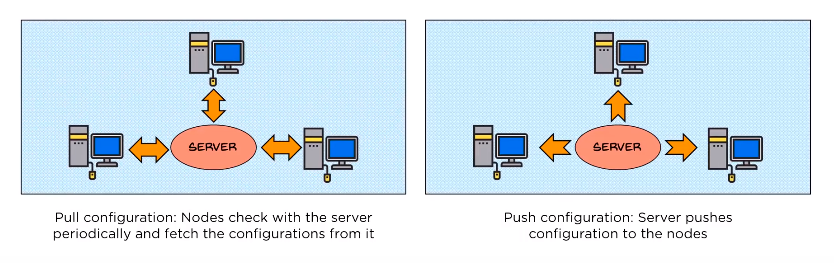

# Ansible Outline

> This outline summarizes Ansible and its main aspects.

Hint: Images and illustrations taken from [resources](#resources).

## Table of Content

* [What is Ansible](#what-is-ansible)
* [Pull vs Push Configuration Tools](#pull-vs-push-configuration-tools)
* [Ansible Architecture](#ansible-architecture)
* [Installation](#installation)
* [Configuration](#configuration)
* [Ansible Simple Commands](#ansible-simple-commands)
* [Ansible Inventory](#ansible-inventory)
* [Ansible Module](#ansible-module)
* [Ansible Tasks](#ansible-tasks)
* [Ansible Playbook](#ansible-playbook)
* [Ansible Tower](#ansible-tower)
* [Resources](#resources)

***

## What is Ansible

Ansible is an open source [IaC](./infrastructure-as-code-outline.md) automation engine.

If you have many servers - could be hundred - configuring all of these servers, installing and deploying different services could be tedious and time consuming task. In addition a manual work could result in errors.

So what about automating servers configuration to Ansible.

You will delegate servers configuration to Ansible and it will provision the configuration in all serves. A code is written once for installation and deployed multiple times.

Ansible provides Automation, Configuration Management, Orchestration and Automatic Deployment.

Orchestration means: Integration of multiple applications and executing them in specific order, eg: DB before Webapp.

Ansible can deploy to Virtualization or Cloud Environment like AWS, VmWare, DigitalOcean, GCP...

***

## Pull vs Push Configuration Tools

Ansible is a push configuration Tool, unlike Chef and Puppet. With Ansible there's master and slave servers, and master is pushing the configuration to slave servers.



***

## Ansible Architecture

* The configuration code files are called **playbooks**.
* Each playbook consist of list of **tasks**.
* **Module** are the programs that perform the actual work of the tasks in a playbook. Core modules are the modules that come bundled with ansible, there are over 400 core modules... eg: `yum`, `service`, `copy`, etc.
* **Inventory** is a document that groups the nodes (or servers ip) under specific label.
* The master machine connects to the nodes through an SSH client.


***

## Installation

* `apt install ansible`
* `ansible --version`

***

## Configuration


* Create a new user for ansible adminstration and grant access to the new user (Do this step on Ansible master server and for each other node/client)
  * `useradd ansadmin`
  * `passwd ansadmin`
  * `visudo` and add `ansadmin ALL=(ALL) NOPASSWD: ALL` user under `# includedir /etc/sudoers.d`
* Enable user login (add to the user to `sshd_config`) (Do this step on Ansible master server and for each other node/client)
  * `vi /etc/ssh/sshd_config`, _uncomment_ `PasswordAuthentication yes` and _comment_ `PasswordAuthentication no` so you can use username/password to login.
  * `service sshd restart`
* Login using the new created user on master and generate ssh key (on master)
  * `ssh-keygen` will create `id_rsa.` and `id_rsa.pub.` key pair under `/home/ansadmin/.ssh/id_rsa`
  * `cd .ssh`
* Copy keys to target servers (on master)
  * `ssh-copy-id <target-servers>` and provide the password of target server.
  * Now if you try to ssh the target server `ssh target-server`, it will not ask for a password. Now authentication became passwordless authentication between ansible server and any other node.
* Update target servers information on `/etc/ansible/hosts` file (on master)
  * `echo "10.10.x.x" -> /etc/ansible/hosts`
  * or `sudo vi /etc/ansible/hosts`
    ```bash
    [ansible_client]
    10.10.x.x
    ```
* Test and run below ansible command using `ansadmin` user
  * `ansible all -m ping` it will execute this command to all target servers.

***

## Ansible Simple Commands

* `ansible all -a "/sbin/reboot"` rebooting the system.
* `ansible all -m copy -a "src=/home/dan dest=/temp/home"` copy file.
* `ansible all -m user -a "name=testuser password=<encrypted password>"` create user.
* `ansible all -m -a "name=testuser state=absent"` delete user.
* `ansible all -m file -a "dest=/home/dan/file1.txt mode=777"` change file permission.
* `ansible all -s -m yum -a "name=httpd state=latest"` install package. `-s` stands for sudo, if you try to run without this option, it will fail, you have to give authorization.
* `ansible all -s -m service -a "name=httpd state=started"` start service.
  * verify on client `service httpd status`.
* `ansible all -m service -a "name=httpd state=stopped` stop service.

***

## Ansible Inventory

It's a list of hosts or group of hosts.
It's where we maintain the structure of our network environment. The default location for the host inventory file is `etc/ansible/hosts`.

You can also use a different inventory file, just specify the inventory file location when you run ansible command, eg: `ansible --inventory file_path` or `-i` for short.

```bash
[webservers]
web1.machine
web2.machine
web3.machine
[database_servers]
db1.machine
db2.machine
```

***

## Ansible Module

Modules are the programs that perform the actual work of the tasks of a playbook.

Core modules are the modules that come bundled with ansible, there are over 400 core modules.

***

## Ansible Tasks

A task is nothing more than a call to an ansible module.

***

## Ansible Playbook

Playbook contains all of the configuration files, it's written in YAML.

```yaml
---
-name: sample playbook # name is optional
 hosts: ansible_client # or use all
 remote_user: ansadmin
 become: true # become a root user on target servers.
 tasks:
   - name: install httpd
      yum: # yum is a module
        name: httpd
        state: latest
   - name: run httpd
      service:
        name: httpd
        state: started
   - name: create content
      copy:
        content: "This is your fist Ansible file"
        dest: /var/www/html/index.html
```

* `ansible-playbook sample.yml --syntax-check` check playbook syntax is ok.
* `ansible-playbook sample.yml --check` check if the tasks can be done or any mistake exists.
* `ansible-playbook sample.yml` now run the playbook.
* goto the client node, then try `localhost:8080`.

***

## Ansible Tower

Ansible by itself is a command line, Ansible Tower is a framework by Redhat. It provides a GUI. Thus, reducing the dependency on the command prompt window. It makes it easy for non developers to be able to create the environment from the GUI.

***

## Resources

* [Youtube: Ansible Tutorial For Beginners](https://www.youtube.com/watch?v=EcnqJbxBcM0)
* [Youtube: How to write your first Ansible playbook](https://www.youtube.com/watch?v=BeYUQaFS-vg)
