# Shell Commands and Bash Scripting Outline

> I created this outline to help myself and others summarizing Bash Shell commands, Bash scripting, Linux or Unix-like system and its relative topics which we usually use in our day-to-day job activity as a software developers.

## Index

* [What is Shell](#what-is-shell)
  * [Family Tree of Shell](#family-tree-of-shell)
* [What is Bash](#what-is-bash)
* [Basic CLI Commands](#basic-cli-commands)
* [Pager in Bash](#pager-in-bash)
* [Editing Files](#editing-files)
* [Vagrant](#vagrant)
  * [Installation and Starting](#installation-and-starting)
* [Shell Commands](#shell-commands)
  * [Basic Commands](#basic-commands)
  * [Managing Files and Directories](#managing-files-and-directories)
    * [`ls` Command](#ls-command)
    * [Globbing Patterns](#globbing-patterns)
    * [Paths](#paths)
    * [`mv` Command](#mv-command)
    * [`cp` Command](#cp-command)
    * [`scp` Command](#scp-command)
    * [Copy Directory](#copy-directory)
    * [Create and Remove Directory](#create-and-remove-directory)
  * [Symbolic Links](#symbolic-links)
    * [Creating Symlinks To a File](#creating-symlinks-to-a-file)
    * [Creating Symlinks To a Directory](#creating-symlinks-to-a-directory)
    * [Overwriting Symlinks](#Overwriting-symlinks)
    * [Removing Symlinks](#removing-symlinks)
  * [`curl` Command](#curl-command)
  * [`cat` Command](#cat-command)
  * [`less` Command](#less-command)
  * [`grep` Command](#grep-command)
    * [Recursive Grep Search](#recursive-grep-search)
    * [Using Regular Expressions](#using-regular-expressions)
    * [Display Matching Filenames not Lines](#display-matching-filenames-not-lines)
    * [Lines Before and After Grep Match](#lines-before-and-after-grep-match)
    * [Reverse the Search](#reverse-the-search)
    * [Grep in a Pipeline](#grep-in-a-pipeline)
    * [Search for Multiple Patterns](#search-for-multiple-patterns)
    * [Handle Multiple Search Patterns Using `-e` Flag](#handle-multiple-search-patterns-using--e-flag)
    * [Search Gzip files](#search-gzip-files)
    * [Limit Grep Output to a Particular Number of Lines](#limit-grep-output-to-a-particular-number-of-lines)
    * [Use File as an Input to Grep](#use-file-as-an-input-to-grep)
    * [Display Only Lines that Completely Match the Search Pattern](#display-only-lines-that-completely-match-the-search-pattern)
    * [Regular Expression Overview](#regular-expression-overview)
  * [`sort` Command](#sort-command)
  * [`PATH` Variable](#path-variable)
  * [`id` Command](#id-command)
  * [`tar` Command](#tar-command)
  * [`cut` Command](#cut-command)
  * [`sed` Command](#sed-command)
  * [`uniq` Command](#uniq-command)
  * [`awk` Command](#awk-command)
  * [`tr` Command](#tr-command)
  * [`env` Command](#env-command)
  * [`df` and `du` Commands](#df-and-du-commands)
  * [`whatis` and `apropos` Commands](#whatis-and-apropos-commands)
  * [`ssh` Command](#ssh-command)
  * [`chown` Command](#chown-command)
    * [How to Change Symbolic Links Ownership](#how-to-change-symbolic-links-ownership)
    * [Change Ownership Using a Reference File](#change-ownership-using-a-reference-file)
  * [`chmod` Command](#chmod-command)
  * [`watch` Command](#watch-command)
  * [`lsof` Command](#lsof-command)
  * [`kill` Command](#kill-command)
  * [`ps` Command](#ps-command)
  * [`dd` Command](#dd-command)
  * [`free` Command](#free-command)
  * [`eval` Command](#eval-command)
  * [`ifconfig` Command](#ifconfig-command)
  * [`ip` Command](#ip-command)
  * [`netstat` Command](#netstat-command)
  * [`nslookup` Command](#nslookup-command)
  * [Commands Exercise](#commands-exercise)
* [Linux](#linux)
  * [Unix vs Windows Base](#unix-vs-windows-base)
  * [Linux Home Directory](#linux-home-directory)
  * [Linux Important Directories](#linux-important-directories)
  * [Linux Security](#linux-security)
  * [`sudo` and `su` commands](#sudo-and-su-commands)
  * [Package Source List](#package-source-list)
  * [Finger Program](#finger-program)
  * [Key Based Authentication](#key-based-authentication)
  * [File Permissions](#file-permissions)
  * [Firewalls](#firewalls)
  * [`iptables`](#iptables)
  * [Least Privilege Principle](#least-privilege-principle)
  * [Web Application Servers](#web-application-servers)
  * [Install Postgresql Sql](#install-postgresql-sql)
  * [Exercise](#exercise)
* [Bash Scripting](#bash-scripting)
  * [Variables](#variables)
  * [Passing Arguments to the Script](#passing-arguments-to-the-script)
  * [Special Variables](#special-variables)
  * [Exporting Variables](#exporting-variables)
  * [User Input](#user-input)
  * [Arithmetic](#arithmetic)
  * [Arrays](#arrays)
  * [Array Comparison Example](#array-comparison-example)
  * [Basic String Operations](#basic-string-operations)
  * [Decision Making](#decision-making)
    * [If Then](#if-then)
    * [Nested If Statements](#nested-if-statements)
    * [If Then Else](#if-then-else)
    * [If Elif Else](#if-elif-else)
    * [Case Statements](#case-statements)
  * [Loops](#loops)
    * [`for` Loop](#for-loop)
    * [`while` Loop](#while-loop)
    * [`until` Loop](#until-loop)
    * [`break` and `continue` Statements](#break-and-continue-statements)
    * [`select` Statement](#select-Statement)
  * [Shell Functions](#shell-functions)
    * [Functions](#functions)
    * [Variable Scope](#variable-scope)
    * [Overriding Commands](#overriding-commands)
  * [`tput` Command](#tput-command)
  * [Supplying Data](#supplying-data)
  * [Bash `trap` command](#bash-trap-command)
  * [Pipeline Concept](#pipeline-concept)
  * [Process Substitution](#process-substitution)
* [Useful Resources](#useful-resources)

## What is Shell

A shell program is typically an executable binary that takes commands that you type, and once you hit return, it translates those commands into system calls to the Operating System API.

Bash is not the only kind of shell. Other shells include:

* sh
* ash
* dash
* ksh
* tcsh
* zsh
* tclsh

Since other shells are also programs, they can be run from within one another!

In the following code sample you run `tcsh` from within the terminal. Note that you will get a different prompt after the `tcsh` command is run. Make sure `tcsh` app is installed. To install `$ sudo apt-get install tcsh`

```bash
tcsh            # Enter the tcsh shell
echo $dirstack  # Output a variable in the tcsh shell
exit            # Quit the tcsh program, back to bash shell
echo $dirstack  # The variable does not exist in the bash shell
```

### Family Tree of Shell


* Run `$ ps | grep $$` to find out what is currently active shell.
* Run `$ which bash` to show the full path of the shell interpreter.

***

## What is Bash

Bash is a [Shell](#What-is-shell) program or command language interpreter, for the GNU operating system. The name is an acronym for the ‘Bourne-Again SHell’, a pun on Stephen Bourne, the author of the direct ancestor of the current Unix shell `sh`, which appeared in the Seventh Edition Bell Labs Research version of Unix.

***

## Basic CLI Commands

CLI or Command Line Interface. Different programming languages have different (CLIs).

In this section, we can use `git bash` to execute basic commands, no need to setup linux machine. Later we'll be using [Vagrant](#vagrant).

If you're someone who is using linux based operating system you must be knowing these commands:

* `$ pwd` present working directory.
* `$ open or start folder/file` open folder/file in system GUI (Mac or Windows, respectively).
* `$ start .` open current directory.
* `$ cd Desktop` change directory.
* `$ cd ..` move back one step to parent directory.
* `$ cd` running `cd` only takes us to the home directory.
* `$ mkdir animals` create a directory.
* `$ mkdir marsupials cloven_hoofed_animals carnivores` create 3 directories at once.
* `$ mkdir \ hoofed\ animalscloven` create directory with name includes spaces.
* `$ touch first_file.txt` create a file with extension.
* `$ touch animals/rodents/capybara.txt` create a file in a directory other than the working directory.
* `$ ls animals/rodents` list all files in another directory.
* `$ touch animals/marsupials/kangaroo.txt animals/cloven_hoofed_animals/giraffe.txt` create multiple files in other directories.
* `$ rm first_file.txt` remove directories and files.
* `$ rm apples.txt carrots.txt fruits.txt` remove multiple files at a time.
* Removing directories.
  * `$ rmdir  animals` remove directory if it is empty only.
  * `$ rm -r` recursive deletion, remove non empty directory.
  * `$ rm -ri` or `$ rm -r -i` deletion with confirmation, `i` for interactive mode.
  * `$ rm *'Bad F'*` remove all file contain 'Bad F' eg: 'Bad File' and 'Good Name Bad Face'.
  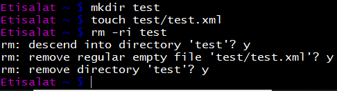

***

## Pager in Bash

Bash is using **Less** program for navigating file content. If you're not used a pager on the command line before, navigating in Less can be a bit odd, here are some helpful keys:

`$ less file_name`

* `j` or `↓` (arrow down) to move/scroll down one line at a time.
* `k` or `↑` (arrow up) to move/scroll up one line at a time.
* `d` or `u` to scroll by half the page screen (go _down_ or go _up_).
* `f` or `b` to scroll by a whole page screen (go _down_ or go _up_).
* To scroll down or up by specific number of lines, press number of lines you want then `f` or `space bar` or any other. eg: `:10` then `f`, it will scroll down by 10 lines. eg: `:5` then `b` it will scroll up by 5 lines. eg: `:5` then `j` it will scroll down by 5 lines.
* `q` to quit out of the log (returns to the regular command prompt).
* `g` return to the beginning of the file, `G` go to the end of the file.
* type line number + (`g` or `G`) to go to specific line.
* `/` to search down the file, eg: `/SubRequest`.
* `?` to search up the file, eg: `?SubRequest`.
* `n` for next occurrence.
* `N` for previous occurrence.
* You can write regular expressions in search as well, but take care if you write search key including special character, less will try to resolve the expression.

***

## Editing Files

You can use `$ vi`, `$ vim`, `$ emacs`, `$ joe` or `$ nano` to edit a file.

`$ vi rtf.properties`

* `i` insert mode then write what you want.
* `esc` exit insert mode.
* `:wq` then `enter` to save and close the editor.
* `:w` save only.
* `:q!` quit without editing, press escape first.

***

## Vagrant

In this section we need a linux server so we'll use the Oracle VirtualBox application to run the virtual machine, and the Vagrant software to configure it.

### Installation and Starting

* Vagrant configuration on my machine located at `e:/Work/shell/`
* `$ vagrant up` download and setup linux ubuntu. Vagrant will create a VM, install a guest OS and configure it.
* `$ vagrant status`
* `$ vagrant suspend` all of your work is saved and the machine is put into a “sleep mode” of sorts. You should use this command if you plan to just take a short break from your work but don’t want to leave the virtual machine running.
* `$ vagrant halt` this command halts your virtual machine. All of your work is saved and the machine is turned off, think of this as “turning the power off”. It’s much slower to stop and start your virtual machine using this command, but it does free up all of your RAM once the machine has been stopped.
* `$ vagrant destroy` your work is not saved, the machine is turned off and forgotten about for the most part. Think of this as formatting the hard drive of a computer.
  * You can always use `$ vagrant up` to relaunch the machine, but it will start download the linux distribution again.
* `$ vagrant ssh` start the virtual machine.
* `$ vagrant reload` if you did some modification to the configuration file, you should reload to enable the configuration.
* `$ ctrl + D` or `logout` logout from the VM.

Now we can use ubunto machine.
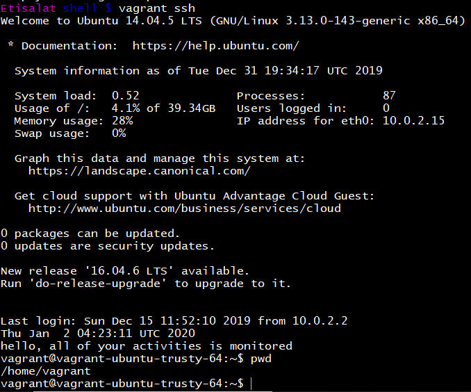

***

## Shell Commands

Now we'll start exploring most used linux shell commands.

### Basic Commands

* `$ alias ll 'ls -l'` give alias to a command, you can put these commands in `.bash_profile` as well.
* `$ date` show the current machine date.
* `$ uname` tells you what operating system you're running on.
* `$ uname -a` full name.
* `$ hostname` show machine name.
* `$ whoami` get the current user of the system.
* `$ history` show previously executed commands history.
* `$ history 5` show last 5 executed commands only.
* `$ host google.com` look up DNS - Domain Name Service - to find out the ip address.
* `$ uptime` system uptime.
  * `$ uptime -p` show uptime in pretty format.
  * `$ uptime -s` system up since.  
  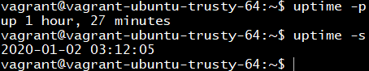
* `$ echo i\'am playing` shell's print command.
* `$ echo $COLUMNS x $LINES` print out shell screen size.
* `ctrl + r` search previous commands.
* `$ unzip things.zip`
* `$ cat  gastropods_draft.txt gastropods.txt` prints out contents of a file, or concatenate files and get a result short files.
* `$ wc  gastropods_draft.txt` word count program. It lists total lines, total words and total bytes respectively.
* `$ diff file_a file_b` compare files and show how they differ.
* `$ cowsay Hello` print out a cow with message.
* `$ cowsay -e ^^ Hello` change the cow eye :).
* `$ man cowsay` open the manual for program `cowsay`.
* `$ rm -rf /` DON'T RUN THIS ANYTIME, `-r` is for recursive, and `-f` is for force. It deletes everything in your linux system, or at least everything that user account has access to delete.
* `$ ping 8.8.8.8` Google's public DNS server.
* `$ bc` simple arithmetic program. Write `quit` to exit.

### Managing Files and Directories

File name can include any character except `/`. In shell, when writing file name which includes special character, put it inside `''` or use back slash `\` before each character.

#### `ls` Command

* `$ ls -l css/` list files in a directory.
  * `$ ls -l` long format, means more details. It will show all file details with its permissions.
* `$ cd css ; ls` change directory then list items.
* `$ ls -a` or `$ ls -all` list all the files including hidden ones and the ones starts with `.`.  
  * `.` used by linux mostly for caching and for configuration.
* `$ ls -l css/*.css` pattern to list all the files which end with `.css`.
* `$ ls -a -l > list.txt` list all files and output the result in a text file.
* `$ ls -lh`
  * `h` flag will show the size of each file in a human readable format.
* `$ ls -laSh /var/www/html/admin_portal/` To list all files and sort them by size, use the `-S` option. By default, it displays output in descending order (biggest to smallest in size).
* `$ ls -laShr /var/www/html/admin_portal/` Option `-r` to sort in reverse order.
* Besides, you can list subdirectories recursively using the -R option.
  * `$ ls -laShR /var/www/html/admin_portal/`

#### Globbing Patterns

Matching files or folders by name in the unix shell.

* `?` matches a single character. So a pattern of `ca?.txt` would match `car.txt`, and `cat.txt`, but not `cart.txt`. You can use a `?` more than once. `p?p?.cf?` would match files named `papa.cfm` and `pipe.cfc`.
* `*` matches any number of characters within name. It will match zero or more characters inside a filename or folder name.  So `d*o` matches `doodoo`, `dao`, and just `do`. `models/*.cfc` will only match cfc files in the root of the _models_ folder.
* `**` matches any number of characters across all directories. So `models/**.cfc` that would match any _cfc_ file in any subdirectory, no matter how deep it's.

Examples

* `ls *pp*` match any number of characters before or after.
* `ls b*png` match any number of characters.
* `ls app.{css,html}` match files which either ends with `css` or `html`.
* `ls bea?.png` match a single one character.
* `ls bea??.png` match two characters.
* `ls be[eaio]r.png` match only one character of chars in braces.
* `ls *{jpg,png}` match any file ending with _jpg_ or _png_.

#### Paths

* Absolute Path vs Relative Path.
  * Absolute path: Starting from beginning `/`.
  * Relative path: Relative to current working directory, `$ cd clam/giant`.
* `$ cd ./ocean` `.` means current directory, so go to ocean which is sub directory from current.
* `$ cd ../mountain` `..` means parent directory of current directory, so go to mountain which is sub directory from my parent.
* `$ cd ../../user` `../../` means grandparent directory, so go to user directory which is sub directory from my grandparent.
* `$ cd ~` refer to root home directory.
* `$ cd ~/ocean/otter`.
* `$ cd` without arguments is a shortcut to take you home directory.
* Press `tab` for completion.
* Press double `tab` to list all possible completion.

#### `mv` Command

* `$ mv documents/*.pdf documents/books` move all files ending with `.pdf` to books folder.
* Below commands are equal and will move all changes from books to documents.
  * `$ mv 'Documents/Books'/* Documents`
  * `$ cd Documents; mv 'Books'/*.epub .`
  * `$ cd 'Documents/Books'; mv * ..`
* `$ mv -i documents/*.pdf documents/books` `-i` enter interactive mode.
* `$ mv -u documents/*.pdf documents/books` `-u` update destination file only if the source file is different than the destination file.
* `$ mv -b documents/*.pdf documents/books` `-b` enter verbose mode and it will print source and destination files.

#### `cp` Command

* `$ cp foo.txt bar.txt` `foo.txt` is copied to a new file called `bar.txt`
* `$ cp foo.txt bar.txt baz.txt foo/` copy files to foo directory.
  * this equals to `$ cp *.txt foo/`
* `$ cp www/*html backup`
* `$ cp -n foo.txt bar.txt` doesn't override the file.
* `$ cp -u foo.txt bar.txt` update destination file only if the source file is different than the destination file.

#### `scp` Command

SCP (Secure Copy) is used to transfer files and directories across the systems securely over the network. When we use `scp` command to copy files and directories from our local system to remote system then in the backend it makes `ssh` connection to remote system. In other words, we can say `scp` uses the same SSH security mechanism in the backend, it needs either password or keys for authentication.

Syntax

* `$ scp <options> <files_or_directories> user@target_host:/<folder>`
* `$ scp <options> user@target_host:/files   <folder_local_system>`

Examples

* `$ scp jdk-linux-x64_bin.rpm root@172.20.10.8:/opt` copy jdk rpm package from our local Linux system to remote system 172.20.10.8 under /opt folder.
* `$ scp root@172.20.10.8:/root/Technical-Doc-RHS.odt /tmp` copy a file from remote system to our local system under the /tmp folder.
* `$ scp -v jdk-linux-x64_bin.rpm root@172.20.10.8:/opt` `-v` for verbose mode. To find what exactly is happening in the background. This becomes very useful in debugging connection, authentication and configuration problems.
* `$ scp install.txt index.html jdk-linux-x64_bin.rpm root@172.20.10.8:/mnt` transfer multiple files to remote system.
* `$ scp -r Downloads root@172.20.10.8:/opt` `-r` copy files and directories recursively.
  * Verify the files `$ sh root@172.20.10.8 "ls -ld /opt/Downloads"`
* `$ scp -r -C Downloads root@172.20.10.8:/mnt` `-C` increase transfer speed by enabling compression. It will automatically enable compression at source and decompression at destination host.
* `$ scp -P 2022 jdk-linux-x64_bin.rpm  root@172.20.10.8:/var` `-P` specify different `ssh` port while `scp`. There can be some scenario where `ssh` port is changed on destination host, so while using `scp` command we can specify the `ssh` port number using `-P` option.
* `$ scp -q -r Downloads root@172.20.10.8:/var/tmp` `-q` transferring files in quiet mode.
* `$ scp -i my_key.pem -r Downloads root@172.20.10.8:/root` `-i` to use keys-based authentication. Specify the identify file or private key file.
* There are some scenarios where you use different networks to connect to Linux systems, may be some network is behind proxy servers, so in that case we must have different ssh_config file. So use `-F` option.
  * `$ scp -F /home/pkumar/new_ssh_config -r Downloads root@172.20.10.8:/root`
* By default, `scp` uses `AES-128` cipher to encrypt the files. If you want to use another cipher in `scp` command then use `-c` option followed by cipher name. Let’s suppose we want to use `3des-cbc` cipher in `scp` command while transferring the files, run the following `scp` command.
  * `$ scp -c 3des-cbc -r Downloads root@172.20.10.8:/root`
* Use the below command to list `ssh` and `scp` ciphers:
  * `ssh -Q cipher localhost | paste -d , -s -`

Transfer Files Across Two Remote Hosts

Using `scp` command we can copy files and directories between two remote hosts, let’s suppose we have a local Linux system which can connect to two remote Linux systems, so from my local linux system I can use `scp` command to copy files across these two systems.

Syntax `$ scp user@remote_hosts1:/<files_to_transfer>  user@remote_host2:/<folder>`

* `$ scp mahmoud@172.20.10.9:~/backup-Oct.zip root@172.20.10.8:/tmp`

#### Copy Directory

By default the `cp` command will not copy directories. Attempting to copy a directory results in an error.

```bash
$ cp directory/ foo
cp: omitting directory 'directory/'
```

To copy a directory pass the `-R` flag. This will recursively copy a directory. It even copies the hidden files.

* `$ cp -R directory/ foo`

To copy multiple directories pass the path of the directories to be copied followed by the destination directory.

* `$ cp foo bar baz some-directory` here `some-directory` is the destination directory and will contain a copy of all directories.

```bash
$ tree .
.
├── bar
│   └── bar.txt
├── baz
│   └── baz.txt
├── foo
│   └── foo.txt
└── some-directory
$ cp foo bar baz some-directory
$
$ tree .
.
├── bar
│   └── bar.txt
├── baz
│   └── baz.txt
├── foo
│   └── foo.txt
└── some-directory
    ├── bar
    │   └── bar.txt
    ├── baz
    │   └── baz.txt
    └── foo
        └── foo.txt
```

How to take a backup when copying a file?

If a copy operation will overwrite a file the `-b` flag may be used to create a back up of the file. This copies the file into place and writes a backup file.

```bash
$ ls
foo.txt bar.txt
$ cp -b foo.txt bar.txt
$
$ ls
foo.txt bar.txt bar.txt~
```

To specify the extension of the backup file use the `-S` option.

```bash
$ ls
foo.txt bar.txt
$ cp -S .bak foo.txt bar.txt
$
$ ls
foo.txt bar.txt bar.txt.bak
```

How to prompt for confirmation when copying a file?

To prompt for confirmation when copying a file pass the `-i` flag. Normally when using the `cp` command a destination file will be overwritten if it exists when copying. Using the `-i` flag the command will prompt to overwrite the file.

```bash
$ ls
foo.txt bar.txt
$ cp -i foo.txt bar.txt
cp: overwrite 'bar.txt'?
```

How to preserve file attributes?

To preserve file attributes (permissions, group and user ownership) pass the `--preserve` option along with the attributes to be preserved. By default mode, ownership and timestamps will be preserved.

```bash
$ ls -la
-rw------- 1 george users 0 Oct 13 09:14 foo.txt
$ cp --preserve foo.txt bar.txt
$
$ ls
-rw-------  1 george users     0 Oct 13 09:14 bar.txt
-rw-------  1 george users     0 Oct 13 09:14 foo.txt
```

How to show files that are being copied?

To show files that are being copied pass the `-v` option to the `cp`. This prints the files and folders that are being copied to standard output. In the following example the directory `foo` is copied as `bar` along with the contents.

```bash
$ cp -R -v foo bar
'foo' -> 'bar'
'foo/foo.txt' -> 'bar/foo.txt'
'foo/bar.txt' -> 'bar/bar.txt'
```

#### Create and Remove Directory

* `$ mkdir /temp/download` create directory.
* `$ rmdir /temp/download` remove directory if it's empty, if it's not empty use `$ rm -r /temp/download`.

### Symbolic Links

A symbolic link, also known as a symlink or soft link, is a special type of file that points to another file or directory.

There are two types of links in Linux/UNIX systems:

* Hard links
* Soft links: A soft link is something like a shortcut in Windows. It is an indirect pointer to a file or directory. Unlike a hard link, a symbolic link can point to a file or a directory on a different filesystem or partition.

#### Creating Symlinks To a File

By default, the `ln` command creates hard links. To create a symbolic link use, the `-s` (`--symbolic`) option.

* `$ ln -s my_file.txt my_link.txt` we are creating a symbolic link named my_link.txt to a file named my_file.txt.

To verify that the symlink was successfully created, use the `ls` command:

```bash
$ ls -l my_link.txt`
lrwxrwxrwx 1 mahmoud users  4 Nov  2 23:03  my_link.txt -> my_file.txt
```

The `l` option is a file type flag that represents a symbolic link. The `->` symbol shows the file the symlink points to.

#### Creating Symlinks To a Directory

* `$ ln -s /mnt/my_drive/movies ~/my_movies` create a symbolic link from the /mnt/my_drive/movies directory to the ~/my_movies directory.

#### Overwriting Symlinks

If you try to create a symbolic link that already exists, the `ln` command will print an error message.

```bash
$ ln -s my_file.txt my_link.txt
ln: failed to create symbolic link 'my_link.txt': File exists
```

To overwrite the destination path of the symlink, use the `-f` (`--force`) option.

* `$ ln -sf my_file.txt my_link.txt`

#### Removing Symlinks

To delete/remove symbolic links use either the `unlink` or `rm` command.

* `$ unlink symlink_to_remove`
* `$ rm symlink_to_remove`

### `curl` Command

Transfer data from or to a server using any of the supported protocol such as HTTP, FTP, SCP, SMTP...  It's helpful for automation. It can be used to transfer files at once.

* `$ curl -o google.html -L 'http://google.com'` download google page as html page.
* `$ curl http://udacity.github.io/ud595-shell/stuff.zip -o things.zip` download file from web.
* `$ curl -o dictionary.txt 'https://d17h27t6h515a5.cloudfront.net/topher/2017/March/58c31f3c_american-english/american-english.txt'` download file and save it with name dictionary.txt.
  * By the way, a lot of URLs have special characters in them, such as the `&` sign, which have unusual meanings to the shell.
  * That's why I'm always putting these URLs in quotes, even though these particular examples would work without them, it's a good practice to get into.

### `cat` Command

* `$ cat dictionary.txt` it will show all file content to the end, efficient for small files.
  * `$ cat -b dictionary.txt` `-b` to add line numbers to non blank lines.
  * `$ cat -n dictionary.txt` `-n` to add line numbers to all the lines.

### `less` Command

`$ less file_name` open file from the beginning. See how to navigate in less [here](#Pager-in-Bash).

### `grep` Command

The name `grep` means "general regular expression parser", but you can think of the `grep` command as a “search” command for Unix and Linux systems:

* `$ grep zoology dictionary.txt` search for content inside a file, it reads the file and output all the lines contains that word.
* `$ grep zoology dictionary.txt | less` search then open `less` program.
* `$ grep --color 'data' fileName` display output in a specific color.
* `$ grep subrequest dictionary.txt | wc  -l` search then use `wc` program to count lines.
* `$ grep -c 'word' /path/to/file` use the `-c` (count) option to report the number of times a particular pattern has been matched for each file.
* `$ grep -w "abc" file` when you are searching for abc, grep will match all sorts of things, kbcabc, abc123 and lots more combinations without obeying word boundaries. use `-w` to match the same word only.
* `$ egrep -w 'word1|word2' /path/to/file` search for two different words.
* `$ grep -i joe users.txt` case-insensitive, find joe, Joe, JOe, JOE, etc.
* `$ grep -n subrequest dictionary.txt` `-n` return the matching strings with their line numbers.
* `$ grep -n "YOUR SEARCH STRING" * > output-file.txt` output search result to text file with their line numbers.

#### Recursive Grep Search

* `$ grep -rl ON_SHOPPING_CART_ERROR rtf-2019-12-2*` it will list all the files which contain this word recursively.
* `$ grep -r "string" ~/thread/`  `-r` flag enables recursive searching through a directory tree.
* `$ find . -type f -exec grep -il 'mahmoud' {} \;` search all files in all subdirectories of the current directory for the string ‘mahmoud’, and print the filenames that contain this pattern.
* `$ grep -rl 'mahmoud'` similar to the previous `find` command; does a recursive search but much shorter.
* `$ grep -ril 'mahmoud' /home/al/sarah /var/www`  search two unrelated directories for the case-insensitive string "mahmoud"
* `$ egrep -ril 'aja|mahmoud' .` you can also perform recursive searches with the `egrep` command, which lets you search for multiple patterns at one time.

When used on a specific file, `grep` only outputs the lines that contain the matching string. When run in recursive mode, `grep` outputs the full path to the file, followed by a colon, and the contents of the line that matches the pattern.

Patterns in `grep` are, by default, basic regular expressions. If you need a more expressive regular expression syntax, `grep` is capable of accepting patterns in alternate formats with the following flags:

* `-E` use [extended regular expression syntax](#Regular-Expression-Overview). Equivalent to the deprecated `egrep` command.
* `-P` use Perl regular expression syntax.

#### Using Regular Expressions

* `$ grep '^mahmoud' /etc/passwd` find "mahmoud", but only at the start of a line.
* `$ grep '[FG]oo' *` find **F**oo or **G**oo in all files in the current dir.
* `$ grep '[0-9][0-9][0-9]' *` find all lines in all files in the current dir with three numbers in a row.

#### Display Matching Filenames not Lines

* `$ grep -l SubRequest *.log` show all filenames containing the string "SubRequest".
* `$ grep -L SubRequest *.log` get names of those files that do not contain the search pattern.
* `$ grep -il SubRequest *.log` same thing, case-insensitive.

#### Lines Before and After Grep Match

* `$ grep -B5 "the living" gettysburg-address.txt` show all matches, and five non-matching lines before each match.
* `$ grep -A10 "the living" gettysburg-address.txt` show all matches, and ten non-matching lines after each match.
* `$ grep -B5 -A5 "the living" gettysburg-address.txt` show all matches, and five non-matching lines before and after each match.
* `$ grep -C 2 "the living" gettysburg-address.txt` show all matches, and two non-matching lines around the matched line. (2 before and 2 after).

#### Reverse the Search

* `$ grep -v mahmoud /etc/passwd` find any line _not_ containing "mahmoud".
* `$ grep -vi mahmoud /etc/passwd` same thing, case-insensitive.

#### Grep in a Pipeline

* `$ ps auxwww | grep httpd` get all processes containing "httpd".
* `$ ps auxwww | grep -i java` get all processes containing "java", case-insensitive.
* `$ ls -al | grep '^d'` command `ls` will list all files then `grep` will filter files starting with `d` eg: `drwx-...`.

#### Search for Multiple Patterns

* `$ egrep 'apple|banana|orange' *` search for multiple patterns in all files in the current dir.
* `$ egrep -i 'apple|banana|orange' *` same thing, case-insensitive.
* `$ locate -i calendar | grep Users | egrep -vi 'twiki|gif|shtml|drupal-7|java|PNG'`
  * `locate` command with the case-insensitive option to find all files and directories with the string "calendar".
  * `grep` command so the output would only display files and directories with the string "Users".
  * `egrep` command with multiple regex patterns to reduce the output much more. `-v` argument to perform the "opposite" meaning of a normal egrep command, so strings with these patterns were not shown; and also used the `-i` argument to perform a case insensitive `egrep` search.
* `$ grep -li "jtable" $(find . -name "*.java,v" -exec grep -li "prevayl" {} \;)` find all files named "*.java,v" containing both 'prevayl' and 'jtable'.

#### Handle Multiple Search Patterns Using `-e` Flag

* `$ grep -e Cat -e Lion *.txt` search for words "Cat" and "Lion" in all the text files present in your current working directory.

  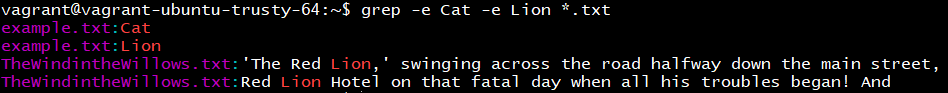
* The `-e` command-line option also helps in scenarios wherein the pattern begins with a hyphen (-). For example, if you want to search for, say, "-mouthed", then the following command `$ grep -mouthed *.txt` won't be helpful. You should use `-e` option.

  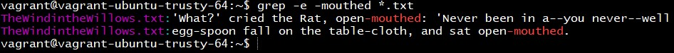

#### Search Gzip files

* `$ zgrep "linux" log.gz` search all lines containing "linux".
* `$ zgrep -i "linux" log.gz` same thing, case-insensitive.
* `$ zgrep -c "linux" log.gz` display the number of matching lines for each file.
* `$ zgrep -n "linux" log.gz` display the line numbers of matching lines.
* `$ zgrep -v "linux" log.gz` invert the search, get all lines not containing "linux".
* `$ zgrep -e "linux" -e "Linux" log.gz` search for multiple patterns.
* `$ zgrep -l "linux" *` Option `-l` will display the names of the files containing the matching lines.
* `$ zgrep -w "linux" log.gz` By default, `zgrep` command displays lines even if the expression is found as a sub-string. This option `-w` only displays lines only if the whole expression is found.
* `$ zgrep -h "linux" *.log.gz` Option `-h` used to display the matched lines but doesn’t display the file names.

#### Limit Grep Output to a Particular Number of Lines

`$ grep -m3 "Project" TheWindintheWillows.txt` stop searching after 3 lines containing the searched pattern have been found.

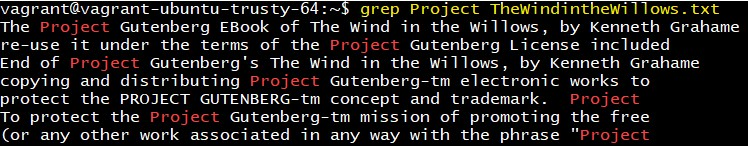  
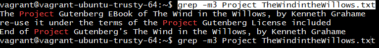

#### Use File as an Input to Grep

`$ grep -f search-keys.txt *.txt` suppose you want to search all the _.txt_ files in the current directory for words "how" and "to", but want to supply these input strings through a file named, say, "search-keys.txt".

#### Display Only Lines that Completely Match the Search Pattern

`$ grep -x "how are you?" *.txt` grep only lines that completely match this pattern.

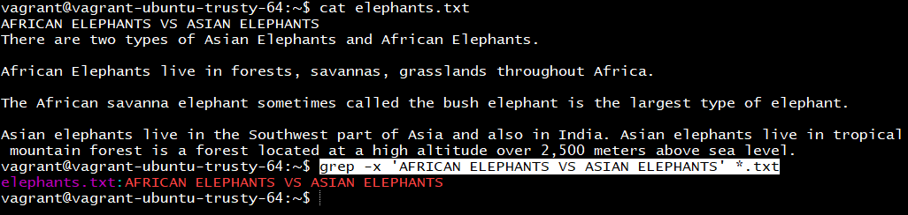

#### Regular Expression Overview

While straightforward pattern matching is sufficient for some filtering tasks, the true power of `grep` lies in its ability to use regular expressions for complex pattern matching.

| Symbol              | Result |
| --- | --- |
| `.`         | Matches any character.|
| `*`       | Matches zero or more characters.|
| `+`       | Matches one or more characters.|
| `[]`        | Matches any of the characters within the brackets.|
| `()`       | Creates a sub-expression that can be combined to make more complicated expressions.|
| `\|`        | OR operator; (www\|ftp) matches either “www” or “ftp”.|
| `{}`     | `{1,3}` requires that the previous characters occur at least once, but no more than three times. |
| `^`       | Matches the beginning of a line.|
| `$`        | Matches the end of the line.|
| `\`        | Escapes the following character. Since `.` matches any character, to match a literal period you would need to use `\..`|

Example

`$ grep -Eoc "^[0-9]{1,3}\.[0-9]{1,3}\.[0-9]{1,3}\.[0-9]{1,3}.* 200"  /srv/www/example.com/logs/access.log` filters an Apache access log for all lines that begin with an IP address, followed by a number of characters, a space and then the characters "200" (where 200 represents a successful HTTP connection). The `-c` option used only to count the number of matches.

To get the output of the IP address of the visitor and the path of the requested file for successful requests, omit the `-c` flag.

`$ grep -Eo "^[0-9]{1,3}\.[0-9]{1,3}\.[0-9]{1,3}\.[0-9]{1,3}.* 200"  /srv/www/example.com/logs/access.log`

The curly brackets specify the number of instances of the pattern. `{1,3}` requires that the previous characters occur at least once, but no more than three times.

The following command generates a list of all IP addresses that have attempted to connect to your web server. Using the `-o` option, only the matching strings are sent to standard output. This output is filtered through the utility `uniq` with the pipe operator (`|`) to filter out duplicate entries:

`$ grep -Eo "^[0-9]{1,3}\.[0-9]{1,3}\.[0-9]{1,3}\.[0-9]{1,3}" /srv/www/example.com/logs/access.log | uniq`

`$ grep -Eo "Invalid user.*([0-9]{1,3}\.){3}[0-9]{1,3}" /var/log/auth.log`  search the most recent /var/log/auth.log file for invalid login attempts.

Grep can filter the output of commands such as `tail -F` to provide real-time monitoring of specific log events:

`$ tail ~/.procmail/procmail.log -F | grep "Subject"` In this case, tail follows the `~/procmail/procmail.log` file. This output is passed to `grep`, which filters the stream and prints only lines that contain the string “Subject”.

### `sort` Command

* `$ sort names.txt` sort the file content alphabetically.
* `$ sort -r names.txt` return the result in reverse order.
* `$ sort -f names.txt` case-insensitive sorting.
* `$ sort -k2,2` sort 2nd column.  
  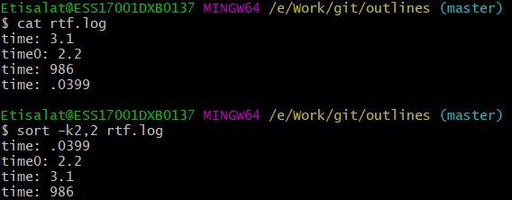

### `PATH` Variable

* `$ $PATH` show system path variable.
* `$ PATH = $PATH:/new/dir/here` add new path, it will be removed when you close the shell.

```bash
$PATH: /usr/local/sbin:/usr/local/bin:/usr/sbin:/usr/bin:/sbin:/bin:/usr/games:/usr/local/games
```

When you type `ls`, linux will start looking for executable file in `/usr/local/sbin` if not found then `/usr/local/bin` then `/usr/sbin` then `/usr/bin`... until it finds in `/bin` and execute it.

### `id` Command

* `$ id` find out user, group names, numeric ids of current or any other user in the system.
* `$ id -g mahmoud` find only the effective group id for this user.
* `$ id -G mahmoud` find all group IDs.
* `$ id -u mahmoud` find effective user id for this user.

### `tar` Command

Zip and unzip files of the `.tar` format.

* `$ tar -cvf filename source-folder` zip file.
* `$ tar -xvf filename` unzip file.

### `cut` Command

Cut portion of a file using columns and delimiters

* `$ cut -c1-2 demo.txt` it will cut and display first and second columns only of all rows.
* `$ cut -c1 demo.txt`  it will cut and display first column only of all rows.

### `sed` Command

Sed is a text editor which can perform editing operations in non interactive way.

`$ sed 's/cat/dog/' animals.txt` it will replace all "cat" strings with "dog" strings, it just print it out, file content will not be changed.

### `uniq` Command

Remove all duplicate lines in a file.

`$uniq filename` it will print out file content without any _line_ duplication.

### `awk` Command

Manipulating data and generating reports.

* `$ awk '{print}' ip.txt` it will print file content.
* `$ awk '/cat/ {print}' animals.txt` it will print every line contains cat.

### `tr` Command

`$ cat animals.txt | tr "[a-z]" "[A-Z]"` transform uppercase to lowercase.

### `env` Command

`$ env` print environment variables

### `df` and `du` Commands

* `df` _disc free_ command reports the amount of available disc space being used by the file systems.
* `du` _disc usage_ command reports the size of directory trees inclusive of all their content and the size of individual files.

The aim is to make sure you're not overshooting the 80% threshold, if you exceed the threshold it's time to clean or scale up your resources.

* `$ sudo df -h`
* `$ sudo du -h -d 1 /var/` show directories which consumes a lot of disc space.

### `whatis` and `apropos` Commands

Each Unix/Linux distro comes with a massive set of man pages.

`whatis` displays one-line manual page descriptions, intended to give you a general idea of what a program do, while `apropos` searches the manual page names and descriptions, intended to help you to learn what program to use when performing a certain job.

```bash
$ whatis df
df (1)               - report file system disk space usage
```

```bash
$ apropos unzip
bunzip2 (1)          - a block-sorting file compressor, v1.0.6
funzip (1)           - filter for extracting from a ZIP archive in a pipe
gunzip (1)           - compress or expand files
lz (1)               - gunzips and shows a listing of a gzip'd tar'd archive
preunzip (1)         - prefix delta compressor for Aspell
unzip (1)            - list, test and extract compressed files in a ZIP archive
unzipsfx (1)         - self-extracting stub for prepending to ZIP archives
uz (1)               - gunzips and extracts a gzip'd tar'd archive
```

`$ apropos working directory` list all the commands that may work with the working directory.

### `ssh` Command

Secure shell. Connect securly to different machine.

### `chown` Command

Change the user and/or group ownership of a given file, directory, or [symbolic link](#Symbolic-Links).

In Linux, all files are associated with an owner and a group and assigned with permission access rights for the file owner, the group members, and others.

* `$ chown mahmoud file1` change the ownership of a file named "file1" to a new owner named "mahmoud".
* `$ chown mahmoud file1 dir1` change the ownership of a file named "file1" and directory "dir1" to a new owner named "mahmoud".
* `$ chown 1000 file2` the numeric user ID (UID) can be used instead of the username. This will change the ownership of a file named "file2" to a new owner with UID of 1000.
* `$ chown mahmoud:users file1` change the ownership of a file named "file1" to a new owner named "mahmoud" and group "users".
* `$ chown mahmoud: file1` if you omit the group name after the colon (`:`) the group of the file is changed to the specified user's group.  
  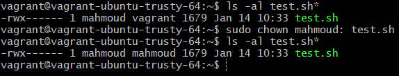
* `$ chown :www-data file1` change the owning group of a file named "file1" to "www-data".
* Another command that you can use to change the group ownership of files is `$ chgrp`.
* `$ chown -R www-data: /var/www` change the ownership of all files and subdirectories under the "/var/www" directory to a new owner and group named "www-data".
* `$ chown -hR www-data: /var/www` if the directory contains symbolic links pass the `-h` option.

#### How to Change Symbolic Links Ownership

Changing [Symbolic Links](#Symbolic-Links) Ownership - when the recursive option is not used -, `chown` command changes the group ownership of the files to which the symlinks points, not the symbolic links themselves.

For example, if you try to change the owner and the group of the symbolic link "symlink1" that points to "/var/www/file1", `chown` will change the ownership of the file or directory the symlink points to:

`$ chown www-data: symlink1`

Chances are that instead of changing the target ownership, you will get a “cannot dereference ‘symlink1’: Permission denied” error.

The error occurs because by default on most Linux distributions symlinks are protected, and you cannot operate on target files. This option is specified in /`proc/sys/fs/protected_symlinks`. `1` means enabled and `0` disabled. We recommend not to disable the symlink protection.

To change the group ownership of the symlink itself, use the `-h` option:

* `$ chown -h www-data symlink1`

#### Change Ownership Using a Reference File

* `$ chown --reference=ref_file FILE`

The `--reference=ref_file` option allows you to change the user and group ownership of given files to be same as those of the specified reference file (`ref_file`). If the reference file is a symbolic link `chown` will use the user and group of the target file.

* `$ chown --reference=file1 file2` will assign the user and group ownership of the "file1" to "file2".

### `chmod` Command

Control who can access files, search directories, and run scripts. check [File Permissions](#File-Permissions).

### `watch` Command

Watch is used to run any arbitrary command at regular intervals and displays the output of the command on the terminal window.

It is useful when you have to execute a command repeatedly and `watch` the command output change over time. For example, you can use the `watch` command to monitor the system uptime or disk usage.

* `$ watch date`

The `watch` command will temporarily clear all of the terminal content and start running the provided command at regular intervals. When used without any option `watch` will run the specified command every two seconds.

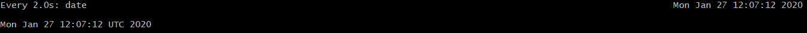

On the top left side of the screen header you can see the `watch` update interval and the executed command (`Every 2.0s: date`), while on the top right side watch shows the current time and date. If you want to turn off the header use the `-t`(`--no-title`) option.

* `$ watch -t date`

Most used options

* `$ watch -n 5 df -h` monitor disk space usage and refresh the screen every five seconds. `-n` (`--interval`) to change the interval.
* `$ watch -td date` Option `-d` (`--difference`) option will cause watch to highlight the changes between successive updates.
* `$ watch -t -d=cumulative date` if you want the highlights to be sticky, pass `-d=cumulative` option. This means that all values that have ever changed will stay highlighted.

Watch Command with Pipes

If you want to execute a command that contains pipes you need to enclose the command in single or double quotes. If you don't enclose the full command watch will run just the first command and then pipe its output to the next command in the pipeline.

* `$ watch "netstat -anp | grep -c ':80\b.*LISTEN'"`
  * `-a` displays all connections and listening ports. (Server-side connections are normally not shown).
  * `-n` displays addresses and port numbers in numerical form.
  * `-p` it will show `PID/Program Name` column for each protocol (`proto` column); `proto` may be `tcp` or `udp`. If used with the `-s` option to display per-protocol statistics, `proto` column may be `tcp`, `udp`, or `ip`.
  * `-s` displays per-protocol statistics.

### `lsof` Command

`lsof` meaning ‘List Open Files’ is used to find out which files are open by which process. Linux/Unix considers everything as a files (pipes, sockets, directories, devices etc). One of the reason to use `lsof` command is when a disk cannot be unmounted as it says the files are being used. With the help of this command we can easily identify the files which are in use.

It will show long listing of open files which displays the columns like `COMMAND`, `PID` (process id), `USER` (user associated with the process), `TYPE`, `FD` (file descriptor, `cwd` means current working directory).

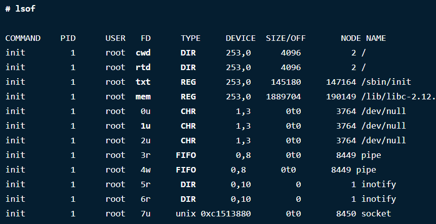

`FD` – stands for File descriptor and may seen some of the values as:

* `cwd`: current working directory.
* `rtd`: root directory.
* `txt`: program text (code and data).
* `mem`: memory-mapped file.
* `mmap`: Memory mapped device.

Also in `FD` column numbers like `1u` is actual file descriptor and followed by `u`, `r` or `w` of it’s mode as

* `r` for read access.
* `w` for write access.
* `u` for read and write access.

`TYPE` – of files and it’s identification.

* `DIR`: Directory.
* `REG`: Regular file.
* `CHR`: Character special file.
* `FIFO`: First In First Out.

Useful Options

* `$ lsof -u mahmoud` list files opened by a specific user.
* `$ lsof -i TCP:22` find processes running on specific port.
* `$ lsof -i TCP:1-1024` list all the running process of open files of TCP Port ranges from 1-1024.
* `$ lsof -i 4` & `$ lsof -i 6` list only IPv4 & IPv6 open files. Shows only IPv4 and IPv6 network files open with separate commands.
* `$ lsof -i -u^root` Character `^` for excluding root user.
* `$ lsof -i -u mahmoud` find out who’s looking what files and commands. This will shows user "mahmoud" is using command like `ping` and /etc directory.
  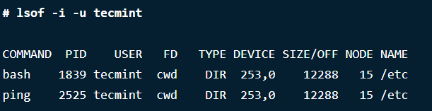
* `$ lsof -i` Option `-i` shows the list of files opened by network connections "LISTENING" & "ESTABLISHED".
* `$ lsof -c Mysql` list all open files by a particular Process.
* `$ lsof -p 10` search by `PID`. This shows open files whose `PID` is 10.
* `$ lsof -p ^10` files opened by all other `PID`.

### `kill` Command

* `$ kill -9 \`lsof -t -u mahmoud\`` kill all activity of particular user.

### `ps` Command

Linux is a multitasking and multi-user systems. So, it allows multiple processes to operate simultaneously without interfering with each other.

Process is one of the important fundamental concept of the Linux OS. A process is an executing instance of a program and carry out different tasks within the operating system.

Linux provides us a utility called `ps` (which stands as abbreviation for "Process Status") for viewing information related with the processes on a system.

`ps` command is used to list the currently running processes and their PIDs along with some other information depends on different options. It is one of the important utilities for system administration specifically under process monitoring, to help you understand whats is going on a Linux system.

It reads the process information from the virtual files in `/proc` file system. `/proc` file contains virtual files, this is the reason it’s referred as a virtual file system.

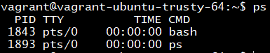

* PID – the unique process ID.
* TTY – terminal type that the user is logged into.
* TIME – amount of CPU in minutes and seconds that the process has been running.
* CMD – name of the command that launched the process.

Useful Commands

* `$ ps -A` or `$ ps -e` view all the active running processes.
* `$ ps -T` view all processes associated with this terminal.
* `$ ps -x` display user's running processes.
* `$ ps -fu vagrant` display running processes by different user.
* `$ ps -U root` Option `-u root` print all processes running as root.
* `$ ps -fG postgres` list all processes owned by a certain group (real group ID (RGID) or name), type.
* `$ ps -fp 1139` list process by it process id.

For various options check this [link](https://www.tecmint.com/ps-command-examples-for-linux-process-monitoring/). Also you can check [Process management in linux](https://www.tecmint.com/linux-process-management/).

### `dd` Command

`dd if = /dev/hda of = /dev/hdb` copy entire hard desk "hda" to "hdb", `if`: input file, `of` output file.

### `free` Command

Show amount of memory, swap memory and buffers used by the kernel.

* `$ free -b` display memory in bytes.
* `$ free -k` display memory in kilobytes - this is the default.
* `$ free -m` display memory in megabytes.
* `$ free -g` display memory in gigabytes.

### `eval` Command


```bash
foo=10 x=foo
y='$'$x # result is '$foo'
echo $y # result is '$foo'
$foo
eval y='$'$x # it will first evaluate $x to the string 'foo'. Now we have the statement y=$foo which will get evaluated to y=10.
echo $y # result is 10
10
```

### `ifconfig` Command

* `ifconfig` is deprecated use [`ip` command](#ip-command) instead.
* `ifconfig` configure the kernel resident network interfaces. It's used at the boot time.
* `$ ifconfig -a` show all interfaces even if they're down.
* `$ ifconfig -s` show short list of all interfaces even if they're down.

### `ip` Command

* `$ ip address show` show all ip addresses associated on all network devices. It will just display the IP addresses assigned to all interfaces. To be precise, it will show you the layer 3 details the interface: the IPv4 and IPv6 addresses, whether it is up, what are the different properties related to the address.
* `$ ip link show` display link layed information. It will give you details about the layer 2 properties of the interface: its MAC address (ethernet address), etc; even if it is shown by ip address.
* `$ ip link set DEVICE up` or `$ ip link set DEVICE down` set devices up or down (similar to `$ ifconfig eth0 up` or `$ ifconfig eth0 down`)

### `netstat` Command

Netstat command displays various network related information such as network connections, routing tables, interface statistics, masquerade connections, multicast memberships etc.

* `$ netstat` display network information. By default, the command displays a list of all open sockets.
* `$ netstat -a` display all connections, listening and non listening ports that are available.
* `$ netstat -at` Option `t` to display all `tcp` connections that are available.
* `$ netstat -au` Option `u` to display all `udp` connections that are available.
* `$ netstat -ax` Option `x` to display all linux ports that are available.
* `l` show only listening sockets. eg: `$ netstat -lx` show only listening linux ports, `$ netstat -lt` show only listening `tcp` ports.
* `-n` display addresses and port numbers in numerical form. `10.0.2.15:22` instead of `vagrant-ubuntu-trus:ssh`.
* `-p` it will show `PID/Program Name` column for by each protocol (`proto` column); `proto` may be `tcp` or `udp`. If used with the `-s` option to display per-protocol statistics, `proto` column may be `tcp`, `udp`, or `ip`. eg: `$ netstat -pt` display the PID and program name for `tcp`.
* `-s` display summary statistics for each protocol. eg: `$ netstat -su` list the statistics for `UDP` ports, `$ netstat -st` list the statistics for `TCP` ports
* `-c` print the netstat information continuously.
* `-M` display a list of masqueraded connections.
* `-i` display a table of all network interfaces.
* `-g` display multicast group membership information for IPv4 and IPv6.
* `-r` display the kernel routing tables.
* `$ netstat -ap | grep ssh` get the port on which a program is running.
* `$ netstat -an | grep ':80'` which process is using a particular port.
* `$ netstat -ie` display extended information on the interfaces, similar to `ifconfig`.
  
### `nslookup` Command

`$ nslookup google.com` name server lookup. Getting information from DNS server.

### Commands Exercise

Resources

* [Extracting Information From Logs - Part 1](https://bash-prompt.net/guides/using-logs-1/)
* [Extracting Information From Logs - Part 2](https://bash-prompt.net/guides/using-logs-2/)
* [Extracting Information From Logs - Part 3](https://bash-prompt.net/guides/using-logs-3/)

SSH logs every successful and unsuccessful login attempt. However, the file that this gets written to is not the same for all distributions. Ubuntu and Debian use the file `/var/log/auth.log` and RedHat based distributions use `/var/log/secure`.

* `$ grep "Invalid user" secure`
* `$ grep "pam_unix(sshd:auth): authentication failure" secure`
* `$ echo "Aug 23 03:53:58 centos7 sshd[5501]: Invalid user agent from 193.201.224.218" | awk '{print $10}'` print 10th string.
* `$ grep "Invalid user" secure | awk '{print $10}' > IPs.txt`
* `$ cut -d"=" -f2` the `-d` option is the "delimiter" or the character that splits the text strings. And the `-f` is the "field" or text string number which we need counting from left to right.
* `$ echo "Aug 23 05:08:33 centos7 sshd[5187]: pam_unix(sshd:auth): authentication failure; logname= uid=0 euid=0 tty=ssh ruser= rhost=218.65.30.123  user=root" | awk '{print $14}'`
* `$ echo "Aug 23 05:08:33 centos7 sshd[5187]: pam_unix(sshd:auth): authentication failure; logname= uid=0 euid=0 tty=ssh ruser= rhost=218.65.30.123  user=root" | awk '{print $14}' | cut -d"=" -f2`
* `$ grep 'pam_unix(sshd:auth): authentication failure;' secure | awk '{print $14}' | cut -d"=" -f2 >> IPs.txt`
* `$ grep 'pam_unix(sshd:auth): authentication failure;' secure | awk '{print $14}' | cut -d"=" -f2 | sort | uniq -c >> IPs.txt` get ips, sort them and then distinct ips
  * `uniq` only a single instance of each IP will remain.
  * `uniq` takes the `-c` option which makes it print the number of times each line occurred.
* `$ grep 'pam_unix(sshd:auth): authentication failure;' secure | awk '{print $14}' | cut -d"=" -f2 | sort | uniq -c | sort -n` final step is to sort the lines by the number of times IP occurred in the log file. This is done with the `sort` command using `-n` option. The `-n` option will force sort to sort on the number at the beginning and therefore rank the IP by the number of login attempts they made.
  * if you want reverse order use `-r` with sort. `$ grep 'pam_unix(sshd:auth): authentication failure;' secure | awk '{print $14}' | cut -d"=" -f2 | sort | uniq -c | sort -n -r`
* Now we'll try to know from which country this login attempt originated.
  * `$ for i in $(grep 'pam_unix(sshd:auth): authentication failure;' secure | awk '{print $14}' | cut -d"=" -f2 | sort | uniq); do echo "$i $(whois $i | grep -m1 country | awk '{print $2}')"; done`
  * Note `whois` command returns more info, we need only country so we did filtering.
* It would be even prettier if the country codes lined up. The `column` command is a tool dedicated to putting information into neat columns.
  * `$ for i in $(grep 'pam_unix(sshd:auth): authentication failure;' secure | awk '{print $14}' | cut -d"=" -f2 | sort | uniq); do echo "$i $(whois $i | grep -m1 country | awk '{print $2}')"; done | column -t`

## Linux

Linux is a Unix-like, open source and community developed operating system for which it's capable of handling activities from multiple users at the same time.

It has evolved to run in wide variety of hardware from phone to super computers. Every Linux based OS involves the Linux kernel which manages the hardware resources and a set of software packages that make up the rest of the operating system.

The Unix system was originally designed in an era when the connections between computers and terminals were very slow, so making commands really short made it much faster to use. This is true not only for the shell, but also for other parts of the Unix system, such as the C programming language.

### Unix vs Windows Base

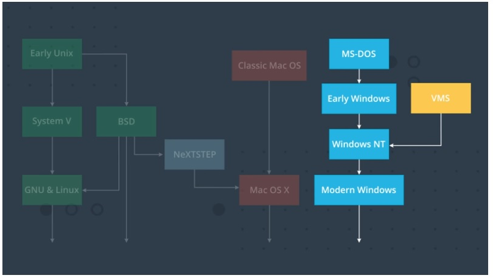

### Linux Home Directory

All standard user's home directories will be within the `/home/` directory. eg: `/home/mahmoud`.

The root user is a special case, its home directory is in `/root/`.

### Linux Important Directories

* `/home`
* `/etc` for configuration files.
* `/var` variable files, files to grow or change in size over time.
* `/bin` executable binaries that is accessible by all users like `ls`, `date`, `chmod` command.
* `/sbin` directory holds all of the applications you may need as an administrator, but normal users typically won't use. It's very similar to `/bin`, except these binaries be used by 'root' user for system administration and maintenence purposes.
* `/lib` libraries that support the binaries located around the system.
* `/usr` for user programs, difference between it and `/bin` is `/bin` binaries required during system boot.

### Linux Security

* The rule in linux is least privilege.
* User `root` is super powerful user, he can do anything they want.
* It is common to disable login with user `root` and log in as a user we create, and then can run individual commands as `root` by using another commands.
* Our [vagrant virtual machine](#Installation-and-Starting) has already setup the security pattern for us, and many other cloud providers will do this for you as well, if not, it should be the first task you do when you setup a new server.
* `$ sudo ls /home/ubuntu/.ssh` it will run the `ls` command as if we are a `root` user.

### `sudo` and `su` commands

Difference between `su` and `sudo`

* `sudo` and `su` are two different ways to gain `root` privileges.
* `su` stands for super user or `root` user, when you execute it with no additional options. You’ll have to enter the `root` account’s password.
  * You can use it to switch to any user account, ex: `su mahmoud` and enter mahmoud's password.
  * Once you’re done running commands in the `root` shell, you should type exit to leave the `root` shell and go back to limited-privileges mode.
* `sudo` runs a single command with `root` privileges.
  * When you execute `sudo` command, the system prompts you for your current user account’s password before running command as the `root` user.
  * By default, Ubuntu remembers the password for fifteen minutes and won’t ask for a password again until the fifteen minutes are up.
* This is the key difference between `su` and `sudo`. Su switches you to the `root` user account and requires the `root` account’s password. Sudo runs a single command with `root` privileges – it doesn’t switch to the `root` user.

Sudo command examples

* `$ su root` or just `$ su` switch to root user.
* Use `$ sudo bash` if `$ su` doesn't work. It will switch you to root user.
* `$ sudo adduser mahmoud` or `$ sudo useradd mahmoud` add a user.
* `$ sudo passwd mahmoud` set password for a user.
* `$ sudo userdel mahmoud` delete a user.
* `$ sudo groupadd techies` add a group to the system.
* `$ sudo groupdel techies` delete a group from the system.

### Package Source List

* `$ cat /etc/apt/sources.list` keep your software up to date with the new release.
* `$ sudo apt-get update` system will only check and know the recent version.
* `apt` means advanced packaging tool.
* for ubunto use 'apt-get' for centos use 'yum'
* `$ sudo apt-get upgrade` system will do the actual update/upgrade, this should be reviewed first in non production environment.
* `$ sudo apt-get update && sudo apt-get upgrade` run first command if succeed, run the second command.
* `$ sudo apt-get autoremove` auto remove unnecessarily packages.
* `$ sudo apt-get install tree` install `tree` program.

### Finger Program

The `finger` program tells you some information about the currently logged in users on your Linux or Unix-like operating system.

* `$ sudo apt-get install finger` install `finger` program.
* `$ finger` output information about all the currently logged in users.

  * **Login**: The user account name of the person who is logged in.
  * **Name**: The full name of the person, if this is known to the system.
  * **Tty**: The type of terminal they are logged in at. This will usually be a pts (a pseudo-teletype). “:0” means the physical keyboard and screen connected to the computer.
  * **Idle**: The idle time of the user. If it is a single digit, it means minutes. If a colon is present, it means hours and minutes, and if a “d” is present, it means days and hours.
  * **Login Time**: The time the person logged in.
  * **Office**: This is a historical hangover. It was used to display the name or number of the room in which the person worked. This is very rarely set up by root nowadays. Instead, finger will display the ip address of the machine the user has logged in from.  “:0” means the physical keyboard and screen connected to the computer.
  * **Office Phone**: This is another legacy item. If root hasn’t recorded the office phone number for a person, it will show a blank.
* `$ finger ubuntu` output information about user ubuntu in long format.  
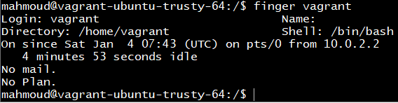
  * **Directory**: The person’s `home` directory.
  * **Shell**: The shell they are using.
  * **On Since**: The time and date the user logged in, from which tty and which IP address.
  * **Mail**: If they have mail this is shown. If they have recently checked their mail, the time they checked it is shown. Vagrant has no mail waiting for him.
  * **Plan**: If the user creates a “.plan” and “.project” file in their home directory, and puts a bit of text inside them describing what they are working on, the contents of those files will be shown here. This is a system that is very rarely used today. We are told Vagrant has no plan. That’s not an indictment on his career strategy, it means he hasn’t bothered updating his “.plan” file. You can confgure  “.plan” and “.project” files.
* `$ finger -l` show all users in long format.
* `$ cat /etc/passwd` finger gets users information from this file.
  * `root:x:0:0:root:/root:/bin/bash`
  * `vagrant:x:1000:1000::/home/vagrant:/bin/bash`
  * `ubuntu:x:1001:1001:Ubuntu:/home/ubuntu:/bin/bash`
  * `mahmoud:x:1002:1002:Mahmoud Sabah Allah,,,:/home/mahmoud:/bin/bash`
  * `username` : `encrypted password in old days` : `user id` : `group id` : `full name` : `home dir` : `default shell`
* `$ sudo adduser mahmoud`
* `$ finger mahmoud`
* To connect to this user "mahmoud" from different machine, open new terminal and type `$ ssh mahmoud@localhost -p 2222`, then enter password for mahmoud.
* If you try to run command `$ sudo cat /etc/passwd` using user 'mahmoud', you will get error "mahmoud is not in the sudoers files. This incident will be reported."
* to fix this go back to vagrant terminal
* `$ sudo cat /etc/sudoers`.
* `$ sudo ls /etc/sudoers.d`.
* `$ sudo cp /etc/sudoers.d/vagrant /etc/sudoers.d/mahmoud`.
* `$ sudo nano /etc/sudoers.d/mahmoud`.
* `$ sudo passwd -e mahmoud` force user 'mahmoud' to reset password next time they login.

### Key Based Authentication

Key based authentication doesn't rely on password. So how public key encryption generally works?

* Server will send message to the client.
* Client will encrypt the message with the private key, then send to the server.
* Server will decrypt the message using the public key.
* If decrypted message is the same as the original message, client is authenticated.

Apply Key Based Authentication in Linux Machine

To do so, on your local machine run the following:

* `$ ssh-keygen` generate public/private authentication key-pair.
* `$ ssh-keygen` enter the file path and file name `.ssh/linuxcourse`, then it will generate two keys public and private.
  * `ssh` is a protocol.
  * `ssh` version 2 supports key types `RSA`, `DSA`, `ECDSA` and `ED25519`.
  * `$ ssh-keygen -t rsa` use `rsa` technique.
* Install public key on the server
  * login to server as mahmoud.
  * `$ mkdir .ssh`
  * `$ touch .ssh/authorized_keys`
  * copy public key from your client machine.
  * `$ nano .ssh/authorized_keys` and paste the public key.
* Restrict accessing to `.ssh` directory.
  * `$ chmod 700 .ssh` add permission to make sure other users can't access your account.
  * `$ chmod 644 .ssh/authorized_keys` add file permission to make sure other users can't access your account.
* Back to your local machine and try to login to remote server using the private key.
* `$ ssh mahmoud@localhost -p 2222 -i ~/.ssh/linuxcourse`
* Disable password authentication (force user to use key based authentication).
  * `$ sudo nano /etc/ssh/sshd_config` edit configuration file that `sshd` service is listening to all of your ssh connections, change `PasswordAuthentication` to `no`.
* `$ sudo service ssh restart` restart the `ssh` service to read the configuration file.
* Now if you try to login from your local machine using user mahmoud via password authentication, you will get permission denied.

### File Permissions

`drwxrwxrwx` [`d` directory or file ?] [`rwx` owner: read write execute] [`rwx` group: read write execute] [`rwx` everyone else: read write execute]
  
* ex: `drwxr-xr-x` or `-rw-r--r--`

Octal permissions [r=4,w=2,x=1]

* ex: `drwxr-xr-x` = 755
* `$ chmod 755 .ssh`

You can use the full command

* `u`: User, meaning the owner of the file.
* `g`: Group, meaning members of the group the file belongs to.
* `o`: Others, meaning people not governed by the `u` and `g` permissions.
* `a`: All, meaning all of the above.

ex:

* `$ chmod u=rw,og=r new_file.txt` give read write access to user and read access only to group and anyone else.

Using the `=` operator means we wipe out any existing permissions and then set the ones specified.

How about adding a permission _without_ removing the existing permissions settings?

Let’s say we have a script file that we have finished editing. We need to make it executable for all users.

* `$ chmod a+x new_script.sh` the execute permission `x` is now granted to everyone `a`, and the existing permissions are still in place.
* `$ chmod +x new_script.sh` same as before, but we didn't put `a` if it's for everyone.

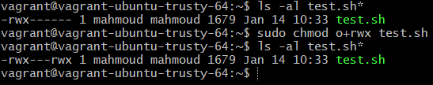

Setting Permissions for Multiple Files

* `$ chmod o-r *.page` remove (`-`) read permission of the others from all files with `.page` extension.

If we had wanted to include files in subdirectories, we could have used the `-R` (recursive) option.

* `$ chmod -R o-r *.page`

Change owner and group

* `$ sudo chgrp root .bash_history` change group of the directory ".bash_history".
* `$ sudo chown root .bash_history` change owner of the directory ".bash_history".

You can also refer to [full section of chown command](#chown-Command)

### Firewalls

How does your server (linux machine) know which application is in charge of handling each type of request? The answer is firewall.

Each of your applications are configured to respond to requests destined for a specific port. Server listens to ports then redirect request to specific application. We can control which ports our server is allowed to accept requests by using application called firewall.

Ports for famous protocols

* HTTP (80)
* HTTPS (443)
* SSH (22)
* FTB (21)
* POP3 (110)
* SMTP (25)

### `iptables`

It’s the basics of Firewall for Linux. Iptables is a rule based firewall system and it is normally pre-installed on a Unix operating system which is controlling the incoming and outgoing packets. By-default the iptables is running without any rules, we can create, add, edit rules into it.

`$ service iptables stop` disable the firewall.

### Least Privilege Principle

We should only listen on the ports required for our applications to function correctly.

Ubuntu comes with a firewall pre-installed called `ufw`, but it's not active by default, you should configure it first, then enable it.

* `$ sudo ufw status`
* `$ sudo ufw default deny incoming`
* `$ sudo ufw default allow outgoing`
* `$ sudo ufw allow ssh`
* `$ sudo ufw allow www`
* `$ sudo ufw enable` take care of this step, if anything went wrong, you'll lose any active ssh connection.
* `$ sudo ufw status`

There are a lot of different types of servers, email servers, chat servers, web application servers...

Generally the only big difference between each of these is the software they have installed and the ports that they have open.

### Web Application Servers

Use the Apache HTTP Server to respond to HTTP requests and serve a static webpage. We’ll setup our web application server one piece at a time.

The first step is to get your server responding to HTTP requests. To do this, you’ll use Apache HTTP Server - the most commonly installed web server on the internet with roughly 47% market share.

You need to update `Vagrantfile` with below configuration, to enable route request from your machine to linux server.

`config.vm.network "forwarded_port", guest: 80, host: 8080, host_ip: "127.0.0.1"`

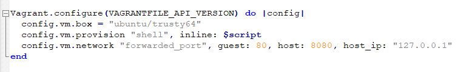

* `$ sudo apt-get install apache2`
* `$ vagrant halt`
* `$ vagrant up`
* `$ vagrant ssh`

Then try `localhost:8080` from your web browser.

When Apache receives a request it has a number of ways it can respond. What you’ve seen thus far is the simplest method of operation, Apache just returns a file requested or the index.html file if no file is defined within the URL.

But, Apache can do so much more! You’ll now configure Apache to hand-off certain requests to an application handler `mod_wsgi`.

The first step in this process is to install `mod_wsgi`:

* `$ sudo apt-get install libapache2-mod-wsgi`

You then need to configure Apache to handle requests using the WSGI module. You’ll do this by editing the `/etc/apache2/sites-enabled/000-default.conf` file

This file tells Apache how to respond to requests, where to find the files for a particular site and much more.

You can read up on everything this file can do within the Apache documentation.

For now, add the following line at the end of the `<VirtualHost *:80>` block, right before the closing `</VirtualHost>`

`WSGIScriptAlias / /var/www/html/myapp.wsgi`

Edit file `/etc/apache2/apache2.conf` and add line:

`ServerName localhost`

Finally, restart Apache with the below command

* `$ sudo apache2ctl restart command`

[WSGI](http://wsgi.readthedocs.io/en/latest/) is a specification that describes how a web server (ex: linux machine) communicates with web applications.

Most if not all Python web frameworks are WSGI compliant, including Flask and Django; but to quickly test if you have your Apache configuration correct you’ll write a very basic WSGI application.

You just defined the name of the file you need to write within your Apache configuration by using the `WSGIScriptAlias` directive.

Despite having the extension `.wsgi`, these are just Python applications.

Create the `/var/www/html/myapp.wsgi` file using the command

* `sudo nano /var/www/html/myapp.wsgi`

Within this file, write the following application:

```python
def application(environ, start_response):
status = '200 OK'
output = 'Hello User!'

response_headers = [('Content-type', 'text/plain'), ('Content-Length', str(len(output)))]
start_response(status, response_headers)

return [output]
```

This application will simply print return Hello User! along with the required HTTP response headers.

After saving this file you can reload <http://localhost:8080> to see your application run in all its glory!

### Install Postgresql Sql

`$ sudo apt-get install postgresql`

Since you are installing your web server and database server on the same machine, you do not need to modify your firewall settings.

Your web server will communicate with the database via an internal mechanism that does not cross the boundaries of the firewall.

If you were installing your database on a separate machine, you would need to modify the firewall settings on both the web server and the database server to permit these requests.

### Exercise

Update your `/var/www/html/myapp.wsgi` application so that it successfully connects to your database, queries a table for data and presents that piece of data rather than the text Hello World!.

You will need to create a table and populate it with data of your choosing, then query it from your app.

## Bash Scripting

Bash scripts are often small tools used to automate tedious and repetitive tasks.

Shell scripts are quite handy because you need not compile them, plus they use ordinary shell commands.

Shell programming can be accomplished by directly executing shell commands at the shell prompt or by storing them in the order of execution in a text file, called a shell script, and then executing the shell script. To execute, simply write the shell script file name. Make sure the file has execute permission (`$ chmod +x filename`).

### The Shebang (#!)

Shell script starting with `#!/bin/bash` which tells the operating system that this file is a set of commands to be fed into the interpreter indicated in this path.

### Running Bash Script

When you just type a name on the command line, bash tries to find it in a series of directories stored in a variable called `$PATH`. The directories are separated by `:`. Bash only looks in those specific directories and doesn't consider sub directories or your current directory. It will look through those directories in order and execute the first instance of the program or script that it finds.

If a program or script is not in one of the directories in your `$PATH` then you can run it by telling bash where it should look to find it.

* `$ /home/ryan/myscript.sh`

### Why Bash is Important for Software Developers

* For management of code repository, testing, checking the test results and even writing the test suites, shell scripting is a must.
* There are a lot of mundane jobs which can be done easily using the shell scripting without taking the help from high level languages. ex: tailing logs, setting up alarms etc
* If you are writing a code for any sort of file management, your first choice should be a shell script as well.
* For basic house keeping stuff, scheduling etc, it is better to take help from the shell instead from a sophisticated language.
* Doing routine software development stuff; code pull, setting up and running tests, deployment to production systems.
* If you are a devops using Unix environment, you must be proficient in bash. I’m not sure if you can manage Unix infrastructure without being proficient in bash.
* If you are just a normal software developer in a small team, or worse, working solo, bash will be useful. In small team or solo environment, you have to squeeze every opportunity for productivity improvement. Meanwhile, bash is one of the most powerful productivity tool available in Unix computers.
* If you are just a normal software developer in a large team, bash skill is needed only if it is explicitly required, otherwise it’s optional. Large team usually already has its own way of doing things, which often you have to follow. Moreover, in large team, individual productivity usually matters less. It’s more important to have the whole team being able to work seamlessly and cohesively.
* Another reason is automation, bash is way better with rsync and crontab for such tasks.

### Variables

```bash
PRICE_PER_APPLE=5
MyFirstLetters=ABC
greeting='Hello    world!'

# A backslash `\` is used to escape special character meaning.
echo "The price of an Apple today is: \$$PRICE_PER_APPLE"

# Encapsulating the variable name with ${} is used to avoid ambiguity.
echo "The first 10 letters in the alphabet are: ${MyFirstLetters}DEFGHIJ"

# Encapsulating the variable name with "" will preserve any white space values.
echo $greeting
echo "Now with spaces: $greeting"
```

Variables can be assigned with the value of a command output. This is referred to as _substitution_. Substitution can be done by encapsulating the command with `` (known as back-ticks) or with $()

```bash
FILELIST=`ls` # When script runs, it will run ls command and store the output in FILELIST variable
FileWithTimeStamp=/tmp/my-dir/file_$(/bin/date +%Y-%m-%d).txt # When script runs, it will run the command inside $() and capture its output and concatenate to the rest of the value.
```

```bash
BIRTHDATE="Jan 1, 2000"
Presents=10
BIRTHDAY=`date -d "$BIRTHDATE" +%A` # 'date' command can be used to convert a date format into a different date format. For example, this will convert date value $BIRTHDATE to day of the week of BIRTHDATE which is Saturday
echo BIRTHDAY
Saturday
```

* Single quotes will treat every character literally.
* Double quotes will allow you to do substitution (that is include variables within the setting of the value).

```bash
myvar='Hello World'
echo $myvar
Hello World
newvar="More $myvar"
echo $newvar
More Hello World
newvar='More $myvar'
echo $newvar
More $myvar
```

### Passing Arguments to the Script

In shell scripts or [function](#functions), you use `"$1"` represent the first argument passed to script or function.

`$ ./bin/my_shopping.sh apple 5 banana 8 "Fruit Basket" 15` here we passing 6 argument to the script separated by space.

### Special Variables

Moreover, here are some special variables in shell that you can use inside script or function:

* To use the arguments inside the script, use variables `$1`, `$2`, `$3`, ... `$9` where the number is the argument number.
* The variable `$0` references to the name of current script.
* The variable `$n` refer to the nth argument passed to script or [function](#functions).
* The variable `$#` holds the number of arguments passed to script or [function](#functions).
* The variable `$@` holds a space delimited string of all arguments passed to script or [function](#functions).
* The variable `$*` holds all arguments passed to script or [function](#functions).
* The variable `$?` holds the exit status of the most recently run process or command executed.
* The variable `$$` holds the process ID of the current script under which they are executing.
* The variable `$!` holds The process number of the last background command.
* The variable `$USER` holds the username of the user running the script.
* The variable `$HOSTNAME` holds the hostname of the machine the script is running on.
* The variable `$SECONDS` holds the number of seconds since the script was started.
* The variable `$RANDOM` return a different random number each time is it referred to.
* The variable `$LINENO` retrun the current line number in the Bash script.
* If you type the command `env` on the command line you will see a listing of other variables which you may also refer to.

```bash
#!/bin/bash
echo "No of args: $#"
echo "Your arguments: $@"
echo "************************"
echo $1 $2
PHONE_NUMBER=$3
echo "Your $PHONE_NUMBER is registered in our system"
```

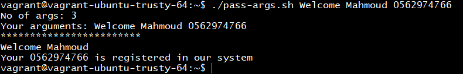

```bash
#!/bin/bash
echo "Script Name: $0"
function name_func {
    for var in $*
    do
        let i=i+1
        echo "The \$${i} argument is: ${var}"
    done
    echo "Total count of arguments: $#"
}
name_func mahmoud ahmed wessam
```

`$@` and `$*` have different behavior when they were enclosed in double quotes.

```bash
#!/bin/bash
function test_args {
    echo "--- \"\$*\""
    for ARG in "$*"
    do
        echo $ARG ## It will print out args in horizontal line
    done

    echo "--- \"\$@\""
    for ARG in "$@"
    do
        echo $ARG ## It will print out args each in seperate lines
    done
}
test_args a bb cc dd
```

### Exporting Variables

Each script is running in its own process. This is named as a scope. The idea is that variables are limited to the process they were created in. For instance, a script may run another script as one of its commands. If we want the variable to be available to the second script then we need to export the variable.

```bash
#!/bin/bash
# demonstrate variable scope 1.
var1=blah
var2=foo
# Let's verify their current value
echo $0 :: var1 : $var1, var2 : $var2
export var1
./script2.sh
# Let's see what they are now
echo $0 :: var1 : $var1, var2 : $var2
```

```bash
#!/bin/bash
# demonstrate variable scope 2
# Let's verify their current value
echo $0 :: var1 : $var1, var2 : $var2
# Let's change their values
var1=flop
var2=bleh
```

Output

```bash
./script1.sh
script1.sh :: var1 : blah, var2 : foo
script2.sh :: var1 : blah, var2 :
script1.sh :: var1 : blah, var2 : foo
```

### User Input

The user may provide input to the Bash script.

* If we would like to ask the user for input then we use a command called `read`. This command takes the input and will save it into a variable.

```bash
#!/bin/bash
# Ask the user for their name
echo Hello, who am I talking to?
# Ask the User for Input
read varname
echo It\'s nice to meet you $varname
```

Two commonly used options however are `-p` which allows you to specify a prompt and `-s` which makes the input silent.

```bash
#!/bin/bash
# Ask the user for login details
read -p 'Username: ' uservar
read -sp 'Password: ' passvar
echo
echo Thankyou $uservar we now have your login details
```

You can supply several variable names to `read` and `read` will then take your input and split it on whitespace. The first item will then be assigned to the first variable name, the second item to the second variable name and so on. If there are more items than variable names then the remaining items will all be added to the last variable name.

```bash
#!/bin/bash
# Demonstrate how read actually works
echo What cars do you like?
read car1 car2 car3
echo Your first car was: $car1
echo Your second car was: $car2
echo Your third car was: $car3
```

Output

```markdown
$ ./cars.sh
What cars do you like?
$ Jaguar Maserati Bentley
Your first car was: Jaguar
Your second car was: Maserati
Your third car was: Bentley
$ ./cars.sh
What cars do you like?
$ Jaguar Maserati Bentley Lotus
Your first car was: Jaguar
Your second car was: Maserati
Your third car was: Bentley Lotus
```

If we would like to make our script able to process data that is piped to it all we need to do is read the relevant file.

* STDIN - `/dev/stdin` or `/proc/self/fd/0`
* STDOUT - `/dev/stdout` or `/proc/self/fd/1`
* STDERR - `/dev/stderr` or `/proc/self/fd/2`

```bash
#!/bin/bash
# A basic summary of my sales report
echo Here is a summary of the sales data:
echo ====================================
echo
cat /dev/stdin | cut -d' ' -f 2,3 | sort
```

Output

```markdown
$ cat salesdata.txt
Fred apples 20 January 4
Susy oranges 5 January 7
Mark watermelons 12 January 10
Terry peaches 7 January 15
$ cat salesdata.txt | ./summary.sh
Here is a summary of the sales data:
====================================
apples 20
oranges 5
peaches 7
watermelons 12
```

`$ cat salesdata.txt` result will be read in the script by `cat /dev/stdin`.

### Arithmetic

```bash
#!/bin/bash
# Basic arithmetic using let
let a=5+4
echo $a # 9

let "a = 5 + 4"
echo $a # 9

let a++
echo $a # 10

let "a = 4 * 5"
echo $a # 20

let "a = $1 + 30"
echo $a # 30 + first command line argument
```

Here is a table with some of the basic expressions you may perform

| Operator | Operation |
| --- | --- |
| +, -, \*, / | addition, subtraction, multiply, divide
| var++       | Increase the variable var by 1
| var--       | Decrease the variable var by 1
| %           | Modulus (return the remainder after division)
| a ** b      | exponentiation (a to the power of b)

`expr` vs `let`

* `expr` is similar to `let` except that `expr` prints the answer instead of saving the result to a variable.
* Unlike `let`, you don't need to enclose the expression in quotes while using `expr`.
* When using `expr`, you also must have spaces between the items of the expression.
* It is also common to use `expr` within command substitution to save the output to a variable.

```bash
#!/bin/bash
# Basic arithmetic using expr
expr 5 + 4

expr "5 + 4"

expr 5+4

expr 5 \* $1

expr 11 % 2

a=$( expr 10 - 3 )

echo $a # result is 7
```

Output

```markdown
$ ./expr_example.sh 12
9
5 + 4
5+4
60
1
7
```

You can also do arithmetic by using double parentheses `$(( expression ))`

```bash
#!/bin/bash

# Basic arithmetic using double parentheses
a=$(( 4 + 5 ))
echo $a # 9

a=$((3+5))
echo $a # 8

b=$(( a + 3 ))
echo $b # 11

b=$(( $a + 4 ))
echo $b # 12

(( b++ ))
echo $b # 13

(( b += 3 ))
echo $b # 16

a=$(( 4 * 5 ))
echo $a # 20
```

Output

```bash
$ ./expansion_example.sh
9
8
11
12
13
16
20
```

```bash
#!/bin/bash
A=3
B=$((100 * $A + 5))
echo $B # 305

COST_PINEAPPLE=50
COST_BANANA=4
COST_WATERMELON=23
COST_BASKET=1
TOTAL=$(($COST_PINEAPPLE + (3 * $COST_BANANA) + $COST_WATERMELON + $COST_BASKET))
echo "Total Cost is $TOTAL"
```

If you want to find out the lengh of a variable (how many characters) you can do the following: `${#variable}`

```bash
#!/bin/bash
# Show the length of a variable.
a='Hello World'
echo ${#a} # 11
b=4953
echo ${#b} # 4
```

### Arrays

```bash
#!/bin/bash
fruit_array=(apple banana "Fruit Basket" orange)
echo ${fruit_array[3]}   # result is: orange - note that curly braces are needed

# adding another array element
fruit_array[4]="carrot"  # value assignment without a $ and curly braces

# getting array size
echo ${#fruit_array[@]}  # result is: 5

#To refer to all the array values
echo ${fruit_array[@]}   # result is: apple banana Fruit Basket orange carrot

echo ${fruit_array[${#fruit_array[@]}-1]}     # result is: carrot
```

* The array elements can be accessed with their numeric index. The index of the first element is 0. ex: `${fruit_array[3]}`.
* The total number of elements in the array is referenced by `${#arrayname[@]}`

### Array Comparison Example

```bash
#!/bin/bash
# initialize arrays a b c
a=(3 5 8 10 6)
b=(6 5 4 12)
c=(14 7 5 7)
#comparison of first two arrays a and b
for x in "${a[@]}"; do
  in=false
  for y in "${b[@]}"; do
    if [ $x = $y ];then
      # assigning the matching results to new array z
      # first time array will be initialized, and item will be added, second match it will be added directly to the array
      z[${#z[@]}]=$x
    fi
  done
done
#comparison of third array c with new array z
for i in "${c[@]}"; do
  in=false
  for k in "${z[@]}"; do
    if [ $i = $k ];then
      # assigning the matching results to new array j
      j[${#j[@]}]=$i
    fi
  done
done
# print content of array j
echo ${j[@]}
```

### Basic String Operations

```bash
########## String Length ##########

STRING="this is a string"
echo ${#STRING}            # result is: 16

########## Substring Extraction ##########

STRING="this is a string"
POS=1
LEN=3
echo ${STRING:$POS:$LEN}   # his

# If :$LEN is omitted, extract substring from $POS to end of line

STRING="this is a string"
echo ${STRING:1}           # $STRING contents without leading character
echo ${STRING:12}          # ring

########## Index ##########

STRING="this is a , string"
SUBSTRING="hat"
expr index "$STRING" "$SUBSTRING"     # 1 is the position of the first 'h' in $STRING
SUBSTRING2=","
expr index "$STRING" "$SUBSTRING2"     # 11 is the position of , in $STRING

########## Simple data extraction ##########

# Code to extract the First name from the data record
DATARECORD="last=Clifford,first=Johnny Boy,state=CA"
COMMA1=`expr index "$DATARECORD" ','`  # 14 position of first comma
CHOP1FIELD=${DATARECORD:$COMMA1}       #
COMMA2=`expr index "$CHOP1FIELD" ','`  # 17 position of second comma
LENGTH=`expr $COMMA2 - 6 - 1`
FIRSTNAME=${CHOP1FIELD:6:$LENGTH}      # Johnny Boy
echo $FIRSTNAME

########## Substring Replacement ##########

STRING="to be or not to be"

# Replace first occurrence of substring
echo ${STRING[@]/be/eat}        # to eat or not to be

# Replace all occurrences of substring
echo ${STRING[@]//be/eat}        # to eat or not to eat

# Delete all occurrences of substring (replace with empty string)
echo ${STRING[@]// not/}         # to be or to be

# Replace occurrence of substring if it's at the beginning of $STRING
echo ${STRING[@]/#to be/eat now} # eat now or not to be

# Replace occurrence of substring if it's at the end of $STRING
echo ${STRING[@]/%be/eat}        # to be or not to eat

# Replace occurrence of substring with shell command output
echo ${STRING[@]/%be/be on $(date +%Y-%m-%d)}    # to be or not to be on 2020-01-06
```

Another examples

```bash
#!/bin/bash

BUFFETT="Life is like a snowball. The important thing is finding wet snow and a really long hill."

# write your code here
ISAY=$BUFFETT
change1=${ISAY[@]/snow/foot}  # replace the first occurrence of 'snow' with 'foot'
change2=${change1[@]//snow/}  # delete the second occurrence of 'snow'
change3=${change2[@]/finding/getting} # replace 'finding' with 'getting'
loc=`expr index "$change3" 'w'` # delete all characters following 'wet'
ISAY=${change3::$loc+2}

echo "Warren Buffett said:"
echo $BUFFETT
echo "and I say:"
echo "$ISAY"
```

### Decision Making

#### If Then

```bash
#!/bin/bash
NAME="Mahmoud"
if [ "$NAME" = "Ahmed" ]; then
  echo "Ahmed SabahAllah"
  pwd
elif [ "$NAME" = "Mahmoud" ]; then
  echo "Mahmoud SabahAllah"
  pwd
else
  echo "Someone else"
fi
```

* Conditional expressions should be surrounded by double brackets `[]`.
* The expression can be a single string or variable.
* An empty string or a string consisting of spaces or undefined variable name all are evaluated to `false`.
* The expression can be a logical combination of comparisons, `||`, `&&` and `!`.

Numeric Comparison Operators

| Comparison       | Evaluated to true when |
| ----------- | --- |
| `$a -lt $b`  |  `$a` < `$b` |
| `$a -gt $b`  |  `$a` > `$b` |
| `$a -le $b`  |  `$a` <= `$b` |
| `$a -ge $b`  |  `$a` >= `$b` |
| `$a -eq $b`  |  `$a` is equal to `$b` |
| `$a -ne $b`  |  `$a` is not equal to `$b` |

String Comparison Operators

| Comparison       | Evaluated to true when |
| ----------- | --- |
| `"$a" = "$b"`     | `$a` is the same as `$b` |
| `"$a" == "$b"`    | `$a` is the same as `$b` |
| `"$a" != "$b"`    | `$a` is different from `$b` |
| `-"$a"`         | `$a` is empty |

* Whitespace around `=` is required
* Use `""` around string variables to avoid shell expansion of special characters as `*`

Other Operators

| Comparison       | Evaluated to true when |
|--- | ----|
| `-n STRING` | The length of STRING is greater than zero.
| `-z STRING` | The length of STRING is zero (ie. It is empty).
| `-d FILE` | FILE exists and is a directory.|
| `-e FILE` | FILE exists.|
| `-r FILE` | FILE exists and the read permission is granted.|
| `-s FILE` | FILE exists and it's size is greater than zero (ie. It is not empty).|
| `-w FILE` | FILE exists and the write permission is granted.|
| `-x FILE` | FILE exists and the execute permission is granted.|

When we refer to FILE above we are actually meaning a path. Remember that a path may be absolute or relative and may refer to a file or a directory.

* use `-e` to test if file exist.

```bash
#!/bin/bash
filename="sample.md"
if [ -e "$filename" ]; then
    echo "$filename exists as a file"
fi
```

* use `-d` to test if directory exists.

```bash
#!/bin/bash
directory_name="test_directory"
if [ -d "$directory_name" ]; then
    echo "$directory_name exists as a directory"
fi
```

* use `-r` to test if file has read permission for the user running the script.

```bash
#!/bin/bash
filename="sample.md"
if [ ! -f "$filename" ]; then
    touch "$filename"
fi
if [ -r "$filename" ]; then
    echo "you are allowed to read $filename"
else
    echo "you are not allowed to read $filename"
fi
```

* Perform an operation if the file is readable and has a size greater than zero.

```bash
#!/bin/bash
# perform an operation if the file is readable and has a size greater than zero.
if [ -r $1 ] && [ -s $1 ]
then
  echo This file is useful.
fi

if [ $USER == 'bob' ] || [ $USER == 'andy' ]
then
  ls -alh
else
  ls
fi
```

Because `[ ]` is just a reference to the command `test`, we may experiment and trouble shoot with `test` on the command line to make sure our understanding of its behavior is correct.

  ```bash
  #!/bin/bash
  test 001 = 1
  echo $? # The variable $? holds the exit status of the previously run command (in this case test), 0 means TRUE (or success), 1 = FALSE (or failure).
  1
  test 001 -eq 1
  echo $?
  0
  touch myfile
  test -s myfile
  echo $?
  1
  ls /etc > myfile
  test -s myfile
  echo $?
  0
  ```

#### Nested If statements

```bash
#!/bin/bash
# Nested if statements
if [ $1 -gt 100 ]
then
  echo Hey that\'s a large number.

  if (( $1 % 2 == 0 )) #  If we would like to check an expression then we may use the double parentheses just like we did for variables
  then
    echo And is also an even number.
  fi
fi
```

#### If Then Else

```bash
#!/bin/bash
# else example
if [ $# -eq 1 ]
then
  nl $1
else
  nl /dev/stdin
fi
```

#### If Elif Else

```bash
#!/bin/bash
# elif statements
if [ $1 -ge 18 ]
then
  echo You may go to the party.
elif [ $2 == 'yes' ]
then
  echo You may go to the party but be back before midnight.
else
  echo You may not go to the party.
fi
```

#### Case Statements

```bash
#!/bin/bash
case $1 in
  start)
    echo starting
    ;;
  stop)
    echo stopping
    ;;
  restart)
    echo restarting
    ;;
  *)
  echo don\'t know
    ;;
esac
```

Remember that the test for each case is a pattern. The `*` represents any number of any character. It is essentials a catch any case else. It is not necessary but is often used.

Now let's look at a slightly more complex example where patterns are used a bit more.

```bash
#!/bin/bash
# Print a message about disk usage.

used_space=$( df -h | awk '{ print $5 }' | sort -n | tail -n 1 | sed 's/%//' )

case $used_space in
  [1-5]*)
    echo Plenty of disk space available
    ;;
  [6-7]*)
    echo There could be a problem in the near future
    ;;
  8*)
    echo Maybe we should look at clearing out old files
    ;;
  9*)
    echo We could have a serious problem on our hands soon
    ;;
  *)
    echo Something is not quite right here
    ;;
esac
```

### Loops

#### `for` Loop

```bash
#!/bin/bash

# loop on array member.
NAMES=(Joe Jenny Sara Tony)
for N in ${NAMES[@]} ; do
  echo "My name is $N"
done

# loop on string.
usernames='readonly mahmoud rtf'
for name in $usernames
do
  echo $name
done

# loop on command output results.
for f in $( ls ) ; do
  echo "File is: $f"
done

# We can also process a series of numbers.
# When specifying a range you may specify any number you like for both the starting value and ending value. The first value may also be larger than the second in which case it will count down.
for value in {1..5}
do
  echo $value
done

# It is also possible to specify a value to increase or decrease by each time. You do this by adding another two dots ( .. ) and the value to step by.
for value in {10..0..2}
do
  echo $value # it will print 10 8 6 4 2 0.
done
```

One of the more useful applications of `for` loops is in the processing of a set of files. To do this we may use wildcards. Let's say we want to convert a series of `.html` files over to `.php` files.

```bash
#!/bin/bash
# Make a php copy of any html files
for value in $1/*.html
do
  cp $value $1/$( basename -s .html $value ).php
  // basename removes the directory path from a file. using -s option will remove also the extension and leave the file name only.
done
```

#### `while` Loop

The `while` construct tests for a condition, and if `true`, executes commands. It keeps looping as long as the condition is `true`.

```bash
#!/bin/bash

COUNT=4
while [ $COUNT -gt 0 ]; do
  echo "Value of count is: $COUNT"
  COUNT=$(($COUNT - 1)) # == ((COUNT--))
done
```

#### `until` Loop

The `until` construct tests for a condition, and if `false`, executes commands. It keeps looping as long as the condition is `false` (opposite of `while` construct).

```bash
#!/bin/bash

COUNT=1
until [ $COUNT -gt 5 ]; do
  echo "Value of count is: $COUNT"
  COUNT=$(($COUNT + 1)) # == ((COUNT++))
done
```

#### `break` and `continue` Statements

`break` and `continue` can be used to control the loop execution of `for`, `while` and `until` constructs. `continue` is used to skip a particular loop iteration and begin the next iteration, whereas `break` is used to skip the entire rest of loop.

```bash

#!/bin/bash

# Prints out 0,1,2,3,4
COUNT=0
while [ $COUNT -ge 0 ]; do
  echo "Value of COUNT is: $COUNT"
  COUNT=$((COUNT+1))
  if [ $COUNT -ge 5 ] ; then
    break
  fi
done

# Prints out only odd numbers 1,3,5,7,9
COUNT=0
while [ $COUNT -lt 10 ]; do
  COUNT=$((COUNT+1))
  # Check if COUNT is even
  if [ $(($COUNT % 2)) = 0 ] ; then
    continue
  fi
  echo $COUNT
done
```

For example, maybe we are copying files but if the free disk space get's below a certain level we should stop copying.

```bash
#!/bin/bash

# Make a backup set of files
for value in $1/*
do
  used=$( df $1 | tail -1 | awk '{ print $5 }' | sed 's/%//' )
  if [ $used -gt 90 ]
  then
    echo Low disk space 1>&2
    break
  fi
  cp $value $1/backup/
done
```

For example, maybe we are using the loop to process a series of files but if a file doesn't have the read permission we should not try to process it.

```bash
#!/bin/bash

# Make a backup set of files
for value in $1/*
do
  if [ ! -r $value ]
  then
    echo $value not readable 1>&2
    continue
  fi
  cp $value $1/backup/
done
```

#### `select` Statement

The select mechanism allows you to create a simple menu system. When invoked it will take all the items in list (similar to other loops, this is a space separated set of items) and present them on the screen with a number before each item. A prompt will be printed after this allowing the user to select a number. When they select a number and hit enter the corresponding item will be assigned to the variable var and the commands between `do` and `done` are run.

A few points to note:

* No error checking is done. If the user enters something other than a number or a number not corresponding to an item then var becomes null (empty)
* If the user hits enter without entering any data then the list of options will be displayed again.
* The loop will end when an EOF signal is entered or the break statement is issued.
* You may change the system variable `PS3` to change the prompt that is displayed.

```bash
#!/bin/bash
# A simple menu system
names='Kyle Cartman Stan Quit'
PS3='Select character: '
select name in $names
do
  if [ $name == 'Quit' ]
  then
    break
  fi
  echo Hello $name
  break
done

echo Bye
```

Output

```markdown
$ ./select_example.sh
1) Kyle     3) Stan
2) Cartman  4) Quit
$ Select character: 2
Hello Cartman
$ Select Character: 1
Hello Kyle
$ Select character: 4
Bye
```

### Shell Functions

#### Functions

A function call is equivalent to a command. Parameters may be passed to a function, by specifying them after the function name. The first parameter in the function is referred to as `$1`, the second as `$2` etc.

```bash
#!/bin/bash

function function_B {
  echo "Function B."
}
function function_A {
  echo "$1"
}
function add {
  echo "$(($1 + $2))"
}

# FUNCTION CALLS
# Pass parameter to function A
function_A "Function A."     # Function A.
function_B                   # Function B.
# Pass two parameters to function add
add 12 56                  # 68
```

Another exammple

```bash
#!/bin/bash

function ENGLISH_CALC {
if [ "$2" == "plus" ]; then
  echo "$(($1+$3))"
elif [ "$2" == "minus" ]; then
  echo "$(($1-$3))"
else
  echo "$(($1*$3))"
fi
}

# testing code
ENGLISH_CALC 3 plus 5
ENGLISH_CALC 5 minus 1
ENGLISH_CALC 4 times 6
```

Return Values

```bash
#!/bin/bash
# Setting a return status for a function

print_something () {
  echo Hello $1
  return 5
}

print_something Mars
print_something Jupiter

echo The previous function has a return value of $?
```

Output

```markdown
$ ./return_status_example.sh
Hello Mars
Hello Jupiter
The previous function has a return value of 5
```

Typically a return status of 0 indicates that everything went successfully. A non zero value indicates an error occurred.

```bash
#!/bin/bash
# Setting a return value to a function

lines_in_file () {
  cat $1 | wc -l
}
num_lines=$( lines_in_file $1 )

echo The file $1 has $num_lines lines in it.
```

```markdown
$ cat myfile.txt
Tomato
Lettuce
Capsicum
$ ./return_hack.sh myfile.txt
The file myfile.txt has 3 lines in it.
```

#### Variable Scope

Scope refers to which parts of a script can see which variables. By default a variable is global. This means that it is visible everywhere in the script. We may also create a variable as a local variable. When we create a local variable within a function, it is only visible within that function. To do that we use the keyword `local` in front of the variable the first time we set it's value.

It is generally considered good practice to use local variables within functions to keep everything within the function contained. This way variables are safer from being inadvertently modified by another part of the script which happens to have a variable with the same name (or vice versa).

```bash
#!/bin/bash
# Experimenting with variable scope

var_change () {
  local var1='local 1'
  echo Inside function: var1 is $var1 : var2 is $var2
  var1='changed again'
  var2='2 changed again'
}

var1='global 1'
var2='global 2'

echo Before function call: var1 is $var1 : var2 is $var2

var_change

echo After function call: var1 is $var1 : var2 is $var2
```

Output

```markdown
$ ./local_variables.sh
Before function call: var1 is global 1 : var2 is global 2
Inside function: var1 is local 1 : var2 is global 2
After function call: var1 is global 1 : var2 is 2 changed again
```

#### Overriding Commands

It is possible to name a function as the same name as a command you would normally use on the command line. This allows us to create a wrapper. eg. Maybe every time we call the command ls in our script, what we actually want is `$ ls -lh`. We could do the following:

```bash
#!/bin/bash
# Create a wrapper around the command ls

ls () {
  command ls -lh
}
ls
```

When we have a function with the same name as a command we need to put the keyword `command` in front of the the name.

In the example above, if we didn't put the keyword `command` in front of `ls` on line 5 we would end up in an endless loop.

### `tput` Command

`tput` is a command which allows you to control the cursor on the terminal and the format of content that is printed. It is quite a powerful and complex tool so here is the basics you can do more further research.

Here is an example printing a message in the center of the screen.

```bash
#!/bin/bash
# Print message in center of terminal

cols=$( tput cols )
rows=$( tput lines )

message=$@

input_length=${#message}

half_input_length=$(( $input_length / 2 ))

middle_row=$(( $rows / 2 ))
middle_col=$(( ($cols / 2) - $half_input_length ))

tput clear

tput cup $middle_row $middle_col
tput bold
echo $@
tput sgr0
tput cup $( tput lines ) 0
```

* `tput cols` will tell us how many columns the terminal has.
* `tput lines` will tell us how many lines (or rows) the terminal has.
* `message=$@` take all the command line arguments and assign them to a single variable message.
* `input_length=${#message}` find out how many characters are in the string message.
* `half_input_length=$(( $input_length / 2 ))` we need to know what 1/2 the length of the string message is in order to center it.
* `tput clear` will clear the terminal.
* `tput cup` will place the cursor at the given row and column.
* `tput bold` will make everything printed to the screen bold.
* `tput sgr0` will turn bold off (and any other changes we may have made).
* `tput cup $( tput lines ) 0` place the prompt at the bottom of the screen.

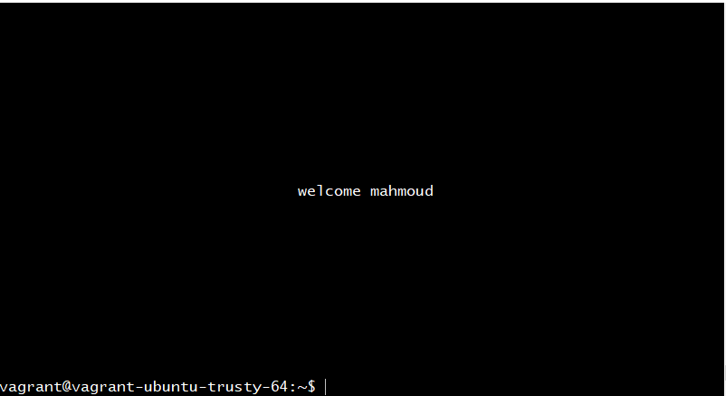

### Supplying Data

Remember there are 3 ways in which you may supply data to a Bash script:

* As command line arguments
* Redirected in as STDIN
* Read interactively during script execution

Your script may use one or a combination of these but should always aim to be the most convenient for the user.

Command line arguments are good as they will be retained in the users history making it easy for them to rerun commands. Command line arguments are also convenient when the script is not run directly by the user (eg, as part of another script or a cron task etc).

Redirected from STDIN is good when your script is behaving like a filter and just modifying or reformatting data that is fed to it.

Reading interactively is good when you don't know what data may be required until the script is already running. eg. You may need to clarify some suspicious or erroneous input. Passwords are also ideally asked for this way so they aren't kept as plain text in the users history.

### Bash `trap` command

On Unix-like operating systems, the `trap` command is a function of the shell that responds to hardware signals and other events. It allows you to catch signals and execute code when they occur.

`$ trap 'rm -f /tmp/xyz$$; exit' ERR EXIT` set a trap which, on shell error or shell exit, deletes a temporary file xyz$$.

Syntax:

```shell
trap [-lp] [[ARG] SIGNAL_SPEC...]
```

* `$ trap -l` display a list of signal names and their corresponding numbers.

## Pipeline Concept

In UNIX command, shell pipeline means the possibility to execute an operation on some input and use the output as the input for the next command and so on. A pipeline is represented by the pipe character `|`.

By default pipelines redirects only the standard output, if you want to include the standard error you need to use the form `|&`.

eg: Print the number of processors based on the information in `/proc/cpuinfo` file.

```bash
#!/bin/bash
cd ../../proc/;
echo "path is: `pwd`"
cat cpuinfo | grep 'processor' | wc -l;
```

`$ ls / | head` Command `head` outputs the first 10 lines by default, use option `-n` to change this behavior.

## Process Substitution

In the previous section we've seen how to chain output of one command to the next one. But what if you want to chain the output of two or more commands to the another one.

Process substitution allows a process’s input or output to be referred to using a filename. It has two forms: `output <(cmd)`, and `input >(cmd)`.

* Output

```bash
#!/bin/bash
sort file1 > sorted_file1
sort file2 > sorted_file2
diff sorted_file1 sorted_file2

# With process substitution you can do it in one line:
diff <(sort file1) <(sort file2)
```

* Input

```bash
#!/bin/bash

# store logs of an application into a file and at the same time print it on the console.
echo "Hello, world!" | tee /tmp/hello.txt

# let say you want to have only lower case characters in the file but keep the regular case on the output.
# It'll be the same output in the file but with lower case chars.
echo "Hello, WorlD!" | tee >(tr '[:upper:]' '[:lower:]' > /tmp/hello.txt)
```

## Useful Resources

* [Repl.it: Online Bash Development Environment](https://repl.it/languages/bash)
* [Explainshell: Useful Website to Explain Shell](https://explainshell.com/explain?cmd=rm+-rf+%2F#)
* [Udacity: Linux Command Line Basics](https://www.udacity.com/course/linux-command-line-basics--ud595)
* [Udacity: Configuring Linux Web Servers](https://www.udacity.com/course/configuring-linux-web-servers--ud299)
* [Less in Unix](https://en.wikipedia.org/wiki/Less_(Unix))
* [Bash Academy](http://www.bash.academy/)
* [Regex](https://regexr.com/)
* [Bash start up files .bash_logout, .bashrc and .profile)](http://www.gnu.org/software/bash/manual/html_node/Bash-Startup-Files.html)
* [How to update $PATH](https://askubuntu.com/questions/60218/how-to-add-a-directory-to-the-path)
* [Editing Sudoers file](https://help.ubuntu.com/community/Sudoers)
* [Linux and Unix `cp` command tutorial with examples](https://shapeshed.com/unix-cp/)
* [Learn Bash](https://www.learnshell.org/)
* [Ryans Bash Scripting tutorials](https://ryanstutorials.net/bash-scripting-tutorial)
* [Bash Generator](www.bashrcgenerator.com) to customize your bash and place that in `.bash_profile/.bashrc`
* [Distro Watch](https://distrowatch.com/) has been around since 2001 as a source of news about Linux distributions and other Free and Open-Source operating systems.
* [Linuxize](https://linuxize.com/) provide good articles on linux.
