<p align="center">
  <a href="https://github.com/sabahallah/frontend-zone/blob/master/css-and-design/css-outline.md">
    
  </a>
  <h2 align="center">CSS Outline</h2>
  <p align="center">This is a CSS wiki for quick review with examples. It covers a lot of CSS definitions, explanations and examples. I'm trying to keep it simple and structured so it could be easy to refresh knowledge and be useful for others.</p>
  <p align="center">
    <a href="https://twitter.com/home?status=CSS+Outline+by+%40msabahallah      +https%3A%2F%2Fgithub.com%2Fsabahallah%2Ffrontend-zone%2Fblob%2Fmaster%2Fcss-and-design%2Fcss-outline.md" target="_blank">
        
    </a>
    <a href="https://twitter.com/msabahallah" target="_blank">
        
    </a>
  </p>
  <br>
</p>

# Index

- [Outlines](#outlines)
  - [Link Your CSS File](#link-your-css-file)
  - [Writing Good CSS](#writing-good-css)
  - [Text Styling and Formatting](#text-styling-and-formatting)
  - [Images](#images)
  - [Icons](#icons)
  - [Grid System](#grid-system)
  - [Centre an Element](#technique-to-centre-an-element)
  - [Transform](#transform)
  - [CSS Mask](#css-mask)
- [Box Model](#box-model)
- [Targeting Elements (selectors)](#targeting-elements-selectors)
  - [Targeting Direct Element](#targeting-direct-element)
  - [Targeting Element by id](#targeting-element-by-id)
  - [Targeting Element by Class Name](#targeting-element-by-class-name)
  - [CSS Combinators](#css-combinators)
  - [CSS Grouping Selectors](#css-grouping-selectors)
  - [CSS Specificity](#css-specificity)
- [Units](#units)
- [Colors](#colors)
  - [Complementary Colors](#complementary-colors)
  - [Tertiary Colors](#tertiary-colors)
  - [Adjust the Hue of a Color](#adjust-the-hue-of-a-color)
  - [CSS Gradient](#css-gradient)
- [Cascading](#cascading)
- [Create a Custom CSS Variable](#create-custom-css-variable)
  - [Attach a Fallback value to a CSS Variable](#attach-a-fallback-value-to-a-css-variable)
  - [Improve Compatibility with Browser Fallbacks](#improve-compatibility-with-browser-fallbacks)
- [Cascading CSS Variables](#cascading-css-variables)
- [Visual Design](#visual-design)
- [Element Positioning](#element-positioning)
  - [Relative Positioning](#relative-positioning)
  - [Absolute Positioning](#absolute-positioning)
  - [Fixed Positioing](#fixed-positioning)
  - [Float Property](#float-property)
  - [z-index Property](#z-index-property)
  - [Positioning technique with Margin Property](#positioning-technique-with-margin-property)
- [Adding content by css](#adding-content-by-css)
- [Buttons or links in CSS](#buttons-or-links-in-CSS)
- [Three Pillars to Write Good html and css](#the-three-pillars-to-write-good-html-and-css)
- [Responsive web design](#responsive-web-design)
  - [Fluid Grid](#fluid-grid)
  - [Responsive Images](#responsive-images)
  - [Media Queries](#media-queries)
- [Browser Support & Compitability](#browser-support-&-compitability)
- [Animation](#animation)
- [How CSS works behind the scenes?](#how-css-works-behind-the-scenes)
  - [1-Cascading process](#1-Cascading-process)
  - [2-Process final css value](#2-process-final-css-value)
  - [3-Stacking Context](#3-stacking-context)
- [CSS Architecture](#css-architecture)
- [SASS](#sass)
- [Applied Accessibility](#applied-accessibility)
- [Flexbox](#flexbox)
- [Grid Layout](#grid-layout)
  - [Naming Grid](#naming-grid)
  - [Implicit Grids vs Explicit Grids](#implicit-explicit-grid)
  - [Grid Flow](#grid-flow)
  - [Aligning Grid Items](#align-grid-items)
  - [Aligning Tracks](#align-tracks)
  - [Grid Functions](#grid-functions)
  - [Responsive Layouts with auto-fit and auto-fill](#grid-responsive-layout)
- [SVG](#svg)
- [Miscellaneous](#miscellaneous)
- [Emmet](#emmet)
- [CSS Performance](#css-performance)
- [Text Properties](#text-properties)
- [Image Background Properties](#image-background-properties)
- [Resources](#resources) TODO: to check
- [What is shame.css File](#what-is-shame.css-file)
- [@property](#@property)
- [Development Resources](#useful-development-resources) TODO: to check

CSS stands for **C**ascading **S**tyle **S**heets.

## Linking CSS File

You can link your css file in 3 different ways:

- Inline style:
  ```html
  <p style="color: red; border: 3px dotted blue">this is inline style</p>
  ```
- Internal style:
  ```css
  <style>
      p {
          color: red;
          border: 3px dotted blue;
      }
  </style>
  ```
- External style:
  ```css
  <link rel="stylesheet" type="text/css" href="style.css">
  /* Or using @import
  The @import rule allows you to import a style sheet into another style sheet. */
  @import url('http://..../google/font');
  ```

## Writing Good CSS Guidelines

- Use Low-Specificity selectors.  
   Instead of writing:

  ```css
  .navigation a {
    color: blue;
  }
  ```

  write:

  ```css
  .nav-link {
    color: blue;
  }
  ```

- Don't use ID or element selectors.  
   Instead of writing:

  ```css
  #banner {
    background-color: blue;
  }

  #banner h1 {
    color: white;
  }
  ```

  write:

  ```css
  .banner {
    background-color: blue;
  }

  .banner-title {
    color: white;
  }
  ```

- Don't depend on a certain markup structure (markup can change at anytime).  
   Instead of writing:

  ```css
  .header ul li a {
    margin-right: 20px;
  }
  ```

  write:

  ```css
  .header-link {
    margin-right: 20px;
  }
  ```

- Don't use Inline Styles.
- Don't use `!important` keyword. The only one case in which you might be forced to use `important` if using some third party JavaScript library.
- Prefix Modifier Classes.  
   Instead of writing:

  ```css
  .btn {
    padding: 0.25em;
    background-color: blue;
    color: white;
  }

  .btn.red {
    background-color: red;
  }
  ```

  write:

  ```css
  .btn {
    padding: 0.25em;
    background-color: blue;
    color: white;
  }
  .btn-red {
    background-color: red;
  }
  ```

- Write small rules.  
   Instead of writing:

  ```css
  .role-stat h1,
  .role-stat h2,
  .role-stat p,
  .role-stat a,
  .role-su h1,
  .role-su h2,
  .role-su p,
  .role-su a {
    color: #fff;
  }

  .features-1 h1,
  .features-1 h2,
  .features-1 p,
  .features-2 h1,
  .features-2 h2,
  .features-2 p,
  .features-3 h1,
  .features-3 h2,
  .features-3 p {
    color: #fff;
  }

  .features-1 a,
  .features-2 a,
  .features-3 a {
    color: #fff;
    text-decoration: underline;
  }

  .feature-1 h1,
  .feature-2 h2,
  .feature-3 p {
    color: #fff;
  }

  .feature-1 a,
  .feature-2 a,
  .feature-3 a {
    color: #fff;
    text-decoration: underline;
  }
  ```

  write:

  ```css
  .text-white {
    color: #fff;
  }

  .text-underline {
    text-decoration: underline;
  }
  ```

## Text Styling and Formatting

- The `font-weight` property sets how thick or thin characters are in a text.
- The `line-height` property to change the height of each line in a block of text. It changes the amount of vertical space that each line of text gets.
- With the `<s>` tag (strickthrough), the browser applies the CSS of `text-decoration: line-through;` to the element.
- `text-align: justify;` It makes all lines of text except the last line to meet the left and right edges of the line box.
  ```css
  p {
    text-align: justify;
  }
  ```
- Examples

  ```css
  html {
    font-family: "Times New Roman", serif, sans-serif;
    font-size: 2em;
    font-style: italic;

    text-align: center; /* any text base element will be centered; 'justify' will try to centre the element */
    line-height: 2em;
  }

  a {
    text-decoration: none; /* remove underline */
    letter-spacing: 10px;
    word-spacing: 10px; /* put 10px space between words */
    text-transform: capitalize; /* lowercase, uppercase & capitalize */
  }
  ```

- change the style of a selected text

  ```css
  ::selection {
    background-color: $color-primary;
    color: $color-white;
  }
  ```

- `writing-mode: vertical-rl;` will transform the text to be vertically aligned.
  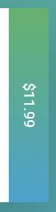

## Images

```css
img {
  /****** applying responsiveness to an image ******/
  max-width: 100%;
  height: auto; /* to maintain the aspect ratio of a photo */
  padding: 5px; /* padding 5px around the image */
  opacity: 0.7; /* transparency from 0 to 1; 0 will be completely hidden, and 1 will be completely visible. */

  /****** centering an image ******/
  display: block; /* it will force line break */
  margin: auto; /* it will centre the image. it will try to split the margin around the image by two. */

  border: 2px solid white;
  border-radius: 10px;
}
```

```scss
.background-video {
  position: absolute;
  top: 0;
  left: 0;
  height: 100%;
  width: 100%;
  z-index: -1;
  opacity: 0.15;
  overflow: hidden;

  // to fix the video overflow issue and maintain the aspect ratio. object-fit: cover;
  &__content {
    height: 100%;
    width: 100%;
    object-fit: cover; /* similar to background-size: cover and it will maintain the aspect ratio
        but you need to clear the sides overflow in parent*/
  }
}
```

### Image Background Properties

```css
background-image: linear-gradient(rgba(0, 0, 0, 0.8), rgba(0, 0, 0, 0.8)),
  url(img/hero-min.jpg);
background-size: cover; /* we want to use the actual image size */
background-position: top; /* it ensures whatever the viewport size, image will always at top of the container, there is also bottom and centre */
height: 100vh; /* 100% of the view port */
background-attachment: fixed; /* very cool to make the image fixed in its position, so you can scroll the the page and the image will be fixed in its place */
```

## Icons

```css
.icon-big {
  /* if it is font icon */
  font-size: 350%;
  display: block; /* will force line break */
  color: #e67e22;
  margin-bottom: 10px;
}
```

Align text and icons

```html
<div class="city-feature">
  <i class="icon ion-md-person icon-small"></i>
  1600+ happy eaters
</div>
```

```css
.icon-small {
  display: inline-block;
  width: 30px;
  text-align: center;
  color: #e67e22;
  font-size: 120%;
  margin-right: 10px;

  /* secrets to align text and icons */
  /* to align the icon with the text on the right side */
  line-height: 120%;
  vertical-align: middle;

  margin-top: -5px;
}
```

## Grid System

We'll create our grid system and placing items inside it.

```css
.row {
  display: flex;
  width: 100%;
}

/*every time row is created we need something to happen after it*/
.row::after {
  display: block; /* stack rows upon each other */
  /* if there're any elements inside this row that have float property like float right or left and has overflow, we're going to clear that */
  clear: both;
  content: "";
}

.col-1 {
  width: 8.33%;
}
.col-2 {
  width: 16.66%;
}
.col-3 {
  width: 25%;
}
.col-4 {
  width: 33.33%;
}
.col-5 {
  width: 41.66%;
}
.col-6 {
  width: 50%;
}
.col-7 {
  width: 58.33%;
}
.col-8 {
  width: 66.66%;
}
.col-9 {
  width: 75%;
}
.col-10 {
  width: 83.33%;
}
.col-11 {
  width: 91.66%;
}
.col-12 {
  width: 100%;
}

* {
  box-sizing: border-box; /* Include padding and border in the element's total width and height */
}

/* attribute selector, grab every single class which starts with col- */
[class*="col-"] {
  border: 2px solid red;
  padding: 15px;
}
```

## Technique to Centre an Element

```html
<div class="header__text-box"></div>
```

```css
.header__text-box {
  position: absolute;
  top: 50%;
  left: 50%;
  transform: translate(-50%, -50%);
}
```

## Transform

```css
img:hover {
  transform: scale(1.5); /* it will make the image 1.5 times bigger */
  transform: rotate(20deg); /* it will rotate the item 20 degree */
}

p {
  transform: skewX(-32deg);
}
```

## CSS Mask

CSS masks: mask-image, mask-size  
Mask defines an area where we can look through the element and see what's behind this element

```css
/* adding icon to the left */
&__item::before {
  content: "";
  display: inline-block;
  height: 1rem;
  width: 1rem;
  margin-right: 0.7rem;
  /* Older browsers */
  background-image: url(../img/chevron-thin-right.svg);
  background-size: cover;

  /* Newer browsers - masks */
  @supports (-webkit-mask-image: url()) or (mask-image: url()) {
    background-color: var(--color-primary);
    /* this will be infront of the background color, so you'll see through the svg */
    -webkit-mask-image: url(../img/chevron-thin-right.svg);
    -webkit-mask-size: cover;
    mask-image: url(../img/chevron-thin-right.svg);
    mask-size: cover;
    background-image: none;
  }
}
```

## Box Model

**content**: Actual content (image, text, etc)  
**padding**: Transparent area around the content inside the box  
**border**: Goes around the padding and the content  
**margin**: Create a space outside the element and between boxes

`box-sizing: border-box;` Include padding and border in the element's total width and height.

Box Model is also part of [The Visual Formatting Model](#the-visual-formatting-model)

## Targeting Elements (selectors)

### Targeting Direct Element

```css
body {
  background: #145asE545;
}
p {
  color: red;
  text-align: justify;
}
```

### Targeting Element by Id

- The id selector uses the id attribute of an HTML element to select a specific element.
- The id of an element should be unique within a page, so the id selector is used to select one unique element.
- The id name cannot start with number.

```css
#signup-id {
  border: 1px solid black;
  border-width: 2px;
  border-color: white;
}
```

### Targeting Element by Class Name

Class name cannot start with a number.

```css
.square {
  width: 100px;
  height: 100px;
  background-color: blue;
  margin: auto; /* puts equal spacing on each side of my element - centre the element. */
}

/* Only <p> elements with class="center" will be center-aligned. */
p.center {
  text-align: center;
  color: red;
}
```

### CSS Combinators

For **Direct Child Only**

```css
/* any body element which has header which has h3 elements */
body > header > h3 {
  color: #f00;
}
```

Unlike **Descendent Selector** which means every single h3 under the body element (_it doesn't matter how deep it is_)

```css
/* Descendant combinator */
body h3 {
  color: #020;
}
```

### CSS Grouping Selectors

If you have elements with the same style declarations, it will be better to group the selectors to minimize the code:

```css
h1,
h2,
p,
.container,
#name {
  text-align: center;
  color: red;
}
```

### Sibling Selectors (~ and +)

- Use `~` if items are sibling (have the same parent) but not adjacent to each other.
- Use `+` if items are sibling (have the same parent) but adjacent to each other.

```html
<input type="checkbox" class="navigation__checkbox" id="navi-toggle" />

<label for="navi-toggle" class="navigation__button">
  <span class="navigation__icon">&nbsp;</span>
</label>

<div class="navigation__background">&nbsp;</div>

<div class="navigation__background">&nbsp;</div>

<nav class="navigation__nav">
  <ul class="navigation__list">
    <li class="navigation__item">
      <a href="#about" class="navigation__link" onclick="closeIcon()"
        ><span>01</span>About Natous</a
      >
    </li>
    <li class="navigation__item">
      <a href="#features" class="navigation__link" onclick="closeIcon()"
        ><span>02</span>Your benfits</a
      >
    </li>
    <li class="navigation__item">
      <a href="#section-tours" class="navigation__link" onclick="closeIcon()"
        ><span>03</span>Popular tours</a
      >
    </li>
    <li class="navigation__item">
      <a href="#stories" class="navigation__link" onclick="closeIcon()"
        ><span>04</span>Stories</a
      >
    </li>
    <li class="navigation__item">
      <a href="#book-now" class="navigation__link" onclick="closeIcon()"
        ><span>05</span>Book now</a
      >
    </li>
  </ul>
</nav>
```

```scss
// When checkbox is checked, scale the background 80 times
// We used ~ because __checkbox and __background are sibling (have the same parent) but not adjacent
// If they were adjacent, we would use + (adjacent sibling selector)
&__checkbox:checked ~ &__background {
  transform: scale(80);
}
// When checkbox is checked, make the navigation is visible with 100% width
&__checkbox:checked ~ &__nav {
  opacity: 1;
  width: 100%;
}
```

Another Example

```scss
// when hover over a button go to icon::before and change the top: -1rem;
&__button:hover &__icon::before {
  top: -1rem;
}
// when hover over a button go to icon::after and change the top: 1rem;
&__button:hover &__icon::after {
  top: 1rem;
}

// When checkbox is checked, go to __nav > __item > __link and make it visible
&__checkbox:checked ~ &__nav &__item &__link {
  opacity: 1;
  display: inline-block;
}
```

Another Example

```css
.composition {
  &__photo {
    /* ... */
  }

  /* select all the images which is not hovered */
  /* this will be transformed to .composition:hover .composition__photo:not(:hover) {} */
  &:hover &__photo:not(:hover) {
    transform: scale(0.95);
  }
}
```

Another Example

```scss
/* apply to last of the same type of element */
.paragraph:not(:last-of-type) {
  margin-bottom: 2rem;
}
```

Attribute Selector

- Attribute presence selectors

  ```css
  /*  will select all p tags in the page that have an id attribute, regardless of its value */
  p[id] {
    /* ... */
  }
  ```

- Exact attribute value selectors

  ```css
  p[id="my-id"] {
    /* ... */
  }
  ```

- Match an attribute value portion. While `=` lets us check for exact value, we have other operators:
  - `*=` checks if the attribute _contains_ the partial
  - `^=` checks if the attribute _starts_ with the partial
  - `$=` checks if the attribute _ends_ with the partial
  - `|=` checks if the attribute starts with the partial and it's followed by a dash (common in classes, for example), or just contains the partial
  - `~=` checks if the partial is contained in the attribute, but separated by spaces from the rest
- All the checks we mentioned are case sensitive.
- If you add an i just before the closing bracket, the check will be case insensitive. It's supported in many browsers but not in all, check <https://caniuse.com/#feat=css-case-insensitive>.

### CSS Specificity

Here's the calculation, put 0 or 1 point for each of the following elements in order:

- (inline style) style property embedded in html
- id
- class, pseudo-class or attribute ex: [id="foo"]
- html elements

#### Example 1

```css
body h1.main #id {
}
```

0 point for style attribute [no inline style attribute]  
1 point for id [`#id`]  
1 point for class, pseudo-class, attribute [`.main`]  
2 point for html elements [`body` & `h1`]

This will be evaluated to: 0 1 1 2

#### Example 2

```css
#foo {
  color: red;
}
```

This will be evaluated to: 0 1 0 0

```css
[id="foo"] {
  /* another way to grab element by id using attribute selector */
  color: red;
}
```

This will be evaluated to: 0 0 1 0  
So **first one** won; because 0100 > 0010

It doesn't matter the hierarchy of HTML page, it is about the order in the CSS itself.

```css
body h1 {
  color: green;
}
html h1 {
  color: red;
}
```

So final color will be red.

`!important` use it scarcely. only use on page specific css that override foreign CSS like external libraries such as bootstrap or normalize.css

## Pseudo Classes and Pseudo Elements

A pseudo-class is a keyword that can be added to selectors, in order to select a specific state of the element.

### Pseudo Classes

Pseudo classes is a special state of an element.

Pseudo classes are predefined keywords that are used to select an element based on its state, or to target a specific child. They start with `:`


`:nth-child()` deserves a special mention. It can be used to target `odd` or `even` children with `:nth-child(odd)` and `:nth-child(even)`. It is commonly used in lists to color odd lines differently from even lines:

```css
ul:nth-child(odd) {
  color: white;
  background-color: black;
}
```

You can also use it to target the first 3 children of an element with `:nth-child(-n+3)`. Or you can style 1 in every 5 elements with `:nth-child(5n)`.

### Pseudo Elements

Pseudo-elements are used to style a specific part of an element. They start with a double colon `::`. Sometimes you will spot them in the wild with a single colon, but this is only a syntax supported for backwards compatibility reasons. You should use 2 colons to distinguish them from pseudo-classes.

`::before` and `::after` are probably the most used pseudo-elements. They are used to add content before or after an element, like icons for example.


```css
/* make the first line of a paragraph slightly bigger in font size, a common thing in typography*/
p::first-line {
  font-size: 2rem;
}

/*  first letter to be bolder */
p::first-letter {
  font-weight: bolder;
}

/* add icons using CSS */
p::before {
  content: url(/myimage.png);
}
.myElement::before {
  content: "Hey Hey!";
}
```

### :root pseudo-class

`:root` is a CSS pseudo-class that identifies the root element of a tree. In the context of an HTML document, using the `:root` selector points to the html element, except that `:root` has higher specificity (takes priority). In the context of an `SVG` image, `:root` points to the `svg` tag. Adding a CSS custom property to `:root` makes it available to all the elements in the page.

## Units

`(px, %, em, rem, vh & wh)`

- **vw:** `width: 10vw` would be 10% of the viewport width.
- **vh:** `width: 3vh` would be 3% of the viewport height.
- **vmin:** `width: 70vmin` would be 70% of the viewport smaller dimension (height vs. width).
- **vmax:** `width: 100vmax` would be 100% of the viewport bigger dimension (height vs. width).
- **em** is relative to the `font-size` of the parent element. If you have a `<div>` with `font-size=16px`, and a `<p>` element inside that div with a font-size set to `2em`, the font-size of text in the `<p>` will be `32px`. If you change font size from `2em` to `0.5em`, and the `font-size` will be `8px`.
- **rem** is dictated by the set root (HTML document) size.
  - The default size, if one has not been defined, is 16px — so 1em/rem = 16px.

## Colors

We usually use decimals, or base 10 numbers, which use the symbols 0 to 9 for each digit. Hexadecimals (or hex) are base 16 numbers. This means it uses sixteen distinct symbols. Like decimals, the symbols 0-9 represent the values zero to nine. Then A,B,C,D,E,F represent the values ten to fifteen. Altogether, 0 to F can represent a digit in hexadecimal, giving us 16 total possible values.  
In CSS, we can use 6 hexadecimal digits to represent colors, two each for the red (R), green (G), and blue (B) colors #000000

From these three pure colors (red, green, and blue), we can vary the amounts of each to create over 16 million other colors!  
`16 * 16 * 16 * 16 * 16 * 16 = 16777216`

`#FFA500` The digit `0` is the lowest number in hex code, and represents a complete absence of color, The digit `F` is the highest number in hex code, and represents the maximum possible brightness.

Many people feel overwhelmed by the possibilities of more than 16 million colors. And it's difficult to remember hex code. Fortunately, you can shorten it.
For example, red's hex code `#FF0000` can be shortened to `#F00`. This shortened form gives one digit for red, one digit for green, and one digit for blue.

This reduces the total number of possible colors to around 4,000. But browsers will interpret `#FF0000` and `#F00` as exactly the same color.

`rgb(255, 255, 255) = rgb (16*16, 16*16, 16*16)` each color represented by two digits.

`rgba(255, 255, 255)` The RGB values can range from 0 to 255.

rgba stands for:

- r = red
- g = green
- b = blue
- a = alpha (level of opacity)

The alpha value can range from 1 (which is fully opaque or a solid color) to 0 (which is fully transparent or clear).

The `opacity` property in CSS is used to adjust the opacity, or conversely, the transparency for an item:

- A value of 1 is opaque, which isn't transparent at all.
- A value of 0.5 is half see-through.
- A value of 0 is completely transparent.

If you need a color with transparency use rgb not hexadecimal `rgba(0, 204, 255, 0.75)`;

```scss
background-color: rgba($color-white, 0.8); /* setting the opacity */
```

### Complementary Colors

When two colors are opposite each other on the wheel, they are called complementary colors.
They have the characteristic that if they are combined, they "cancel" each other out and create a gray color.
However, when placed side-by-side, these colors appear more vibrant and produce a strong visual contrast.  
Some examples of complementary colors with their hex codes are:

- red (`#FF0000`) and cyan (`#00FFFF`)
- green (`#00FF00`) and magenta (`#FF00FF`)
- blue (`#0000FF`) and yellow (`#FFFF00`)

### Tertiary Colors

Red (R), green (G), and blue (B) are called primary colors. Mixing two primary colors creates the _secondary colors_.

cyan (G + B), magenta (R + B) and yellow (R + G). You saw these colors in the [Complementary Colors](#complementary-colors). These secondary colors happen to be the complement to the primary color, and are opposite to that primary color on the color wheel.

For example, magenta is made with red and blue, and is the complement to green.

_Tertiary colors_ are the result of combining a primary color with one of its secondary color neighbors, for eg: green and magenta.

### Adjust the Hue of a Color

Colors have several characteristics including hue (درجة اللون), saturation (التشبع - صفاء اللون), and lightness. CSS3 introduced the `hsl()` property as an alternative way to pick a color by directly stating these characteristics.

**Hue** is what people generally think of as 'color'. If you picture a spectrum of colors starting with red on the left, moving through green in the middle, and blue on right, the hue is where a color fits along this line. In hsl(), hue uses a color wheel concept instead of the spectrum, where the angle of the color on the circle is given as a value between 0 and 360.

**Saturation** is the amount of gray in a color. A fully saturated color has no gray in it, and a minimally saturated color is almost completely gray. This is given as a percentage with 100% being fully saturated.

**Lightness** is the amount of white or black in a color. A percentage is given ranging from 0% (black) to 100% (white), where 50% is the normal color.

Here are a few examples of using `hsl()` with fully-saturated, normal lightness colors:

| Color   | HSL                 |
| ------- | ------------------- |
| red     | hsl(0, 100%, 50%)   |
| yellow  | hsl(60, 100%, 50%)  |
| green   | hsl(120, 100%, 50%) |
| cyan    | hsl(180, 100%, 50%) |
| blue    | hsl(240, 100%, 50%) |
| magenta | hsl(300, 100%, 50%) |

### CSS gradient

Display smooth transitions between two or more specified colors.

- <https://www.w3schools.com/css/css3_gradients.asp>
- <https://developer.mozilla.org/en-US/docs/Web/CSS/linear-gradient>
- <https://www.w3schools.com/colors/colors_picker.asp>

There is two types of gradient: a linear-gradient and radial-gradient.

```css
/* first argument specifies the direction, from which color transition starts - it can be stated as a degree where 90deg makes a vertical gradient */
background-image: linear-gradient(to right, red, yellow);
background-image: radial-gradient(red 5%, yellow 15%, green 60%);
```

Use a CSS Linear Gradient to Create a Striped Element

```html
<style>
  div {
    border-radius: 20px;
    width: 70%;
    height: 400px;
    margin: 50 auto;
    background: repeating-linear-gradient(
      45deg,
      yellow 0px,
      yellow 40px,
      black 40px,
      black 80px
    );
  }
</style>

<div></div>
```

## Cascading

Is the process of combining different stylesheets and resolving conflicts between different css rules and declarations when more than one rule applies to a certain element.

## Create Custom CSS Variable

It can be manipulated by js and can be changed in dev tools.  
To create a CSS Variable, you just need to give it a name with two dashes in front of variable name and assign it a value:

```css
--penguin-skin: gray;
```

This will create a variable named `--penguin-skin` and assign it a value of `gray`.

Usage:

```css
background: var(--penguin-skin);
```

### Attach a Fallback Value to a CSS Variable

When using your variable as a CSS property value, you can attach a fallback value that your browser will revert to if the given variable is invalid.

```css
background: var(--penguin-skin, black);
```

### Improve Compatibility with Browser Fallbacks

When your browser parses the CSS of a webpage, it ignores any properties that it doesn't recognize or support. For example, if you use a CSS variable to assign a background color on a site, Internet Explorer will ignore the background color because it does not support CSS variables. In that case, the browser will use whatever value it has for that property. If it can't find any other value set for that property, it will revert to the default value.

```css
.red-box {
  background: red; /* better to add */
  background: var(--red-color);
  height: 200px;
  width: 200px;
}
```

### Cascading CSS variables

When you create a variable, it becomes available for you to use inside the element in which you create it. It also becomes available within any elements nested within it. This effect is known as cascading.
Because of cascading, CSS variables are often defined in the `:root` element.
You can think of the `:root` element as a container for your entire HTML document,

By creating your variables in `:root` selector, they will be available throughout the whole web page.

```css
:root {
  --penguin-belly: pink;
}
```

You can then overwrite these variables anytime by setting them within a specific element.

```css
.penguin {
  --penguin-belly: white;
}
```

## Visual Design

Visual Design in web development is a broad topic. It combines typography, color theory, graphics, animation, and page layout to help deliver a site's message. In web development, HTML gives structure and semantics to a page's content, and CSS controls the layout and appearance of it.

## Element Positioning

### `display` property

- `display: block;`
  - It uses the full available width and force line breaks (ex: `h1`, `h2`, `h6`, `p`, ...).
- `display: inline;` ex: images, links, `strong` and `em` elements.
  - No line break.
  - You can add only left & right margins and padding, but not top & bottom.
  - cannot have a width and height set.
  - allow other elements to sit to their left and right.
- `display: inline-block;`
  - No line break.
  - can add margin and padding right, left, top and bottom.
  - can add `width` and `height`.
  - allow other elements to sit to their left and right.
- `display: none;` will hide the element.

### Relative Positioning

CSS treats each HTML element as its own box, which is usually referred to as the CSS Box Model. Block-level items automatically start on a new line (think headings, paragraphs, and divs) while inline items sit within surrounding content (like images or spans). The default layout of elements in this way is called the normal flow of a document, but CSS offers the position property to override it.

When the `position` of an element is set to `relative`, it allows you to specify how CSS should move it _relative to_ its **current position** in the normal flow of the page. It pairs with the CSS offset properties of `left` or `right`, and `top` or `bottom`. These say how many pixels, percentages, or ems to move the item away from where it is normally positioned. The following example moves the paragraph 10 pixels away from the bottom:

```css
p {
  position: relative;
  bottom: 10px;
}
```

Changing an element's position to relative does not remove it from the normal flow - other elements around it still behave as if that item were in its default position.

```html
<style>
  h2 {
    position: relative;
    top: 31px;
  }
</style>
<body>
  <h1>On Being Well-Positioned</h1>
  <h2>Move me!</h2>
  <p>I still think the h2 is where it normally sits.</p>
</body>
```

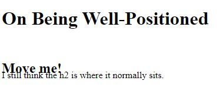

### Absolute Positioning

The next option for the CSS `position` property is `absolute`, which locks the element in place _relative to_ its **parent container**. Unlike the relative position, _this removes the element from the normal flow of the document_, so surrounding items ignore it. The CSS offset properties (`top`, `bottom`, `left` and `right`) are used to adjust the position.

One nuance (فارق بسيط) with absolute positioning is that it will be locked relative to its closest positioned ancestor. If you forget to add a `position` rule to the parent item, (this is typically done using `position: relative;`), the browser will keep looking up the chain and ultimately default to the `body` tag.

`absolute`: can be positioned any where we want inside their parent element but you have to ensure parent element is `relative` and child element is `absolute`.

```html
<style>
  #searchbar {
    position: absolute;
    top: 50px;
    right: 50px;
  }
  section {
    position: relative;
  }
</style>
<body>
  <h1>Welcome!</h1>
  <section>
    <form id="searchbar">
      <label for="search">Search:</label>
      <input type="search" id="search" name="search" />
      <input type="submit" name="submit" value="Go!" />
    </form>
  </section>
</body>
```

### Fixed Positioning

The next layout scheme that CSS offers is the `fixed` position, which is a type of absolute positioning that locks an element _relative to_ the **browser window**. Similar to absolute positioning, it's used with the CSS offset properties and also removes the element from the normal flow of the document. Other items no longer "realize" where it is positioned, which may require some layout adjustments elsewhere.

One key difference between the fixed and absolute positions is that an element with a fixed position won't move when the user scrolls.

```css
#navbar {
  position: fixed;
  top: 0;
  left: 0;
}
```

### Float Property

The next positioning tool does not actually use `position`, but sets the `float` property of an element. Floating elements are removed from the normal flow of a document and pushed to either the left or right of their containing parent element. It's commonly used with the `width` property to specify how much horizontal space the floated element requires.

We use the `float` property to put **block** elements side by side.

```html
<head>
  <style>
    #left {
      float: left;
      width: 50%;
    }
    #right {
      float: right;
      width: 40%;
    }
    aside,
    section {
      padding: 2px;
      background-color: #ccc;
    }
  </style>
</head>
<body>
  <header>
    <h1>Welcome!</h1>
  </header>
  <section id="left">
    <h2>Content</h2>
    <p>Good stuff</p>
  </section>
  <aside id="right">
    <h2>Sidebar</h2>
    <p>Links</p>
  </aside>
</body>
```

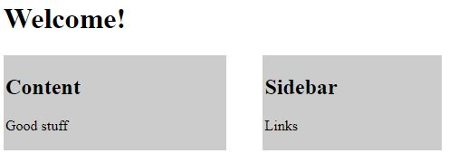

The `clear` property is the counterpart of the `float` property [Ensures that an element self-clears its children]

Note: This is only useful if you are still using float to build layouts. Please consider using a modern approach with flexbox layout or grid layout.

```html
<div class="clearfix"></div>
```

```css
.clearfix:after {
  content: "";
  display: table;
  clear: both;
}
```

### `z-index` Property

When elements are positioned to overlap, the element coming later in the HTML markup will, by default, appear on the top of the other elements. However, the `z-index` property can specify the order of how elements are stacked on top of one another. It must be an integer, and higher values for the `z-index` property of an element move it higher in the stack than those with lower values.

```css
.first {
  background-color: red;
  position: absolute;
  z-index: 2;
}
.second {
  background-color: blue;
  position: absolute;
  left: 40px;
  top: 50px;
  z-index: 1;
}
```

### Positioning Technique with Margin Property

Another positioning technique is to center a block element horizontally. One way to do this is to set its `margin` to a value of `auto`.  
This method works for images, too. Images are inline elements by default, but can be changed to block elements when you set the `display` property to `block`.

```html
<style>
  div {
    background-color: blue;
    height: 100px;
    width: 100px;
    margin: auto;
  }
</style>
<div></div>
```

## Adding Content by CSS

Using `:after` will add some content after `h2` so we can style it as normal element.

```css
h2:after {
  display: block;
  height: 2px;
  background-color: #e67e22;
  content: "";
  width: 100px;
  margin: 30px auto 0 auto; /* centering the element */
}
```

## Buttons or Links in CSS

Buttons can have different states `link`, `visited`, `active` and `hover` and all are pseudo-classes.

```css
.btn-full:link, /*  for links that have not been visited yet */
.btn-full:visited {
  /* if the user visited the link before */
  background-color: #e67e22;
  border: 1px solid #e67e22;
  color: #fff;
  margin-right: 15px;
}

.btn-full:hover,
.btn-full:active {
  /* when user click the button, time between the user presses the mouse button and releases it. */
  border: 1px solid #cf6d17;
  color: #fff;
}
```

## Animation

There is two ways to apply animation:

- Using `transition` property and change the property you like.
- Using `keyframes` and `animation`.

```css
a:link,
a:visited {
  color: #e67e22;
  text-decoration: none;
  padding-bottom: 1px;
  border-bottom: 1px solid #e67e22;

  transition: border-bottom 0.2s, color 0.2s;
}

a:hover,
a:active {
  color: #555;
  border-bottom: 1px solid transparent;
}
```

```css
@keyframes animate {
  0% {
    background-color: black;
    margin-left: 0;
  }
  100% {
    background-color: white;
    margin-left: 200px;
  }
}

/* usage */
p {
  animation-name: animate;
  animation-duration: 10s;
  animation-iteration-count: infinite;
  /* the animation-timing-function property controls how quickly an animated element changes over the duration of the animation.
    The default value is ease, which starts slow, speeds up in the middle, and then slows down again at the end. */
  animation-timing-function: east-out; /*These are built in timing functions */
  /* animation-timing-function: cubic-bezier(0.25, 0.25, 0.75, 0.75); */
  animation-delay: 3s; /* it will wait for 3s then start animating */

  /* shortcut*/
  animation: moveInRight 1s ease-out 0.75s; /* animation-name animation-duration animation-timing-function animation-delay */
}
```

```css
button:hover {
  animation-name: change-background-color;
  animation-duration: 500ms;
  /* The animation-fill-mode specifies the style applied to an element when the animation has finished.
    You want the button to stay highlighted when the user hover over it */
  animation-fill-mode: forwards;
}
@keyframes change-background-color {
  100% {
    background-color: #4791d0;
  }
}
```

`animation-fill-mode: backwards;` automatically applies the properties defined in 0% { } before even the animation starts. It's in Natours project/buttons.scss

## The Three Pillars to Write Good HTML and CSS

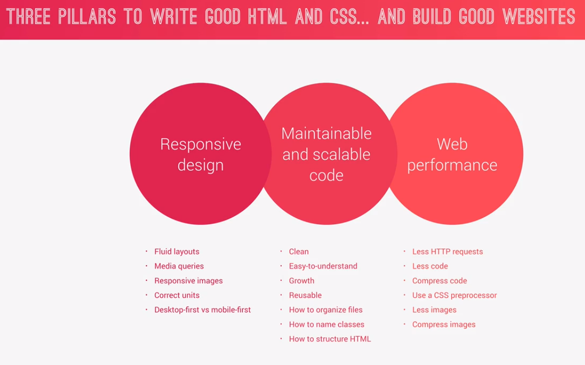

### Responsive Design

Looks beautiful on all screen sizes on all devices.

- Fluid Grids and Layouts.
- Media Queries.
- Flexible/Responsive Images, optimize image width.
- Correct Units.
- Desktop First vs Mobile First.

### Write Maintainable and Scalable Code

- Clean.
- Easy to understand.
- Growth.
- Reusable.
- How to organize files.
- How to name classes.
- How to structure html.

### Web Performance

- Less http requests, which means include little files.
- Less code.
- Compress Code.
- Use CSS Preprocessor.
- Less Images.
- Compress Images.

## Responsive Web Design

### Three Ingredients to Responsive Web Design

- Fluid grid and layouts: all layout elements are sized in relative units, such are percentages, instead of absolute units like pixels.
- Flexible and Responsive images: Images are also sized in relative units. Optimize image width.
- Media Queries: Allow us to specify different CSS style rules for different browser widths.

### Fluid Grid

Fluid Grid and Layout Types:

- Float Layouts
- Flexbox
- CSS Grid (best)

Float Layouts still used nowadays because Flexbox and CSS Grid still not supported by all browsers.

Build a custom grid with floats.

```css
.row {
  /* difference between max-width and width is max-width will take 100% of the view port if the width is less than 1140px, so if the viewport is small it will adopt automatically */
  max-width: $grid-width;
  background-color: #eee;
  margin: 0 auto;

  /* select everything except the last child */
  &:not(:last-child) {
    margin-bottom: $gutter-vertical;
  }

  /* if we didn't use clear fix, the width of the height will be 0px, because the child elements (columns) are floated to left so we need to use clear fix hack */

  @include clearfix;

  /* Using the attribute selector
        ^ select all elements which have a class attribute and value starts with col-
        $ select all elements which have a class attribute and value ends with col-
        * select all elements which have a class attribute and value contains col- */
  [class^="col-"] {
    background-color: orange;
    float: left;
    &:not(:last-child) {
      margin-right: $gutter-horizontal;
    }
  }

  /* we make variable $gutter-horizontal so for future projects we can play with the value as we want */
  .col-1-of-2 {
    /*  calc is a css function, it allows calculations where you can mix units,
        in order to use sass variables you need to wrap the variable inside #{ } */
    width: calc((100% - #{$gutter-horizontal}) / 2);
  }

  .col-1-of-3 {
    width: calc((100% - 2 * #{$gutter-horizontal}) / 3);
  }

  .col-2-of-3 {
    /* == 2 'col-1-of-3' + $gutter-horizontal */
    width: calc(
      2 * ((100% - 2 * #{$gutter-horizontal}) / 3) + #{$gutter-horizontal}
    );
  }

  .col-1-of-4 {
    width: calc((100% - 3 * #{$gutter-horizontal}) / 4);
  }

  .col-2-of-4 {
    width: calc(
      2 * ((100% - 3 * #{$gutter-horizontal}) / 4) + #{$gutter-horizontal}
    );
  }

  .col-3-of-4 {
    width: calc(
      3 * ((100% - 3 * #{$gutter-horizontal}) / 4) + (2 * #{$gutter-horizontal})
    );
  }
}
```

### Responsive Images

TODO: Come back here

Responsive images are crucial for web performance. The goal of responsive images is to serve the right image to the right screen size and device, in order to avoid downloading unnecessary large images on smaller screens, instead of sending 1 mb image, send 200kb image.

We have responsive images in (html) and (responsive images in css like background).

There is 3 use cases to use responsive images:

- **Resolution Switching**: Decrease image resolution on smaller screen; same image with smaller resolution.
- **Density Switching**: Special Case of resolution switching, screen size doesn't matter but the screen density does instead.
  - Density means amount of pixels found on an inch or centimeter.
  - @2x screen
    - (high resolution)
    - (exist in mac with retina display and all modern smart phones)
    - (it uses two physical pixels to display 1 pixel of our design)
  - @1x screen
    - (Low resolution)
    - (our normal computers)
- **Art Direction** When you want to not serve the same image but a whole different image for different screen sizes.

Check natours index page to see different flavours.

#### Resolution Switching

```css
/* responsive images in css - 'Resolution Switching'
    * dpi (dot per inch)
    * 192 because this the resolution of apple retina screen
    * if resolution is higher than 192 (we have 2x screen - DPR:2.0) then show the bigger image (../img/hero.jpg)
    * and (min-width: 600px) because in the mobile view (which is less than 600) almost the density is 2x so no need to download high resolution image
*/
@media only screen and (min-resolution: 192dpi) and (min-width: 37.5em),
  /* 600px/16px=37.5em */ /* comma here is like OR */ /* this is for safari because min-resolution not supported */ /* 2 means 2x*/ only screen and (-webkit-min-device-pixel-ratio: 2) and (min-width: 37.5em),
  /* if the screen size is more than 2000px download the big image */ /* this is to support devices not having higher density but having higher resolution */ only screen and (min-width: 125em) {
  /* 2000px/16px=125em */
  background-image: linear-gradient(
      to right bottom,
      rgba($color-secondary-light, 0.8),
      rgba($color-secondary-dark, 0.801)
    ), url(../img/hero.jpg);
}
```

```css
/* Make an Image Responsive */
img {
  /* scales the image to fit the width of its container */
  max-width: 100%;
  display: block;
  /* keeps the original aspect ratio of the image. */
  height: auto;
}
```

#### Art Direction

```html
<!-- This is for 'Art Direction' 
        Different image for different viewport width
        When you want to not serve the same image but different image for different screen sizes
        We have to specify <source> and  elements, at least 1  and 0 or more <source> -->
<picture class="footer__logo">
  <!-- we want the art direction happens at phone, so we put the media query for phone
            if the size is greater than 600px then browser forced to use  
            otherwise will use the <source> element-->
  <source
    srcset="img/logo-green-small-1x.png 1x, img/logo-green-small-2x.png 2x"
    media="(max-width: 37.5em)"
  />

  <!-- This is for 'Density Switching' (which is special Case of resolution switching) 
        * Screen size doesn't matter but the screen density does instead
        * Density means amount of pixels found on an inch or centimeter.
        * @2x screen
            * (high resolution)
            * (exist in mac with retina display and all modern smart phones)
            * (it uses two physical pixels to display 1 pixel of our design)
        * @1x screen
            * (Low resolution)
            * (our normal computers)

        1x and 2x is the density descriptor
        img/logo-green-2x.png for high resolution screen (2x)
        img/logo-green-1x.png for normal resolution screen (1x) 
    
        src attribute in case the user uses a browser that doesn't support srcset attribute -->
  
</picture>
```

#### Let the Browser Decide which Image to Use

```html
<div class="composition">
  <!-- Unlike the 'Art Direction' that we basically force the browser to use a certain image according to a media query, this approach let the browser choose the best image for the current viewport and pixel density for different situations.

300w and 1000w are the width descriptor which informs the browser the actual width of an image (in pixels) 
You're telling the browser the actual width of the image (in pixels) without forcing the browser to download them in order to get these information.

sizes attribute informs the browser about the approximate width of an image at different viewport width
with these information together with width descriptor the browser can figure out which perfect image to use for the current viewport width and current display resolution

suppose at viewport width 900px the image width is 171 so 171/900=0.19 almost 20% of the viewport width
suppose at viewport width 600px the image width is 171 so 171/600=0.285 almost 30% of the viewport width
and default size is 300px (if none of conditions happens)

so all of this will take care of 'Resolution Switching' and 'Density Switching'

we added src attribute in case the user uses an older browser                
-->

  

  

  
</div>
```

### Media Queries

```css
@media (max-width: 100px) {
  /* CSS Rules */
}
@media (min-height: 350px) {
  /* CSS Rules */
}
```

Media query will trigger at different breakpoints, and breakpoints are screen width at which we want our website to look good at all devices:

- 0 - 480px >> mobile
- 480px - 767px >> tablet
- 768px - 1023px >> tablet
- 1024px - 1200px >> PC

when you just starting out the easiest way is to define breakpoints for popular devices width like iPhone or iPad, but when you get more experience you start putting more break points where your websites looks terrible

```html
<!-- required for mobile view; it's telling device not to zoom out and start with scale 1.0 -->
<meta name="viewport" content="width=device-width, initial-scale=1.0" />
```

For testing media query on different devices, there is a website [sizzy.co](http://sizzy.co) put your website url and it will show you different sizes.

Using `em` and `rem` (in media queries) are not affected by root `font-size` setting which we set as `html { font-size: 62.5%; }`, this means `1em` or `1rem` (in media queries) is equal to the font size coming from the browser itself which is by default `16px`.

But if the user changed the font-size to `20px`, it will be `20px` no matter what is in base font definition which is `html { font-size: 62.5%; }`

So we're going to use `em` not `rem`; `em` is the best option to use in media query here, `1em = 16px`.

`@media only screen` only screen: apply only to screens, if someone wants to print the page media query will not apply

```scss
@mixin respond($breakpoint) {
  @if $breakpoint == phone {
    @media screen only and (max-width: 13em) {
      @content;
    }
  }
}
```

Check [this file](https://github.com/sabahallah/frontend-zone/blob/952ea557cff9ea3039e65c2e9c69efac9df9b4a4/css-and-design/projects/5-natours-project/sass/base/_base.scss) for base settings.

## Browser Support & Compatibility

- If you need to support some of the browsers you can check the property browser support at [caniuse.com](http://caniuse.com).
- Use Graceful Degradation using `@supports`.
- Go back to this section again if required, video 'Testing for Browser Support with `@supports`' in section 6, advanced css course.

## How CSS Works Behind the Scenes

This is [section 3](https://www.udemy.com/course/advanced-css-and-sass/learn/lecture/8274422#overview) in advanced CSS course.

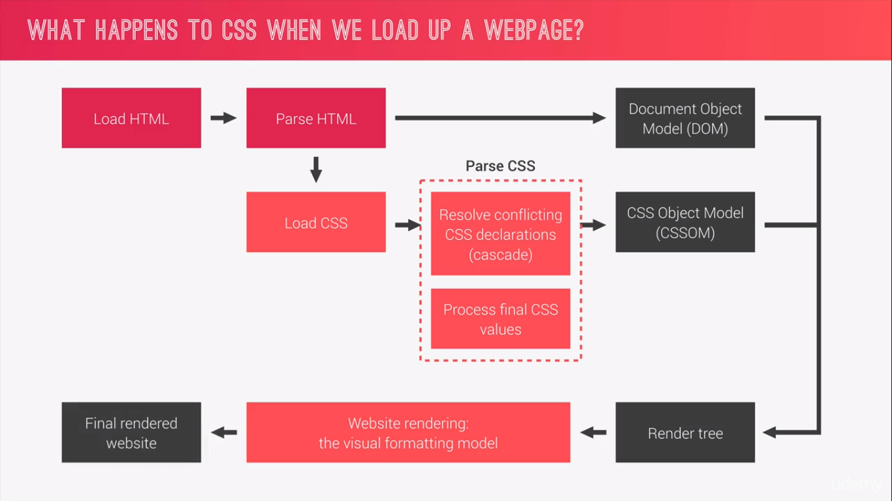

- Resolve conflicting CSS declarations (cascade) which means resolve conflicts for css rules written in different stylesheets.
- [Process final CSS values](#2.-process-final-css-value) means calculating the relative unites like `%`, `rem`, `em`, etc. which could be happened only on user's device.
- [The visual formatting model](#the-visual-formatting-model) means the box model, padding, margin, etc.

### How CSS is Parsed

#### 1. Cascading Process

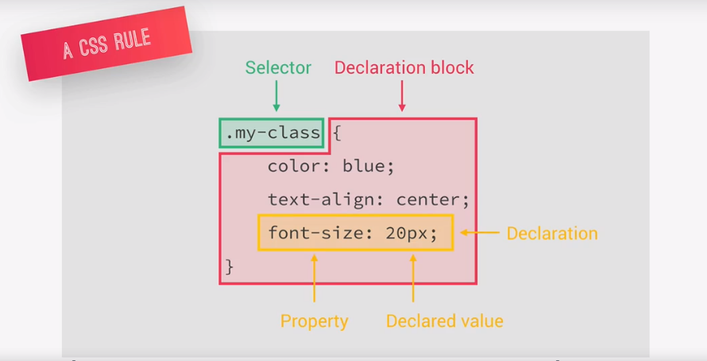

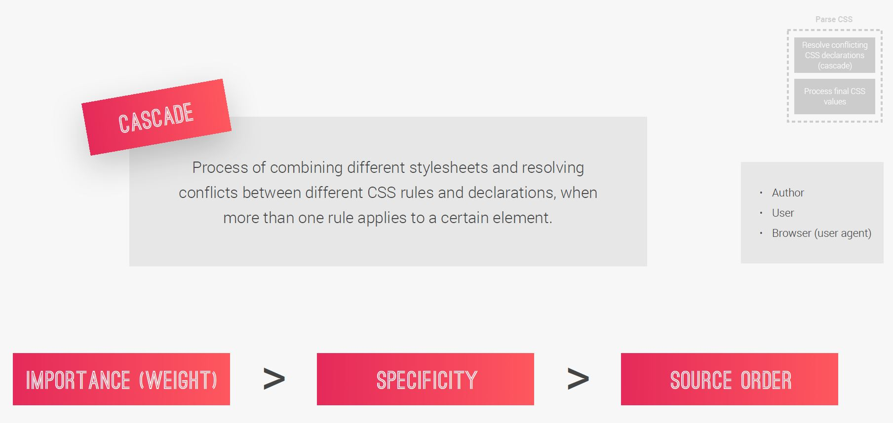

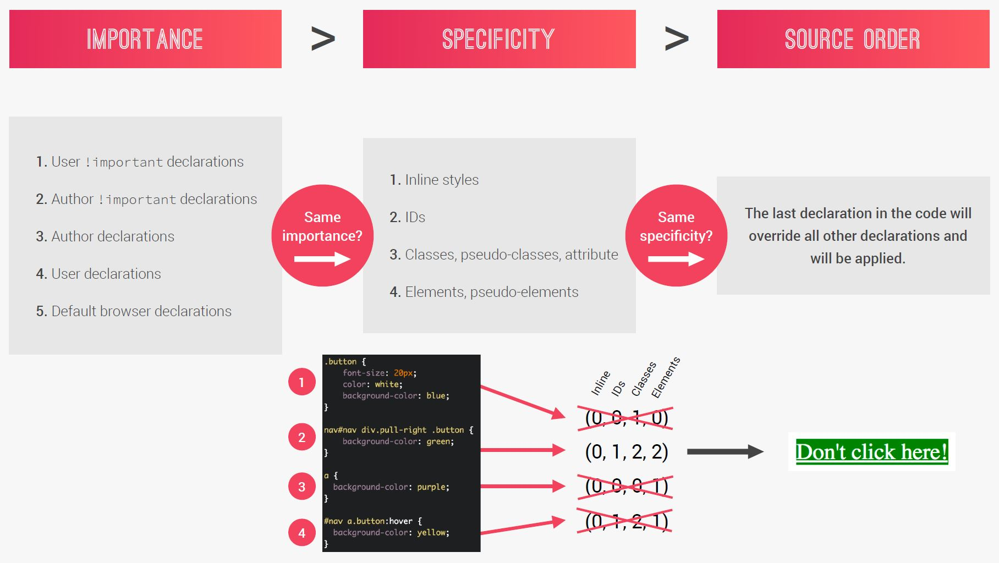

- Process of combining different stylesheets and resolving conflicts between different css rules and declarations, when more than one rule applies to a certain element.
  - **author** decelerations: what we - developers - write.
  - **user** decelerations: when user change the default font size in the browser.
  - **browser** (user agent) declarations: default css set by the browser.
- How does it fix the conflicts? importance (weight) > specificity > source order.
- The universal selector `*` has no specificity value (0,0,0,0).
- CSS declarations marked with `!important` have the highest priority.
- Inline styles will always have priority over styles in external stylesheets.
- Rely more on specificity than on the order of selectors. But, rely on order when using 3rd-party stylesheets — always put your author stylesheet last

```css
#nav div.pull-right a.button {
  background-color: green;
}
/* :hover >> in the same level of class */
#nav a.button:hover {
  background-color: yellow;
}

/*
if you apply the specificity rules mentioned in specificity section, which is "put 1 for each of below rules from left to right":
    * (inline style) style property embedded in html
    * id
    * class, pseudo-class or attribute selectors ex: [id="foo"]
    * html elements
first:  0122
second: 0121
first one will win because it has extra element div */
```

#### 2. Process Final CSS Value

[Advanced CSS Course: Value Processing](https://www.udemy.com/course/advanced-css-and-sass/learn/lecture/8274430#overview)

Value processing for `%`, `em`, `rem`, `vw`, `hw` to pixels.

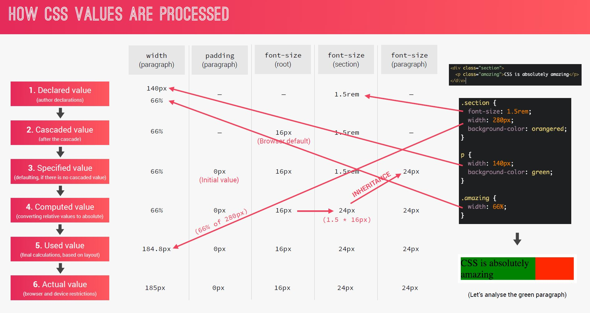

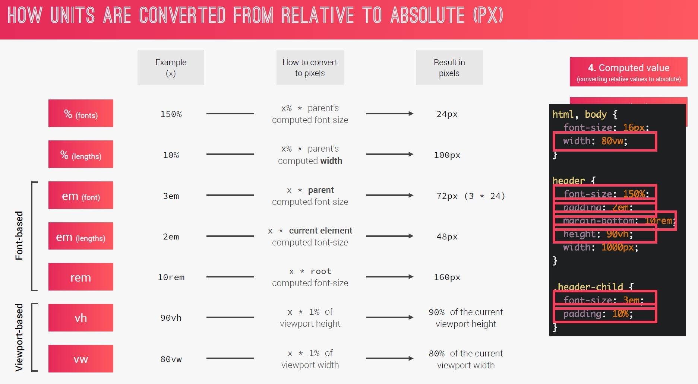

- `%` in font context (eg: `font-size`) = `%` of parent `font-size`.
- `%` in length context (eg: `padding`) = `%` of parent width.
- `em` and `rem` is font-based.
- `em` in font context (eg: `font-size`) = x \* parent `font-size`.
- `em` in length context (eg: `padding`) = x \* current element `font-size`.
- `rem` = x \* root `font-size`.
- Why to use `em` or `rem`? This is good for responsive design, only thing you need to change is `font-size`.
- `vh` = x \* viewport height.
- `vw` = x \* viewport width.

#### 3. Inheritance

There are some properties are inherited and some others are not inherited. eg: `line-height` property is inherited as written in the specifications. `padding` property is not inherited so it has an initial value (specific to each property), in case of `padding` it's just `0px`.

- Properties related to text are inherited: `font-family`, `font-size`, `color`, etc.
- The computed value of a property is what gets inherited, **not** the declared value. In below screen shot the value of `line-height` of `.child` is `30px` not `150%`.
- Inheritance of a property only works if no one declares a value for that property.
- The `inherit` keyword forces inheritance on a certain property. [See](./projects/5-natours-project/sass/base/_base.scss), `box-sizing: inherit;`.
- The `initial` keyword resets a property to its initial value.

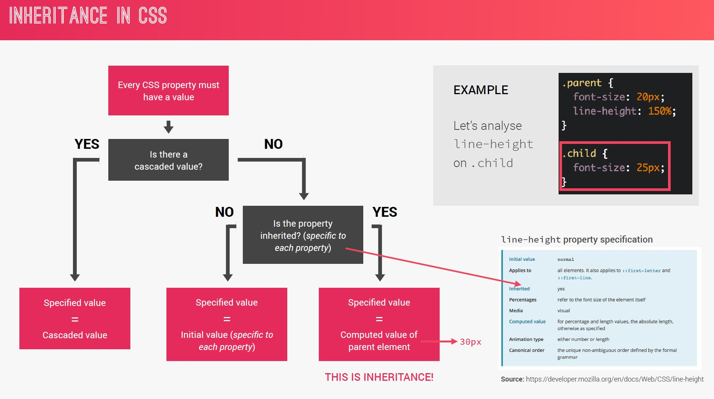

### The Visual Formatting Model

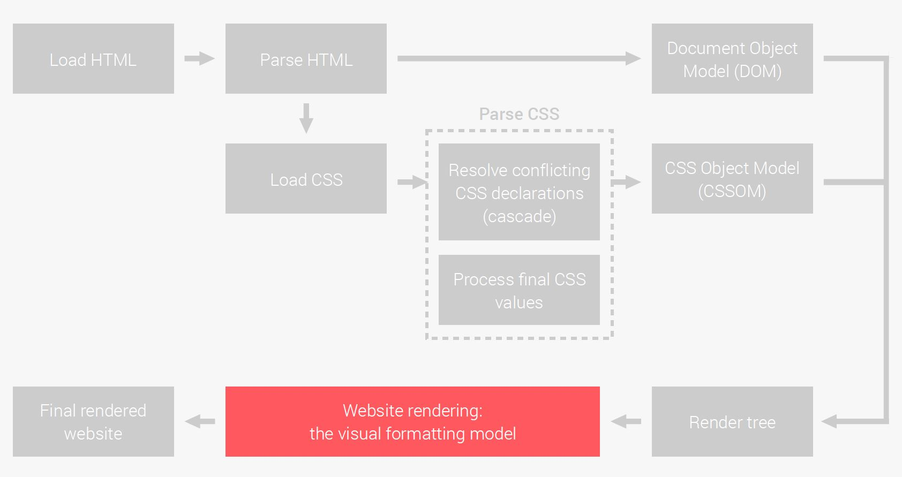

The Visual Formatting Model is the algorithm that calculates boxes and determines the layout
of theses boxes, for each element in the render tree, in order to determine the
final layout of the page.

- Dimensions of boxes: [the box model](#the-box-model).
- [Box types](#box-types): inline, block and inline-block.
- [Positioning scheme](#positioning-scheme): floats and positioning.
- [Stacking contexts](#stacking-context).
- Other elements in the render tree.
- Viewport size, dimensions of images, etc.

#### The Box Model

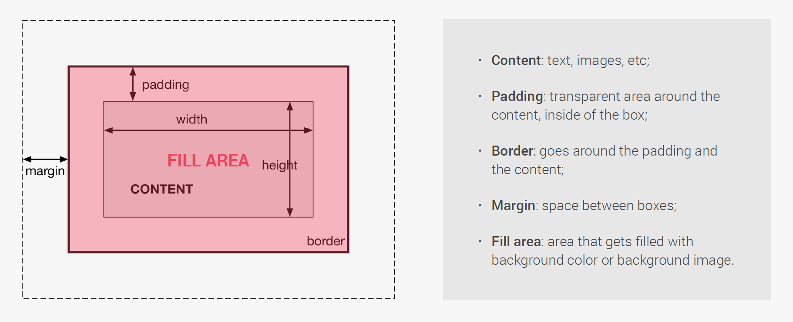

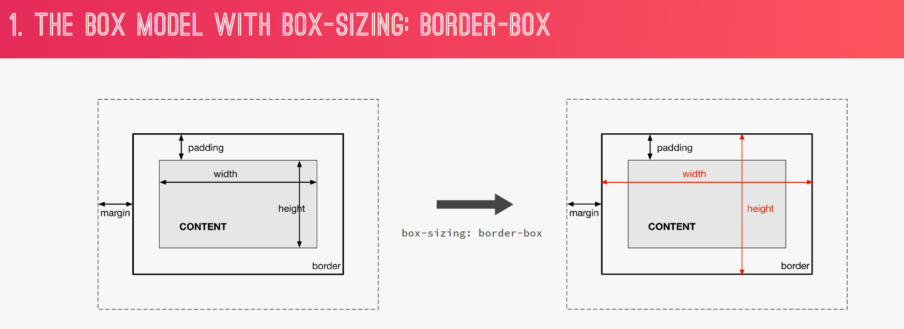

#### Box Types

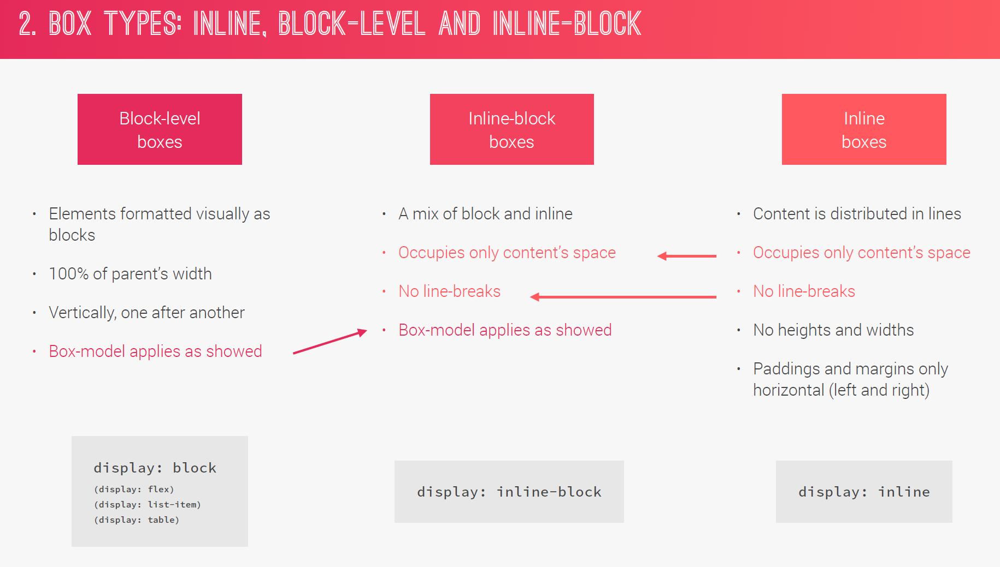

#### Positioning Scheme

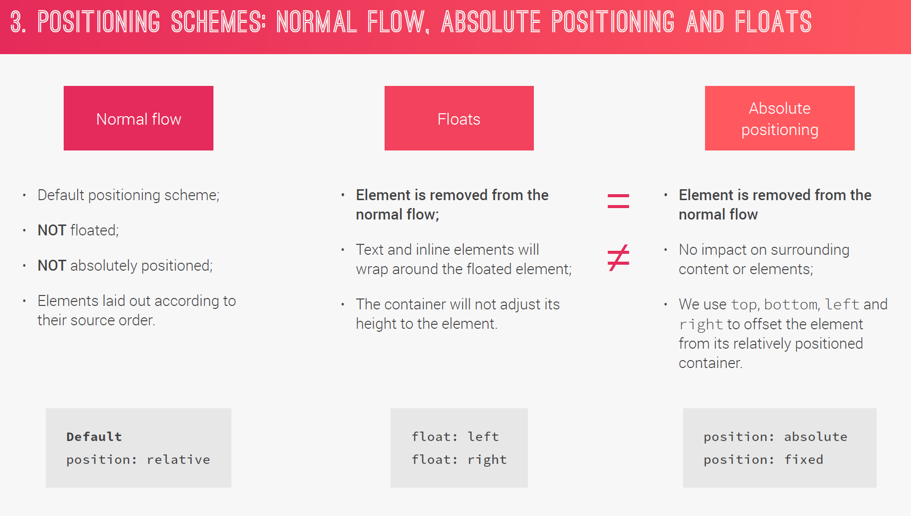

When you use absolute positioning you can use top, left, right, bottom and the other elements will be in its position, because css create stacking context for the absolute element and put it on top of the elements.

#### Stacking Context

In Which order elements rendered on the page.

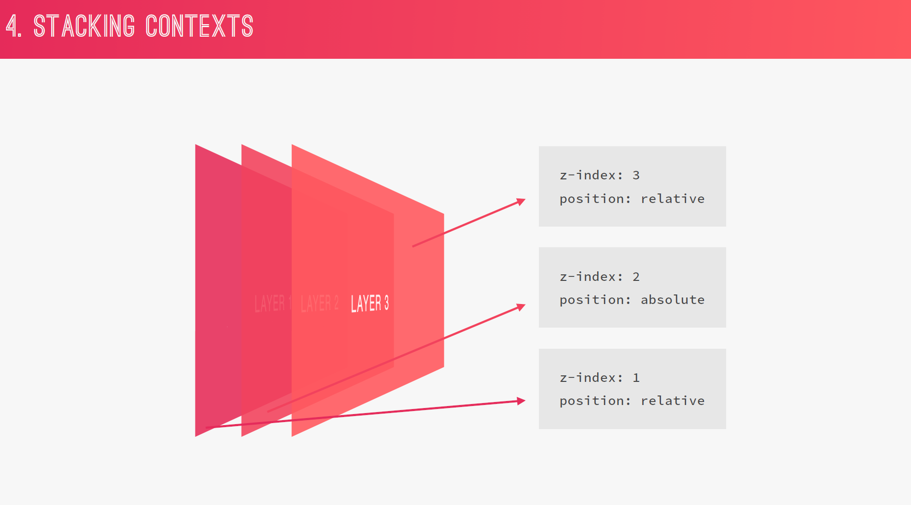

```css
z-index: 3;
position: relative;

z-index: 2;
position: absolute;

z-index: 3;
position: relative;
```

Note: `opacity`, `transform`, `filter` also create a new stacking context, because of that sometimes when putting the element with `z-index` stacking doesn't work as expected.

## CSS architecture

We have different CSS architecture strategies:

- BEM (Block Element Modifier)
- OOCSS (Object Oriented CSS)
- SMACSS (Scalable and Modular Architecture for CSS)
- 7-1 pattern (by google)
- OOCSS
- Atomic Design

### BEM (Block Element Modifier)

```css
/* BLOCK: standalone component meaningful of its own ex: .btn */
.block {
}
/* ELEMENT: part of a block and has no standalone meaning */
.block__element {
}
/* a different version of block or element .btn--round */
.block--modifier {
}
.block__element--modifier {
}
```

### 7-1 pattern (by google)

- Create a separate folder for each component.
- 7 different folders for partial SASS files.
- 1 main SASS file to import all the other files into a compiled css stylesheet.
- The 7 folders are:
  - base/ (for base and typography)
  - components/ (1 file for each component, buttons, cards, forms...)
  - layout/ (for general layout HEADER, FOOTER, NAVIGATION... + GRID)
  - pages/ (for page specific styles)
  - themes/
  - abstracts/ (variables, functions and mixins)
  - vendors/ (third party cs or animation)

Use this in larger projects it will be handy, for small projects you can use one scss file.

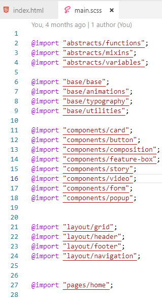
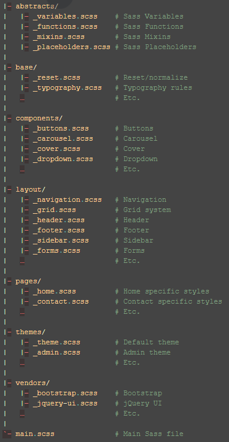

## SASS

SASS is a css preprocessor, other css pre-processors are LESS and STYLUS.

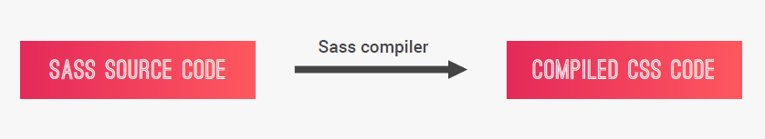

Files with **.sass** syntax (use indentation without curly braces)  
Files with **.scss** syntax (sassy css) (with curly braces)

[Example of SASS](https://codepen.io/anon/pen/eGZKyY?editors=1100#0)

**Variables** for reusable values such as colors, font-sizes, spacing, etc.

```scss
$color-primary: #f9ed69;

nav {
  background-color: $color-primary;
}
```

**Nesting**: to nest selectors inside of one another which allowing to write less code.

```scss
.navigation {
  list-style: none;
  float: left;

  /* & means concatenate */

  /* no need for '&' because it is a direct child of .navigation but in case of :first-child is attached to the element so we need to use '&:' */

  li {
    display: inline-block;
    margin-left: 30px;

    /* It will write the path until this point, means .navigation li:first-child {} */
    &:first-child {
      margin: 0;
    }

    a:link {
      @include style-link-text($color-text-dark);
    }
  }
}
```

**Mixins**: to write reusable pieces of css code.

```scss
@mixin clearfix {
  &::after {
    content: "";
    clear: both;
    display: table;
  }
}

nav {
  margin: divide(60, 2) * 1px; /* 30px */
  background-color: $color-primary;
  @include clearfix;
}
```

You can also pass variables to mixins.

```scss
@mixin style-link-text($col) {
  text-decoration: none;
  text-transform: uppercase;
  color: $col;
}

nav {
  @include style-link-text($color-primary);
}
```

**Functions**: similar to mixins but produces a value.

`darken` and `lighten` are a built in function in SASS.

```scss
darken($color-secondary, 15%);

@function divide($a, $b) {
    @return $a / $b;
}

nav {
    margin: divide(60, 2) * 1px; /* 30px */
}
```

**Extends** DRY (Don't Repeat Yourself) by applying inheritance.

```scss
%btn-placeholder {
  padding: 10px;
  /* will put the padding around the element.
    without using inline-block it will put padding only on right and left side. */
  display: inline-block;
  text-align: center;
  border-radius: 100px;
  width: $width-button;
  @include style-link-text($color-text-light);
}

.btn-main {
  &:link {
    @extend %btn-placeholder;
    background-color: $color-secondary;
  }

  &:hover {
    background-color: darken($color-secondary, 15%);
  }
}

.btn-hot {
  &:link {
    @extend %btn-placeholder;
    background-color: $color-tertiary;
  }

  &:hover {
    background-color: lighten($color-tertiary, 10%);
  }
}
/* difference between mixins is that code will not be repeated in time of compiling to css, the extend code will be only one.

code will not be copied to @extend place instead, it will be like below(putting .btn-main:link, .btn-hot:link before the placeholder) */

.btn-main:link,
.btn-hot:link {
  padding: 10px;
  display: inline-block;
  text-align: center;
  border-radius: 100px;
  width: $width-button;
  @include style-link-text($color-text-light);
}
```

**Operators**: for mathematical operations right inside css. eg: `margin: divide(60, 2) * 1px;`

**Partials and Imports**: to write css in different files and importing them all into one single file. Partial files always start with \_underscore but imported without underscore and file extension.

```css
/* without _ and .scss */
@import "base/base";
```

**Control directives** for writing complex code using **conditionals and loops**.

## Accessibility

### Use `alt` to Describe Images

`alt` text describes the content of the image and provides a text-alternative. This helps in case the image fails to load or can't be seen by a user. It's also used by search engines to understand what an image contains to include it in search results.

Background images usually fall under the 'decorative' label as well. However, they are typically applied with CSS rules, and therefore not part of the markup screen readers process.

### Use Headings to Show Hierarchical Relationships of Content

Screen readers can be set to read only the headings on a page so the user gets a summary. This means it is important for the heading tags in your markup to have semantic meaning and relate to each other, not be picked merely for their size values.

Each page should always have one (and only one) `h1` element, which is the main subject of your content. This and the other headings are used in part by search engines to understand the topic of the page.

### Page Structure

HTML5 introduced a number of new elements that give developers more options while also incorporating accessibility features. These tags include `main`, `header`, `footer`, `nav`, `article`, and `section`, among others. This adds semantic meaning to the page content.

`article` tag works well with blog entries, forum posts, or news articles.

Note about `section` and `div`

The `section` element is also new with HTML5, and has a slightly different semantic meaning than `article`. An `article` is for standalone content, and a `section` is for grouping thematically related content. They can be used within each other, as needed. For example, if a book is the `article`, then each chapter is a `section`. When there's no relationship between groups of content, then use a `div`.

```html
<div>
  <!--  groups not related content -->
  <section>
    <!--  groups related content -->
    <article><!--  groups independent, self-contained content --></article>
  </section>
</div>
```

### HTML `audio` Element

HTML5's `audio` element gives semantic meaning when it wraps sound or audio stream content in your markup. Audio content also needs a text alternative to be accessible to people who are deaf or hard of hearing. This can be done with nearby text on the page or a link to a transcript.

```html
<audio id="meowClip" controls>
  <source
    src="https://s3.amazonaws.com/freecodecamp/screen-reader.mp3"
    type="audio/mpeg"
  />
  <source src="audio/meow.ogg" type="audio/ogg" />
</audio>
```

### Improve Chart Accessibility with the `figure` Element

HTML5 introduced the `figure` element, along with the related `figcaption`. Used together, these items wrap a visual representation (like an image, diagram, or chart) along with its caption.

```html
<figure>
  
  <br />
  <figcaption>
    Master Camper Cat demonstrates proper form of a roundhouse kick.
  </figcaption>
</figure>
```

### Improve Form Field Accessibility with the `label` Element

```html
<form>
  <label for="name">Name:</label>
  <input type="text" id="name" name="name" />
</form>
```

### Wrap Radio Buttons in a `fieldset` Element for Better Accessibility

```html
<form>
  <fieldset>
    <legend>Choose one of these three items:</legend>
    <input id="one" type="radio" name="items" value="one" />
    <label for="one">Choice One</label><br />
    <input id="two" type="radio" name="items" value="two" />
    <label for="two">Choice Two</label><br />
    <input id="three" type="radio" name="items" value="three" />
    <label for="three">Choice Three</label>
  </fieldset>
</form>
```

### Standardize Times with the HTML5 `datetime` Attribute

HTML5 also introduced the `time` element along with a `datetime` attribute to standardize times. This is an inline element that can wrap a date or time on a page. A valid format of that `date` is held by the `datetime` attribute. This is the value accessed by assistive devices.

```html
<p>
  Posted by: Sub-Zero on
  <time datetime="2016-08-13T20:01Z">August 13<sup>th</sup></time>
</p>
```

### Make Elements Only Visible to a Screen Reader by Using Custom CSS

CSS can also improve accessibility on your page when you want to visually hide content meant only for screen readers.
This happens when information is in a visual format (like a chart), but screen reader users need an alternative presentation (like a table) to access the data.
CSS is used to position the screen reader-only elements off the visual area of the browser window.

```css
.sr-only {
  position: absolute;
  left: -10000px;
  width: 1px;
  height: 1px;
  top: auto;
  overflow: hidden;
}
```

```html
<table class="sr-only">
    <caption>Hours of Weekly Training in Stealth, Combat, and Weapons</caption>
    <thead>
        <tr>
            <th></th>
            <th scope="col">Stealth &amp; Agility</th>
            <th scope="col">Combat</th>
            <th scope="col">Weapons</th>
            <th scope="col">Total</th>
        </tr>
    </thead>
    <tbody>
        <tr>
            <th scope="row">Week One</th>
            <td>3</td>
            <td>5</td>
            <td>2</td>
            <td>10</td>
        </tr>
        <tr>
            <th scope="row">Week Two</th>
            <td>4</td>
            <td>5</td>
            <td>3</td>
            <td>12</td>
        </tr>
        <tr>
            <th scope="row">Week Three</th>
            <td>4</td>
            <td>6</td>
            <td>3</td>
            <td>13</td>
        </tr>
    </tbody>
    </table>
</section>
```

Note: The following CSS approaches will NOT do the same thing:

- `display: none;` or `visibility: hidden;` hides content for everyone, including screen reader users.
- `display: none;` means that the tag will not appear on the page at all (although you can still interact with it through the dom). There will be no space allocated for it between the other tags.
- `visibility: hidden;` means that unlike `display:none`, the tag is not visible, but space is allocated for it on the page. The tag is rendered, it just isn't seen on the page.

For example:

```html
test | <span style="[style-tag-value]">Appropriate style in this tag</span> |
test
```

Replacing [style-tag-value] with `display:none` results in:

```html
test | | test
```

Replacing [style-tag-value] with `visibility:hidden` results in:

```html
test | | test
```

Zero values for pixel sizes, such as `width: 0px; height: 0px;` removes that element from the flow of your document, meaning screen readers will ignore it.

### Improve Readability with High Contrast Text

- Low contrast between the foreground and background colors can make text difficult to read.
- Sufficient contrast improves the readability of your content.
- Avoid colorblindness issues by using sufficient contrast.
- Avoid colorblindness issues by carefully choosing colors that convey information.

## Flexbox

- Adding `display: flex` to an element turns it into a flex container.
- Flexbox is a new module in CSS3 that makes it easy to align elements to one
  another, in different directions and orders.
- The main idea behind flexbox is to give the container the ability to expand and
  to shrink elements to best use all the available space.
- Flexbox replaces float layouts, using less and more readable and logical code.
- <https://codepen.io/anon/pen/dVZvGr>

### Container Properties

- `flex-direction: row | row-reverse | column | column-reverse`
- `justify-content: flex-start | flex-end | center | space-between | space-around | space-evenly`
  - `center`: all the flex item at the center of the flex container.
  - `space-between`: space distributed between the flex items.
  - `space-around`: same amount of space on the right and left side of each of the flex items.
  - `space-evenly`: space always the same between flex items.
- `align-items: stretch | flex-start | flex-end | center | baseline` for cross direction
  - `center`: center flex items relative to the item which has highest height value.
  - `stretch`: (default) stretch flex items relative to the item which has highest height value.
  - `baseline`: align the **text** on flex items along the line, suppose there is flex item contains a bigger font size so if we put baseline, all flex items will be aligned on the cross access along the bigger font line.
- `flex-wrap: nowrap | wrap | wrap-reverse;` If flex items should wrap into new lines if there is not enough space in the flex container or not. `wrap` will create a new line if there's no enough space. Using the `flex-wrap` property, it tells CSS to wrap items. This means extra items move into a new row or column. The break point of where the wrapping happens depends on the size of the items and the size of the container.
- `align-content: stretch | flex-start | flex-end | center | space-between | space-around` Apply only when more than one row of the flex items, how rows are aligned along the cross axis if there's empty space. Same like align-items property but this aligns _rows_ along the cross axis.

### Flex Item Properties

- `align-self: auto | stretch | flex-start | flexend | center | baseline` Overrides container's alignment.
  `align-self` accepts the same values as `align-items` and will override any value set by the `align-items` property.
- `order: 0 | <integer>` all flex items has `order: 0;` by default, if you set `order: -1;` to a flex item, it will put this item at the beginning of the container, because any other flex item is 0.  
  The `order` property is used to tell CSS the order of how flex items appear in the flex container. By default, items will appear in the same order they come in the source HTML. The property takes numbers as values, and negative numbers can be used.
- `flex-grow: 0 | <integer>` ability of an element to grow as much as it can. If we put `flex-grow: 1;` on items it will occupy all the entire space as much as it can. If we put `flex-grow: 2;` on item so means it has double the ability to grow. shorthand property `flex: 1;`
- `flex-shrink: 1 | <integer>` default is `1`, means it allows an item to shrink if the flex container is too small, or there's no more available space. If we don't want item to shrink, we'll set it to 0.
  The `flex-shrink` property takes numbers as values. The higher the number, the more it will shrink compared to the other items in the container. For example, if one item has a `flex-shrink` value of 1 and the other has a `flex-shrink` value of 3, the one with value 3 will shrink three times as much as the other.

  ```html
  <style>
    #box-container {
      display: flex;
      height: 300px;
    }
    #box-1 {
      background-color: dodgerblue;
      width: 100%; // we put 100% here, so there will not be any available space, so it can shrink.
      height: 100%;
      flex-shrink: 1;
    }

    #box-2 {
      background-color: orangered;
      width: 100%;
      height: 100%;
      flex-shrink: 2;
    }
  </style>

  <div id="box-container">
    <div id="box-1"></div>
    <div id="box-2"></div>
  </div>
  ```

  

- `flex-basis: auto | <length>` width of an item. `flex-basis: 20%;` 20% of its container.  
  The `flex-basis` property specifies the initial size of the item before CSS makes adjustments with `flex-shrink` or `flex-grow`. The value `auto` sizes items based on the content.

- `flex` Shorthand Property. For example, `flex: 1 0 10px;` will set the item to `flex-grow: 1;`, `flex-shrink: 0;`, and `flex-basis: 10px;`. The default property settings are `flex: 0 1 auto;`

  ```html
  <!-- 
      300px is the combined size of the flex-basis values of the two boxes.
      These values will cause #box-1 to grow to fill the extra space at twice the rate of #box-2 when the container is greater than 300px and shrink at twice the rate of #box-2 when the container is less than 300px. 
  
      When container width > 300px then (grow)
          * divide total container width by 3 (from: box-1 grows 2 times, box-2 grows 1 time) = 1 unit width
          * grow box-1 (2 * 1 unit)
          * grow box-2 (1 * 1 unit)
  
      When container width < 300px then (shrink)
          * divide total container width by 3 (from: box-1 shrinks 2 times, box-2 shrinks 1 time) = 1 unit width
          * shrink box-1 (2 * 1 unit)
          * shrink box-2 (1 * 1 unit)
  -->
  <style>
    #box-container {
      display: flex;
      height: 500px;
    }
    #box-1 {
      background-color: dodgerblue;
      flex: 2 2 150px;
      height: 200px;
    }

    #box-2 {
      background-color: orangered;
      flex: 1 1 150px;
      height: 200px;
    }
  </style>

  <div id="box-container">
    <div id="box-1"></div>
    <div id="box-2"></div>
  </div>
  ```

- Very good trick to know with `flexbox`.

  ```scss
  .overview {
    display: flex;
    &__stars {
      // flex: 1;  not ideal because it will occupy the whole available space, imagine we have hover effect, so effect will be applied to whole space
      // if you use margin-right: auto; with flexbox it will occupy only the space that it needs and all remaining space will be margin right
      margin-right: auto;

      /* there is small space below each of the stars because SVGs behave like inline elements, so it a bit like text that produces a small white space under the star
          we can remove this space by setting the line height and font size to 0, but we have a simple way doing this is by setting parent element to display: flex; */
      display: flex;
    }
    &__icon-star,
    &__icon-location {
      width: 1.75rem;
      height: 1.75rem;
      fill: var(--color-primary);
    }
  }
  ```

## Grid Layout

- CSS Grid Layout is a brand new module that brings a two-dimensional grid system to CSS for the first time.
- CSS Grid replaces float layouts, using less, and more readable and logical CSS and HTML.
- CSS Grid works perfectly together with Flexbox, which is best to handle one dimensional components and layouts.
- No Need for Bootstrap anymore.
- It requires a whole new mindset, whole new thinking about design, html and CSS.

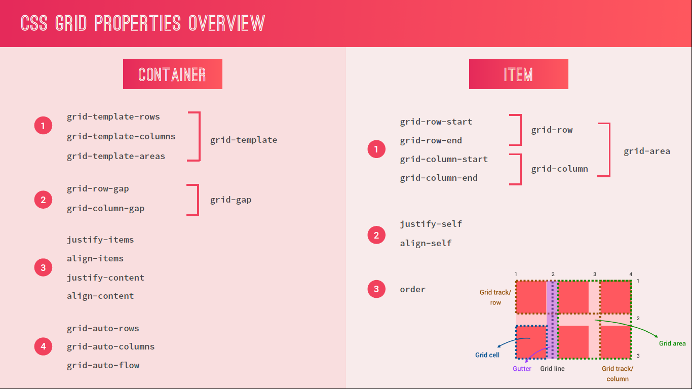

- [Reference on codepen](https://codepen.io/jonasschmedtmann/pen/ppzVZo)
- Grid Components
  - Grid Line 1 2 3 4
  - Grid Track [Space between Grid Lines, ex: 1-3]
    - Grid Track (Row)
    - Grid Track (Column)
  - Grid Area [Space Between Two Vertical and Two Horizontal Grid Lines]
  - Grid Cell [Space Between Two Adjacent Vertical and Two Horizontal Grid Lines]
  - Use Dev Tool in Firefox Quantumn > Layout > Display Line Numbers.
- Grid Properties
  - `grid-template-rows: 150px 150px` two rows each of 150px height.
  - `grid-template-columns: auto 50px 10% 2fr 1fr;` This snippet creates five columns. The first column is as wide as its content, the second column is 50px, the third column is 10% of its container, and for the last two columns; the remaining space is divided into three sections, two are allocated for the fourth column, and one for the fifth.
  - You can also use repeat() function
  - `grid-gap: 10px 20px;` If grid-gap has one value, it will create a gap between all rows and columns. However, if there are two values, it will use the first one to set the gap between the rows and the second value for the columns.
    - `grid-row-gap: 30px;`
    - `grid-column-gap: 50px;`
  - `justify-self: center;` In CSS Grid, the content of each item is located in a box which is referred to as a cell. You can align the content's position within its cell horizontally using the justify-self property on a grid item. By default, this property has a value of `stretch`.
  - `align-self: center;` property on an item to align an item vertically. This property accepts all of the same values as `justify-self`
  - `justify-items: center;` on your grid container. Sometimes you want all the items in your CSS Grid to share the same alignment.
  - `align-items: end;` on your grid container to align items vertically.
  - `grid-area: 1/1/2/4;` grid-area: horizontal line to start at / vertical line to start at / horizontal line to end at / vertical line to end at;

```css
.container {
  display: grid;

  grid-template-rows: repeat(
    2,
    150px
  ); /* 2 tracks for the rows each has 150px height same as 150px 150px */
  grid-template-columns: repeat(2, 150px) 300px; /* 3 tracks; 2 columns has 150px and 1 has 300px width */
  grid-template-columns: repeat(
    3,
    1fr
  ); /* 1 fractional unit, it expands to all space that it can occupy, 1 fraction of the available space, it divides available space by 3 */
  grid-template-columns: 1fr 2fr 1fr;
  grid-template-columns: 50% 1fr 1fr; /* 50% of the available space, the remaining 50% will go to the fraction. (it includes fraction and gap) */

  /* grid-row-gap: 30px; */
  /* grid-column-gap: 50px;*/
  grid-gap: 30px;
}

.box {
  /* positioning a grid cell */
  grid-row-start: 2;
  grid-row-end: 3;
  grid-column-start: 2;
  grid-column-end: 3;
}

.box-2 {
  /* Shorthand */
  grid-row: 1 / 3;
  grid-column: 2 / 4;

  /* -1 means span from column no. 1 to the end, no matter how many columns you have (if you don't know how many columns) */
  grid-column: 1 / -1;

  grid-column: 1 / span 2; /* same as grid-column: 1 / 3 */
}

/* Spanning Grid Items cross multiple cells

If we span a cell to occupy multiple cells, Grid Layout will create a new row or a new column.

but You can have multiple grid items in the same cell, they overlap on top of each other, if you want to show the behind, use z-index */
.box-3 {
  /* Shorthand 1 row start, 2 column start, 3 row end, 4 column end 
  
  if there's items on the right, it will create a new row 
  but if you explicitly tell the position of grid items, they can be in the same cell.  */
  grid-area: 1 / 2 / 3 / 4;
}
```

### Naming Grid

There are three different ways to name gride lines, we use them to place grid items on the grid:

1. Using auto generated grid line numbers [Codepen Example](https://codepen.io/sabahallah/pen/gqRRdj).
2. Using line names [Codepen Example](https://codepen.io/sabahallah/pen/omwwPe).
3. Naming Grid Area [Codepen Example](https://codepen.io/sabahallah/pen/LqyyBN).

### Implicit Grids vs Explicit Grids

Implicit Grids is great for use cases where you don't really know how many rows or columns will be on your grid layout, for example: if you retrieving data from the server via ajax call in web app and you don't really know how many items will return from the server, so you can style the extra rows and everything will work as expected even if you don't know how many items will be in it. `grid-auto-rows: 80px;`  
[Codepen Example](https://codepen.io/sabahallah/pen/exREpB)

### Grid Flow

```css
.container {
  /* the grid flow by default is row, but you can change the default behavior using grid-auto-flow property */
  grid-auto-flow: column;

  /* now the grid flow is column so give the implicit cells width of 1/2 fraction */
  grid-auto-columns: 0.5fr;
}
```

### Aligning Grid **Items** Inside Grid Areas

Align grid items inside the grid area or cell [Codepen Example](https://codepen.io/sabahallah/pen/RvgLEo)

```css
.container {
  display: grid;
  grid-template-rows: repeat(2, 150px);
  grid-template-columns: repeat(2, 1fr);
  grid-gap: 30px;

  grid-auto-flow: row;
  grid-auto-rows: 80px;

  /* item will be completely centered, it will calculate width and height of the item and remaining space will be set as auto margin around the item */

  /* align items in the column axis, like flexbox */
  align-items: center; /* stretch, start, end, default is stretch */
  /* align items in the row axis, not exist in flexbox */
  justify-items: center; /* stretch, start, end */

  &--4 {
    background-color: crimson;
    grid-row: 2 / span 3;

    /* to override container settings */
    align-self: start;
    justify-self: start;
  }
}
```

### Aligning **Tracks** Inside its Container

Align grid tracks (cell or multiple cells) inside its container (which is the grid) [Codepen Example](https://codepen.io/sabahallah/pen/pGwpJj)

```css
.container {
  /* - sometimes when you align track, some empty holes (boxes or cells without any items) will be created in order to keep the source order in html
  - to prevent this from happening set dense value to grid-auto-flow
  - this probably good if you have image gallery for example */
  grid-auto-flow: row dense;

  /* align grid track [cell or multiple cells] to its container (which is the grid) horizontally if width is less than the container's width */
  justify-content: space-evenly; /* center, start, end, space-between, space-around */

  /* align grid track [cell or multiple cells] to its container (which is the grid) vertically if height is less than the container's height */
  align-content: center; /* start, end, space-between, space-around, space-evenly */
}
```

### Using `min-content`, `max-content` and `minmax()` Functions

[Codepen Example](https://codepen.io/sabahallah/pen/NogyYa)

```css
.container {
  width: 1000px;
  margin: 30px auto;
  background-color: #ddd;

  display: grid;
  // grid-template-rows: repeat(2, 150px);

  /* max-content: it will adopt the content according to the largest content as wide as it has to be to fit this content without making any line break
     min-content: is the same but for smallest content in the grid columns */
  // grid-template-columns: max-content 1fr 1fr min-content;

  /* it will set the row height to the min content height */
  // grid-template-rows: repeat(2, min-content);

  width: 90%;
  /* it will make sure height is between 50px and min-content */
  grid-template-rows: repeat(2, minmax(50px, min-content));

  /* it will make sure width is at least 200px */
  grid-template-columns: minmax(200px, 1fr) repeat(3, 1fr);

  /* repeat(3, 1fr)
  setting the size to 1fr doesn't mean it will be fixed to 1fr. If the content is bigger than 1fr, it will take its normal spac, you can think 1fr is the initial value, but content will decide this. */
}
```

### Responsive Layouts with `auto-fit` and `auto-fill` Functions

[Codepen Example](https://codepen.io/sabahallah/pen/BMZVXm)

```css
.container {
  width: 1000px;
  margin: 30px auto;
  background-color: #ddd;

  display: grid;

  grid-template-rows: repeat(2, minmax(150px, min-content));

  /* auto-fill: it will create grid of 10 columns because our width is 1000px, but we have 8 divs only */
  grid-template-columns: repeat(auto-fill, 100px);

  /* auto-fit: it will create grid of 10 columns also but the last two will collapse with width of 0px */
  grid-template-columns: repeat(auto-fit, 100px);

  width: 90%;
  /* it will be really adoptive to screen width. If width isn't enough to contain the items, new implicit rows will be created 
  */
  grid-template-columns: repeat(auto-fit, minmax(200px, 1fr));

  /* because implicit rows will be created */
  grid-auto-rows: 150px;
}
```

```html
<div class="container">
  <div class="item item--1">CSS</div>
  <div class="item item--2">is</div>
  <div class="item item--3">awesome</div>
  <div class="item item--4">and</div>
  <div class="item item--5">now</div>
  <div class="item item--6">learning</div>
  <div class="item item--7">Grid</div>
  <div class="item item--8">Layout</div>
</div>
```

Text can be treated as a grid as well as after and before pseudo elements.

```scss
&__seenon-text {
  display: grid;
  grid-template-columns: 1fr max-content 1fr;
  grid-column-gap: 1.5rem;
  align-items: center;

  font-size: 1.6rem;
  color: $color-grey-light-2;

  &::before,
  &::after {
    content: "";
    height: 1px;
    display: block;
    background-color: currentColor;
  }
}
```

#### `auto-fit` vs `auto-fill` example

`auto-fit` works almost identically to `auto-fill`. The only difference is that when the container's size exceeds the size of all the items combined, `auto-fill` keeps inserting empty rows or columns and pushes your items to the side, while `auto-fit` collapses those empty rows or columns and stretches your items to fit the size of the container.

```html
<style>
  .item1 {
    background: LightSkyBlue;
  }
  .item2 {
    background: LightSalmon;
  }
  .item3 {
    background: PaleTurquoise;
  }
  .item4 {
    background: LightPink;
  }
  .item5 {
    background: PaleGreen;
  }

  .container {
    font-size: 40px;
    min-height: 100px;
    width: 100%;
    background: LightGray;
    display: grid;
    grid-template-columns: repeat(auto-fill, minmax(60px, 1fr));
    grid-template-rows: 1fr 1fr 1fr;
    grid-gap: 10px;
  }

  .container2 {
    font-size: 40px;
    min-height: 100px;
    width: 100%;
    background: Silver;
    display: grid;
    /* change the code below this line */

    grid-template-columns: repeat(auto-fit, minmax(60px, 1fr));

    /* change the code above this line */
    grid-template-rows: 1fr 1fr 1fr;
    grid-gap: 10px;
  }
</style>

<div class="container">
  <div class="item1">1</div>
  <div class="item2">2</div>
  <div class="item3">3</div>
  <div class="item4">4</div>
  <div class="item5">5</div>
</div>
<div class="container2">
  <div class="item1">1</div>
  <div class="item2">2</div>
  <div class="item3">3</div>
  <div class="item4">4</div>
  <div class="item5">5</div>
</div>
```

#### Use Media Queries to Create Responsive Layouts example

```html
<style>
  .item1 {
    background: LightSkyBlue;
    grid-area: header;
  }

  .item2 {
    background: LightSalmon;
    grid-area: advert;
  }

  .item3 {
    background: PaleTurquoise;
    grid-area: content;
  }

  .item4 {
    background: lightpink;
    grid-area: footer;
  }

  .container {
    font-size: 1.5em;
    min-height: 300px;
    width: 100%;
    background: LightGray;
    display: grid;
    grid-template-columns: 1fr;
    grid-template-rows: 50px auto 1fr auto;
    grid-gap: 10px;
    grid-template-areas:
      "header"
      "advert"
      "content"
      "footer";
  }

  @media (min-width: 300px) {
    .container {
      grid-template-columns: auto 1fr;
      grid-template-rows: auto 1fr auto;
      grid-template-areas:
        "advert header"
        "advert content"
        "advert footer";
    }
  }

  @media (min-width: 400px) {
    .container {
      /* change the code below this line */

      grid-template-areas:
        "header header"
        "advert content"
        "footer footer";

      /* change the code above this line */
    }
  }
</style>

<div class="container">
  <div class="item1">header</div>
  <div class="item2">advert</div>
  <div class="item3">content</div>
  <div class="item4">footer</div>
</div>
```

## SVG

Moving from Icon Fonts to SVGs. (Scalable Victor Graphics)

- Icon Fonts is just a hack to display icon like a font.
- Icon Fonts fail more often that you would think and in that case browser display a small square on the screen.
- Screen readers failing to read the Icon Fonts.
- It's super easy to style SVGs.
- Small file sizes that compress well.
- Scales to any size without losing clarity.
- Looks great on retina displays.

So it's a best practice to use SVGs instead of using icon fonts.  
Use <https://icomoon.io/> to convert Icon Font to SVG or to download SVG images.  
Symbol-defs.svg is called sprite file, it's a simple SVG file contains all other svg images. Instead of making multiple http calls, you will make only one http request.

Using SVGs in Html:

```html
<svg class="search__icon">
  <!-- This will appear only if you're using a webserver -->
  <use xlink:href="img/sprite.svg#icon-magnifying-glass"></use>
</svg>
```

Formatting SVG is easy, just set its height and width. also changing SVG color is easy, just use `fill` property.

```css
height: 2rem;
width: 2rem;
fill: var(--color-grey-dark-3);
```

```css
/* setting color of svg to be color of parent element, so if you change parent color in any case this will change automatically */
fill: currentColor;
```

### Useful SVG Resources

- [Inline SVG vs Icon Fonts](https://css-tricks.com/icon-fonts-vs-svg/)
- [Icon System with SVG Sprites](https://css-tricks.com/svg-sprites-use-better-icon-fonts/)
- [A Compendium of SVG Information](https://css-tricks.com/mega-list-svg-information/)
- [SVG Sprite Creation Techniques](https://24ways.org/2014/an-overview-of-svg-sprite-creation-techniques/)
- [Sara Souedian Blog, More Articles on SVG](https://www.sarasoueidan.com/blog/)
- [Building Better Interfaces with SVG](https://slides.com/sarasoueidan/building-better-interfaces-with-svg)
- [Building a Circular Navigation with SVG](https://www.sarasoueidan.com/blog/building-a-circular-navigation-with-svg/)
- [Generate a Circular Navigation](https://www.sarasoueidan.com/tools/circulus/)
- [SVG Custom Animated Checkboxes](https://codepen.io/SaraSoueidan/pen/40433575e3d0d026c7d9c00eb45522a1?editors=1100)
- <https://1stwebdesigner.com/create-simple-shapes-svg/>
- <https://css-tricks.com/using-svg/>
- <https://codepen.io/rafita/pen/aNyRgv>
- [SVG Optimizer](http://petercollingridge.appspot.com/svg-optimiser)

## clip-path

```css
@supports (clip-path: polygon(0 0)) or (-webkit-clip-path: polygon(0 0)) {
  /* specify a polygon in which the image or the element will still be visible */
  /* nice website you can use, www.bennettfeely.com/clippy/ */
  clip-path: polygon(
    0 0,
    100% 0,
    100% 75vh,
    0 100%
  ); /*75vh means 75 percent of the viewport height */
  -webkit-clip-path: polygon(0 0, 100% 0, 100% 75vh, 0 100%);
  height: 95vh;
}
```

## Miscellaneous

todo: come back

### Vertical Align Items

`vertical-align: middle;` align text and image to be in the same vertical axis.

- ```css
  /* to align the icon with the text on the right side */
  line-height: 120%;
  vertical-align: middle;
  margin-top: -5px;
  ```

### Checkbox

Show/Hide elements by css only no js. [jsfiddle example](https://jsfiddle.net/winduptoy/8qfvb1az/)

```html
<label for="toggleControl" style="cursor: pointer;">Click Me</label>
<input type="checkbox" id="toggleControl" style="display: none;" />
<div
  id="toggleMe"
  style="border: 1px solid black; margin: 10px; padding: 10px;"
>
  Look mom, no JavaScript!
</div>
```

```css
#toggleMe {
  display: none;
}
#toggleControl:checked ~ #toggleMe {
  display: block;
}
```

### Use `<details>` and `<summary>` Instead of Using Javascript

Examples [here](https://freefrontend.com/html-details-summary-css/)

```html
<details>
  <summary>Copyright 1999-2014.</summary>
  <p>- by Refsnes Data. All Rights Reserved.</p>
  <p>
    All content and graphics on this web site are the property of the company
    Refsnes Data.
  </p>
</details>
```

- Check this [link](https://github.com/sabahallah/frontend-zone/blob/952ea557cff9ea3039e65c2e9c69efac9df9b4a4/css-and-design/projects/5-natours-project/sass/components/_composition.scss)

  ```css
  &__photo {
    width: 55%;
    box-shadow: 0 1.5rem 4rem rgba($color-black, 0.4);
    border-radius: 2px;
    position: absolute;
    z-index: 10;
    transition: all 0.2s;
    outline-offset: 2rem; /* transparent area outside the image */

    &:hover {
      transform: scale(1.05) translateY(-0.5rem);
      box-shadow: 0 2.5rem 4rem rgba($color-black, 0.5);
      z-index: 20; /* To make the image overlay top of the others it should have higher z-index */

      /* it is like a boarder, but with outline we can use outline-offset property. check above. */
      outline: 1.5rem solid $color-primary;
    }
  }
  ```

- Check [this](https://github.com/sabahallah/frontend-zone/blob/952ea557cff9ea3039e65c2e9c69efac9df9b4a4/css-and-design/projects/5-natours-project/sass/components/_card.scss) file:

  - `perspective: 150rem;`
  - `backface-visibility: hidden;`
  - `background-blend-mode: screen;`
  - `clip-path: polygon(0 0, 100% 0, 100% 85%, 0 100%)`
  - `box-decoration-break: clone;`
  - `@media only screen and (hover: none) {}`

- Check [this](https://github.com/sabahallah/frontend-zone/blob/952ea557cff9ea3039e65c2e9c69efac9df9b4a4/css-and-design/projects/5-natours-project/sass/components/_popup.scss) file:

  - `@supports(-webkit-backdrop-filter: blur(10px)) or (backdrop-filter: blur(10px)) {}`
  - `&:target`
  - `column-count: 2;`
  - `column-gap: 4rem;`
  - `column-rule: 1px solid $color-grey-light-2;`
  - `hyphens: auto;`

- Check this [**link**](https://github.com/sabahallah/frontend-zone/blob/952ea557cff9ea3039e65c2e9c69efac9df9b4a4/css-and-design/projects/5-natours-project/sass/components/_story.scss)

  - `@supports (clip-path: polygon(0 0)) or (-webkit-clip-path: polygon(0 0)) {}`
  - `shape-outside: circle(50% at 50% 50%);`
  - `filter: blur(3px) brightness(80%);`

- ```css
  .section-features {
    padding: 20rem 0;
    background-image: linear-gradient(
        to right bottom,
        rgba($color-primary-light, 0.8),
        rgba($color-primary-dark, 0.801)
      ), url(../img/nat-4.jpg);

    /* HINT: Skew the section -7deg, then we skew the direct children the opposite way 7deg */
    transform: skewY(-7deg);

    /* HINT: Select every element which is a direct child of section-feature and skew it in the y ditection 7deg */
    & > * {
      transform: skewY(7deg);
    }
  }
  ```

- ```scss
  &__input {
    font-size: 1.5rem;
    font-family: inherit; /* HINT: because browser sets default font-family */
    color: inherit; /* HINT: If i didn't add this, browser sets default color which black */
    padding: 1.5rem 2rem;
    border-radius: 2px;
    background-color: rbga($color-white, 0.5);
    border: none;
    border-bottom: 3px solid transparent; /* HINT: Transparent because we will give it a color when user focuses on it. */
    width: 90%;
    display: block;
    transition: all 0.3s;

    /* for media queries */
    @include respond(tab-port) {
      width: 100%;
    }

    &:focus {
      /* HINT: Remove borders when focusing on an element. */
      outline: none;
      box-shadow: 0 1rem 2rem rgba($color-black, 0.1); /* HINT: For accessability: When user moves around with a keyboard, you should give some box-shadow. */
      border-bottom: 3px solid $color-primary;
    }

    &:focus:invalid {
      border-bottom: 3px solid $color-secondary-dark;
    }

    &::-webkit-input-placeholder {
      /* HINT: To style the placeholder */
      color: $color-grey-dark-2;
    }
  }
  ```

- ```scss
  // for putting blockquote sign before a paragraph, using Glyphs special html characters
  &::before {
    /* html entity, check https://css-tricks.com/snippets/html/glyphs/ */
    content: "\201C";
    position: absolute;
    top: -2.75rem;
    left: -1rem;
    line-height: 1;
    font-size: 20rem;
    color: var(--color-grey-light-2);
    /* to look exactly the same as we want */
    font-family: sans-serif;
    z-index: 1;
  }
  ```

- ```css
  /* Putting this on the parent element will put all the children in horizontal row */
  display: flex;
  ```

- ```css
  /*If you set an element's margin to a negative value, the element will grow larger.*/
  margin: -15px;
  ```

- ```css
    /* if we have a list of items and need it to scroll if it's more than the max height, set overflow: scroll; */
    <ul style="height=300px; overflow: scroll;">
        <li></li>
        <li></li>
        <li></li>
        <li></li>
        <li></li>
        <li></li>
        <li></li>
    </ul>
  ```

- ```css
  .borderImg {
    /* 2px horizontal, 2px vertical, 5px blur it out; mush softer, color */
    text-shadow: 2px 2px 5px black;
    border: 5px dotted white; /* width, type and color */
  }
  ```

- ```css
  header {
    background-image: url(img/hero.jpg);
    background-repeat: no-repeat;
    background-size: cover;
    height: 100vh; /* it will take 100% of the view port height */
  }
  ```

- ```css
  .box {
    background-color: lightblue;
    color: white;
    text-align: center;
    font-family: verdana;
    font-size: 20px;
    display: block; /* by default the div element will have this attribute, it will take the full width and force line break */
  }
  ```

- ```html
  <!-- <span> element here only inside <p> to style inline content -->
  <p class="plan-price">399$ <span>per month</span></p>

  <!-- adding white space, like an empty line -->
  <p class="plan-price-meal">&nbsp;</p>
  ```

- ```css
  /* remove borders added by chrome in input elements */
  *:focus {
    outline: none;
  }
  ```

- ```html
  <div class="row">
    <div class="col span-1-of-3">
      <!-- when you click on the label it will highlight the textbox, it didn't work with text area and selection -->
      <label for="find-us">How did you find us?</label>
    </div>
    <div class="col span-2-of-3">
      <select name="find-us" id="find-us">
        <option value="friends">Friends</option>
        <option value="search">Search Engine</option>
        <option value="ad">Advertisement</option>
        <option value="other">Other</option>
      </select>
    </div>
  </div>
  ```

- ```css
  padding: 10px 20px;
  /* It works clockwise starting from top */
  padding-top: 10px;
  padding-right: 20px;
  padding-bottom: 10px;
  padding-left: 20px;

  padding: 10px 20px 40px;
  /* It works clockwise starting from top */
  padding-top: 10px;
  padding-right: 20px;
  padding-bottom: 40px;
  padding-left: 20px; /* like padding right */
  ```

- ```css
  * {
    /* By default browser put margin and padding on elements, to remove this: */
    margin: 0;
    padding: 0;
    /* Include padding and border in the element's total width and height. */
    box-sizing: border-box;
  }
  ```

- ```css
  .container {
    width: 1140px;
    /* auto means left and right margin will be adjusted automatically according to the context of the element which is the browser window our case */
    margin-left: auto;
    margin-right: auto;
  }
  ```

- It is a bad practice to use element id to style the element, use it sparingly.
- javascript:void(0); means stay on the page, the void operator evaluates the given expression and then returns undefined.

- ```css
  /* z-index only works if we specified position */
  z-index: 10;
  ```

- In modern CSS, many times Flexbox used in conjunction with Grid Layout Module. Overall layout can be done by the grid and smaller details can be handled with flexbox.
- If you use `margin-right: auto;` with flexbox container, flexbox item will occupy only the space that it needs and all remaining space will be margin right

```css
.overview {
  display: flex;
  &__heading {
    //// ....
  }
  &__stars {
    margin-right: auto;
  }
  &__location {
  }
}
```

- `align-self: stretch;` to override parent setting and occupy all the available space.
- figure element is perfect for user reviews

```html
<figure class="review">
  <blockquote class="review__text">
    Lorem ipsum dolor sit amet, consectetur adipisicing elit. Fuga doloremque
    architecto dicta animi, totam, itaque officia ex.
  </blockquote>
  <figcaption class="review__user">
    
    <div class="review__user-box">
      <p class="review__user-name">Nick Smith</p>
      <p class="review__user-date">Feb 23rd, 2017</p>
    </div>
    <div class="review__rating">7.8</div>
  </figcaption>
</figure>
```

- Screen readers can read what's between anchor tags, so choose proper text to put between anchor tags

  ```html
  Click here for <a href="">information about batteries</a>
  <h2 id="tools">Tools</h2>
  ```

- Make Links Navigatable with HTML Access Keys

  ```html
  <a href="" accesskey="g"> Important Link</a>
  ```

- Use `tabindex` to Add Keyboard Focus to an Element  
   The HTML `tabindex` attribute has three distinct functions relating to an element's keyboard focus.
  When it's on a tag, it indicates that element can be focused on. The value (an integer that's positive, negative, or zero) determines the behavior

  Certain elements, such as links and form controls, automatically receive keyboard focus when a user tabs through a page. It's in the same order as the elements come in the HTML source markup. This same functionality can be given to other elements, such as `div`, `span`, and `p`, by placing a `tabindex="0"` attribute on them. Here's an example:

  ```html
  <div tabindex="0">I need keyboard focus!</div>
  ```

  A negative `tabindex` value (typically -1) indicates that an element is focusable, but is not reachable by the keyboard.

  Use tabindex to Specify the Order of Keyboard Focus for Several Elements

  The tabindex attribute also specifies the exact tab order of elements. This is achieved when the value of the attribute is set to a positive number of 1 or higher.

  It's important to note that when the tab order is set this way, it overrides the default order (which uses the HTML source). This may confuse users who are expecting to start navigation from the top of the page. This technique may be necessary in some circumstances, but in terms of accessibility, take care before applying it.

  ```html
  <div tabindex="1">I get keyboard focus, and I get it first!</div>
  <div tabindex="2">I get keyboard focus, and I get it second!</div>
  ```

- **FOUC** [Revisit] Flash Of Unstyled Content

  - A FOUC happens when the HTML for a site has loaded, but the styles have not, resulting in a style-less mess for a short duration of time.
  - Some developers might try to hide the page until the site has fully loaded. But such techniques usually rely on JavaScript, which means that if the user has JavaScript disabled, they will never see the page.
  - The most accessible method then is to simply include the styles of your site directly in the `<head>` section of the document as opposed to linking to them. The tradeoff is the overall HTML load time will increase.
  - Alternatively, if you wanted to get creative, you could use a snippet of inline styles in the `<head>`that would hide the page, with overriding inline styles at the bottom of the page. This would remove the need for JavaScript, while eliminating the FOUC and keeping the above-the-fold loading time to a minimum. [hide on the head, unhide at the bottom]

- Advantages of declaring and using system fonts in our websites and applications?
  - Google developed “Roboto;” Apple, “San Francisco;” and Microsoft, “Segoe UI”
  - We save the user from having to download an external font from a CDN, resulting in slightly faster loading times and no flashing from font changes.
  - Because the font in use will be the operating system’s default font, our application or website will appear more like a native app.
- [Using Counters in CSS](https://30-seconds.github.io/30-seconds-of-css/#counter)
- [Custom Scrollbar](https://30-seconds.github.io/30-seconds-of-css/#custom-scrollbar)
- [list-style-type](http://www.java2s.com/Code/HTMLCSS/CSS/liststyletypesquare.htm)

- ```scss
  &__img {
    width: 100%;
    height: 100%;
    // to fix the image overflowing issue and maintain the aspect ratio.
    // to fit its container, no overflow. you should add width, height and display: block
    object-fit: cover;
    display: block;
  }
  ```

- You can use media descriptors to only load a CSS file on the specific media:

  ```css
  @import url(myfile.css) all;
  @import url(myfile-screen.css) screen;
  @import url(myfile-print.css) print;
  ```

- Inheritance:

  - Properties that inherit

    - border-collapse
    - border-spacing
    - caption-side
    - color
    - cursor
    - direction
    - empty-cells
    - font-family
    - font-size
    - font-style
    - font-variant
    - font-weight
    - font-size-adjust
    - font-stretch
    - font
    - letter-spacing
    - line-height
    - list-style-image
    - list-style-position
    - list-style-type
    - list-style
    - orphans
    - quotes
    - tab-size
    - text-align
    - text-align-last
    - text-decoration-color
    - text-indent
    - text-justify
    - text-shadow
    - text-transform
    - visibility
    - white-space
    - widows
    - word-break
    - word-spacing

  - Forcing properties to inherit

    - In the children, you set the property value to the special keyword `inherit`.

    ```css
    body {
      background-color: yellow;
    }
    p {
      background-color: inherit;
    }
    ```

  - Forcing properties to _NOT_ inherit
    - On the contrary, you might have a property inherited and you want to avoid so. You can use the `revert` keyword to revert it. In this case, the value is reverted to the original value the browser gave it in its default stylesheet.
  - Other special values
    - `initial`: use the default browser stylesheet if available. If not, and if the property inherits by default, inherit the value. Otherwise do nothing.
    - `unset`: if the property inherits by default, inherit. Otherwise do nothing.

- [Data URI](https://css-tricks.com/data-uris/)
- [Shapes in web design](https://css-tricks.com/working-with-shapes-in-web-design/)

## Emmet

Writing `.row>(.col-1-of-4>.feature-box)*4` will generate:

```html
<div class="row">
  <div class="col-1-of-4">
    <div class="feature-box"></div>
  </div>
  <div class="col-1-of-4">
    <div class="feature-box"></div>
  </div>
  <div class="col-1-of-4">
    <div class="feature-box"></div>
  </div>
  <div class="col-1-of-4">
    <div class="feature-box"></div>
  </div>
</div>
```

Writing `.container>.item.item--$*6` will generate:

```html
<div class="container">
  <div class="item item--1"></div>
  <div class="item item--2"></div>
  <div class="item item--3"></div>
  <div class="item item--4"></div>
  <div class="item item--5"></div>
  <div class="item item--6"></div>
</div>
```

Writing `section.features>.feature{feature $}*6` will generate:

```html
<section class="features">
  <div class="feature">feature 1</div>
  <div class="feature">feature 2</div>
  <div class="feature">feature 3</div>
  <div class="feature">feature 4</div>
  <div class="feature">feature 5</div>
  <div class="feature">feature 6</div>
</section>
```

## CSS Performance

- The descendant selector can be expensive.  
  Depending on how large your application is, only using the descendant selector without more specificity can be really expensive.  
  The browser is going to check every descendant element for a match because the relationship isn’t restricted to parent and child.  
  `#nav a {}` The browser is going to assess all the links on the page before settling to the ones actually inside our `#nav` section. A more performant way to do this would be to add a specific selector of `.navigation-link` on each `<a>` inside our `#nav` element.
- The browser reads selectors from right to left. When parsing CSS, the browser resolves CSS selectors from right to left.
  
  - The steps taken are:
    - match every `<a>` on the page.
    - find every `<a>` contained in a `<li>`.
    - use the previous matches and narrow down to the ones contained in `<ul>`.
    - Finally, filter down the above selection to the ones contained in an element with the class `.container`
  - Looking at these steps, we can see that the more specific the right selector is, the more efficient it will be for the browser to filter through and resolve CSS properties.
  - To improve the performance of the example above, we could replace `.container ul li a` with adding something like `.container-link-style` on the `<a>` tag itself.
- Be careful of paint complexity. Some CSS properties (e.g: `blur`) are more expensive than others when it comes to painting. Think about potential other more effective ways to achieve the same result.
- Expensive CSS properties. Some CSS properties are more expensive than others. What this means is that they take longer to paint.
  - Some of these expensive properties include:
    - `border-radius`
    - `box-shadow`
    - `filter`
    - `:nth-child`
    - `position: fixed`
- Order in CSS files matters. If we look at the CSS below:
  

  And then look at this HTML code:
  
  The order of the selectors in HTML does not matter, the order of the selectors in the CSS file does.

## The Principle of Least Power

When I build websites, I try to stick to the principle of least power. This states that you should use the least powerful language that does the job. In other words, don’t go straight for the more complex language (like JS) if a simpler language (like CSS or HTML) can also do the same thing. The simpler language will be more maintainable, more robust and easier to understand.

1. Can I use HTML?
1. If not, can I get away with lightly styling the markup?
1. Can I change the design to make this easier to implement?
1. Dangit okay, if I can’t do that then I’ll hand-write some JavaScript to solve this problem.
1. Eff it—okay, this is annoying—I’ll pull in a third-party library.

It’s all too easy to jump straight to step 5 here and pull in a third party library to solve our problems, or npm install something because we don’t want to have to go through the pain of the trying the first four steps. But with almost every codebase I’ve worked on I’ve found this—the principle of least power—is definitely the right way to approach web development in general.

HTML, CSS, and JS are, in a semver sense, still at version 1.x. Whatever you wrote in 2018 or 2008 will still work. On the other hand, a project built on abstractions from native web technologies—frameworks, tooling, language sub/supersets—will contain innumerable dependencies with countless major version changes over time. Updating a single dependency often requires updating everything. Building on top of base web technologies, where possible, is a way to cheat the entropy and churn of modern web technology abstractions.

## What is shame.css File

- [What is shame.css file](https://csswizardry.com/2013/04/shame-css-full-net-interview/)

A shame file is one where you put all the hacks you’re not proud of so that they don’t get lost and ignored. Having this file will encourage you to be honest about the hacks you write and make it easier for you to monitor the technical debt.

## @property

```css
@property --num {
  syntax: "<integer>";
  initial-value: 0;
  inherits: false;
}

div {
  transition: --num 1s;
  counter-reset: num var(--num);
}
div:hover {
  --num: 10000;
}
div::after {
  content: counter(num);
}
```

What is that weird `@property --num` thing on the first line? Well, it’s the CSS version of JavaScript’s `CSS.registerProperty` that we use to declare CSS custom properties as a particular type. Otherwise, custom properties are strings are far more limited in how they can be used.

## Resources

- [freecodecamp.com](https://freecodecamp.com)
- [Udemy: Build Responsive Real World Websites with HTML5 and CSS3](https://www.udemy.com/design-and-develop-a-killer-website-with-html5-and-css3)
- [Udemy: Advanced CSS and Sass: Flexbox, Grid, Animations and More!](https://www.udemy.com/advanced-css-and-sass)
  - [git repo](https://github.com/jonasschmedtmann/advanced-css-course.git)
- [Udemy: Full Stack Web Development: HTML, CSS, React & Node](https://www.udemy.com/ultimate-web)
- [The CSS Handbook: a handy guide to CSS for developers](https://medium.freecodecamp.org/the-css-handbook-a-handy-guide-to-css-for-developers-b56695917d11)
- Most popular CSS libraries
  - [Normalize.css](https://github.com/necolas/normalize.css/)
  - [Animate.css](https://github.com/daneden/animate.css)
  - [Hover.css](http://ianlunn.github.io/Hover/)
  - [Motion UI](https://zurb.com/playground/motion-ui)
  - [Compass](http://compass-style.org/)
  - [Hamburgers: CSS-animated hamburger menues](https://jonsuh.com/hamburgers/)
  - [SpinKit: CSS Spinner](http://tobiasahlin.com/spinkit/)
- Icon Resources
- [ionicons](https://ionicons.com/)

## Useful Development Resources

- [Jonas' Resources, Very Useful and Handy Resources](http://codingheroes.io/resources/)
- Fonts
  - [Google Fonts](https://fonts.google.com/)
- Icons
  - [linea.io](http://linea.io/)
  - [Icons as a unicode char](https://unicode-table.com/)
- Colors
  - [Flat UI Colors](https://flatuicolors.com/)
- Images
  - [imgur.com](https://imgur.com/)
  - [pexel.com](https://www.pexels.com)
- Inspiration
  - [behance](htts://behance.net)
  - [dribbble](https://dribbble.com)
- Designs
  - [Collect UI](https://collectui.com)
- Grid System
  - [Responsive Design Grid](http://www.responsivegridsystem.com/)
- Tools
  - [CSS Shadow Generator](https://www.cssmatic.com/box-shadow)
  - [lorem ipsum Generator](https://www.lipsum.com/)
  - [CSS Validator Service](https://jigsaw.w3.org/css-validator/#validate_by_uri+with_options)
- Basic setup and boilerplate
  - [Normalize CSS in All Browsers](https://necolas.github.io/normalize.css/8.0.1/normalize.css)
  - [html5boilerplate](https://html5boilerplate.com/)
  - Popular alternative is twitter bootstrap.
- [Transform Property Explaination](https://www.udemy.com/design-and-develop-a-killer-website-with-html5-and-css3/learn/v4/questions/851800)
- [Media Queries for Standard Devices](https://css-tricks.com/snippets/css/media-queries-for-standard-devices/)
- [Emmet Cheat Sheet](https://docs.emmet.io/cheat-sheet/)
- [Creative Button Styles](https://tympanus.net/Development/CreativeButtons/)
- [Animated Border Menus](https://tympanus.net/Tutorials/AnimatedBorderMenus/index6.html)
- [Animated Checkboxes and Radio Buttons with SVG](https://tympanus.net/Development/AnimatedCheckboxes/)
- [Text Input Effects](https://tympanus.net/Development/TextInputEffects/index2.html)
- [Elastic SVG Elements, Adding elasticity with SVG shape animations](https://tympanus.net/Development/ElasticSVGElements/button.html)
- [CSS Reference](https://tympanus.net/codrops/css_reference/#section_css-property)
- [Sara Souedian Blog](https://www.sarasoueidan.com/blog/)
- [CSS Effects Snippets](https://emilkowalski.github.io/css-effects-snippets/)
- [Flexulator: Flexbox space distribution calculator](https://www.flexulator.com/)
