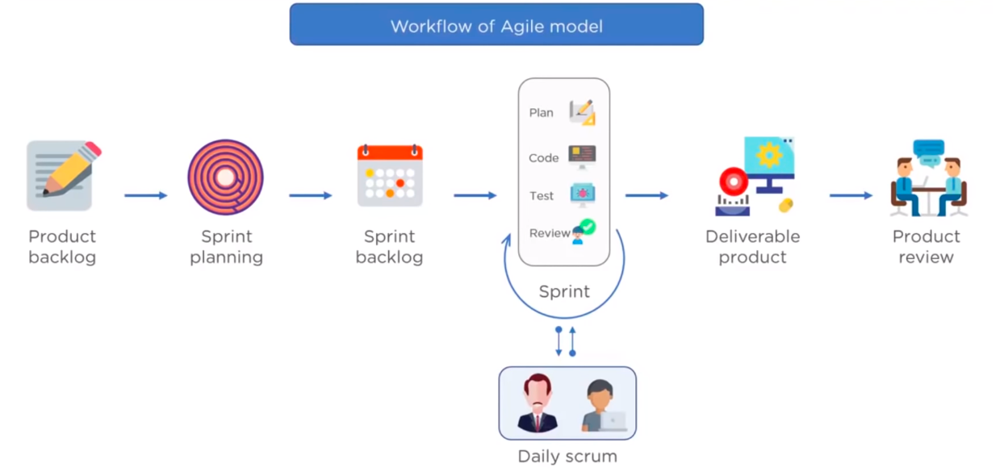

# DevOps Outlines

> This outline summarizes DevOps culture, principles and process.

Hint: Images and visualizations taken from internet and [resources](#resources).

## Table of Content

* [Normal Developer vs Operations Tasks](#normal-developer-vs-operations-tasks)
* [Transition from Waterfall to Agile to DevOps Model](#transition-from-waterfall-to-agile-to-devops-model)
  * [Waterfall Model](#waterfall-model)
  * [Agile Model](#agile-model)
  * [What is DevOps](#what-is-devops)
  * [How DevOps Different from Agile Methodology](#how-devops-different-from-agile-methodology)
* [DevOps Phases](#devops-phases)
* [DevOps Process](#devops-process)
* [Continuous Integration vs. Continuous Delivery vs. Continuous Deployment](#continuous-integration-vs-continuous-delivery-vs-continuous-deployment)
  * [Continuous Integration](#continuous-integration)
  * [Continuous Delivery](#continuous-delivery)
  * [Continuous Deployment](#continuous-deployment)
  * [Continuous Monitoring](#continuous-monitoring)
  * [How the Practices Relate to Each Other](#how-the-practices-relate-to-each-other)
* [DevOps Advantages](#devops-advantages)
* [Pull vs Push Configuration Tools](#pull-vs-push-configuration-tools)
* [DevOps Tools](#devops-tools)
  * [Continuous Integration Tools](#continuous-integration-tools)
  * [Configuration Management Tools](#configuration-management-tools)
* [What is the Rule of Configuration Management in DevOps](#what-is-the-rule-of-configuration-management-in-devops)
* [Steps to Implement DevOps in a Running Project](#steps-to-implement-devops-in-a-running-project)
* [Using Git, Jenkins, Ansible, Docker Kubernetes and AWS in CI/CD](#using-git-jenkins-ansible-docker-kubernetes-and-aws-in-cicd)
* [Resources](#resources)

## Normal Developer vs Operations Tasks

Developer Tasks

* Code
* Push to git
* Build (eg: via maven)
* Test (eg: via selenium)

Operations Tasks:

* Deploy (Ansible, Puppet or Docker)
* Operate
* Monitor (Nagios)

Now a tool like Jenkins can integrate both, development and operation teams.


If code passes the test, jenkins will send it for deployment.

## Transition from Waterfall to Agile to DevOps Model

### Waterfall Model

A traditional software development model that has been in many decades. Development happens in step by step manner.


* Requirement analysis.
* Project plan and design architecture.
* Development.
* Testing.
* Maintenance.

Disadvantages

* Any new requirements from the client will restart the development cycle.
* May be after completing the product, the client is not happy with the product.

This lead to Agile Model.

### Agile Model


Some companies run the sprint into week, some into two weeks, etc. Normally it's two weeks.

Product leader will build out the backlog of the product features.



Advantages of Agile Model

* Client requirements are better understood because of the constant feedback.
* Product is delivered much faster as compared to waterfall model.

Challenges with Agile Model

* Developers and operations team work in silos.
  * Developer submit the product to operations team for deployment.
  * When the product fails in production servers, the operations team are clueless and send product back to the development team.

### What is DevOps

DevOps is an evolution from Agile Model of software development.


### How DevOps Different from Agile Methodology

Agile is a software development methodology that focuses on iterative, incremental, small and rapid releases of software along with customer feedback.

DevOps addresses the gaps between the developers and IT operations.

DevOps is a culture that allows the development and operations teams to work together, this results in continuous development, testing, integration, deployment and monitoring of the software throughout the lifecycle.

## DevOps Phases


* **Plan**: Business owners and software development teams discuss project goals.
* **Code**: Programmers design and code the application, using Git to store the code.
* **Build**: Tools like Maven, Gradle, take code from different repos and combine them to build the application.
* **Test**: Automate testing, tools like Selenium, Junit and Cucumber to ensure software quality.
* **Integrate**: Using Jenkins or Bamboo, when tests pass, move the code automatically.
* **Deploy** to production server, using Ansible, Docker...
* **Operate**
* **Monitor** using Splunk and Nagios

You can merge into 3 phases.

* Plan > Code > Build > Test.
* Integrate. (Jenkins, in between the two phases)
* Deploy > Operate > Monitor.

## DevOps Process

Continuous Integration > Continuous Delivery > Continuous Deployment

## Continuous Integration vs. Continuous Delivery vs. Continuous Deployment

CI is straightforward and stands for continuous integration, a practice that focuses on making and preparing a release easier. But CD can either mean continuous delivery or continuous deployment

### Continuous Integration

Developers practicing continuous integration merge their changes back to the main branch as often as possible. The developer's changes are validated by creating a build and running automated tests against the build. By doing so, you avoid the integration hell that usually happens when people wait for release day to merge their changes into the release branch.

Continuous integration puts a great emphasis on testing automation to check that the application is not broken whenever new commits are integrated into the main branch.

With Continuous Integration, teams are more likely to commit code changes more frequently, which leads to better collaboration and software quality.

### Continuous Delivery

Continuous delivery is an extension of continuous integration to make sure that you can release new changes to your customers quickly in a sustainable way. This means that on top of having automated your testing, you also have automated your release process and you can deploy your application at any point of time by clicking on a button.

In theory, with continuous delivery, you can decide to release daily, weekly, fortnightly, or whatever suits your business requirements. However, if you truly want to get the benefits of continuous delivery, you should deploy to production as early as possible to make sure that you release small batches that are easy to troubleshoot in case of a problem

### Continuous Deployment

Continuous deployment goes one step further than continuous delivery. With this practice, every change that passes all stages of your production pipeline is released to your customers. There's no human intervention, and only a failed test will prevent a new change to be deployed to production.

Continuous deployment is an excellent way to accelerate the feedback loop with your customers and take pressure off the team as there isn't a release day anymore. Developers can focus on building software, and they see their work go live minutes after they've finished working on it.

### Continuous Monitoring

Continuous Monitoring in DevOps is a process of detecting, identifying and reporting any faults or threats in the entire infrastructure of the system.

* Ensures that all the services, applications and resources are running on the servers properly.
* Monitors the status of servers and if application are working properly or not.
* Provide solution that take care of continuous audit, transaction inspection and controlled monitoring.

### How the Practices Relate to Each Other

To put it simply continuous integration is part of both continuous delivery and continuous deployment. And continuous deployment is like continuous delivery, except that releases happen automatically.


## DevOps Advantages

* Time taken to deliver software is reduced.
* Complexity of maintaining an application is reduced, because you're scripting everything.
* Improved collaboration between developers and operation team.
* Continuous integration and delivery ensure faster time to market.
* Technical Benefits
  * Continuous software delivery.
  * Less complex problems to manage.
  * Early detection and faster correction of defects.
* Business Benefits
  * Faster delivery of features.
  * Stable operating environments.
  * Improved communication and collaboration between the teams.

## Pull vs Push Configuration Tools

Ansible is a push configuration Tool, unlike Chef and Puppet. With Ansible there's master and slave servers, and master is pushing the configuration to slave servers.


## DevOps Tools

### Continuous Integration Tools

* Bamboo
* Apache Gump
* Jenkins
* Buildbot
* Travis CI (If your code hosted at GitHub or Bitbucket)
* [gocd: FREE & OPEN SOURCE CI/CD SERVER](https://www.gocd.org/)

### Configuration Management Tools

Chef vs Puppet vs Ansible vs Saltstack

  
[Image source](https://www.youtube.com/watch?v=_TVNCTK808I)

## What is the Rule of Configuration Management in DevOps

* Allows to manage and handle changes to multiple systems.
* Manages IT infrastructure by standardizing resource configurations. Instead of having a large configuration team you can have small high skilled team.
* Helps in administrating and managing several servers and maintains integrity of the entire infrastructure. You can manage significate number of servers and domains.
* Infrastructure as a code.
* There are many approaches to use containers, infrastructure as code, and CI/CD pipelines together. You can explore the options by working through tutorials such as [Kubernetes with Jenkins](https://medium.com/containerum/configuring-ci-cd-on-kubernetes-with-jenkins-89eab7234270).

## Steps to Implement DevOps in a Running Project

* An assessment of the existing process, provide a roadmap for the implementation.
* PoC can be done. Once it's accepted and approved by the end users, then actual implementation and roll out of the project plan should be carried out.
* Implement the DevOps process, version control, integration, testing, deployment, delivery and monitoring.

## Using Git, Jenkins, Ansible, Docker Kubernetes and AWS in CI/CD

* [Jenkins Outlines](./jenkins-outline.md)
* [Ansible Outlines](./ansible-outline.md). Check installation and configuration.

Using Jenkins you can:

* Build your project once code is pushed to repo. Once build is success you can deploy your code automatically using Post-build Actions.
* Or delegate the deployment to Ansible, you can use it as a deployment tool instead of configuration management, this is in case you have complex deployment (Multiple servers).
  * Install `Publish over ssh` plugin in jenkins server.
  * You should have another server with ansible installed (Ansible master).
  * Passwordless authentication should be exist between ansible server and nodes that application will be deployed on. Check [Ansible](./ansible-outline.md) configuration
  * Using Post-build Actions, add instructions to do:
    * Copy artifacts to Ansible server in specific location.
    * Run Ansible command `ansible-playbook /opt/playbooks/copyfile.yml`. This playbook will move the artifacts from the specified location to node servers. It's assuming tomcat is installed, or you can add one more task to install tomcat before copying.
    ```yml
    ---
    - hosts: webservers
      tasks:
        - name: copy war onto tomcat server
          copy:
            src: /opt/playbooks/webapp/target/webapp.war
            dest: /opt/apache-tomcat-8.5.32/webapps
    ```
* Or deploy using docker
  * Launch ec2 instance.
  * Install docker `yum install docker -y`
  * Start docker service `service docker start`
  * Create new user for docker management, and add him to Docker group
    ```bash
    sudo su -
    useradd dockeradmin
    passwd dockeradmin
    usermod -aG docker dockeradmin
    chown dockeradmin:dockeradmin /opt/docker
    // allow password authentication and restart sshd_service
    ```
  * Write a Docker file under `/opt/docker`
    ```
    # Pull base image
    From tomcat:8-jre8

    # Maintainer
    MAINTAINER "sabahallah"

    # copy war file on to container
    COPY ./webapp.war /usr/local/tomcat/webapps
    ```
  * Login to Jenkins console and add Docker server to execute commands from Jenkins.
    * Manage Jenkins --> Configure system --> `Publish over SSH` --> add Docker server and credentials.
  * Create Jenkins job
  * Using Post-build Actions, add instructions to do:
    * Copy artifacts to Docker server in specific location.
    * Exec command `docker stop webapp; docker rm -f webapp; docker rmi webapp; cd /opt/docker`
    * Exec command `docker build -t webapp .`
    * Exec command `docker run -d --name webapp -p 8080:8080 webapp`
* Or move all of previous docker commands to Ansible Playbook.
  * Prerequisites
    * You need a jenkins server.
    * Another server (master) installed Ansible and Docker.
    * Should login to docker hub account on Ansible server.
    * Docker admin user should be part of `docker` group.
    * Another ansible server (client) installed docker.
  * Jenkins will run tests and generate build.
  * Jenkins will move build to ansible server.
  * Jenkins will move Dockerfile to ansible server.
  * Jenkins will execute below commands on ansible server to build and push the image to docker hub.
    * Exec command `cd opt/docker`
    * Exec command `docker build -t $JOB_NAME:v1.$BUILD_ID .`
    * Exec command `docker tag $JOB_NAME:v1.$BUILD_ID sabahallah/$JOB_NAME:v1.$BUILD_ID`
    * Exec command `docker tag $JOB_NAME:v1.$BUILD_ID sabahallah/$JOB_NAME:latest`
    * Exec command `docker push sabahallah/$JOB_NAME:v1.$BUILD_ID`
    * Exec command `docker push sabahallah/$JOB_NAME:latest`
    * Exec command `docker rmi $JOB_NAME:v1.$BUILD_ID sabahallah/$JOB_NAME:v1.$BUILD_ID sabahallah/$JOB_NAME:latest`
    * `JOB_NAME` and `BUILD_ID` to track your docker image version so you can rollback if something wrong happen.
    * Optional: You can also move previous commands to ansible playbook and ask jenkins to execute it.
  * Jenkins will then run ansible playbook on ansible server to start a container.
    * Exec command `cd opt/playbooks`
    * Exec command `ansible-playbook create-docker-container.yml`
      ```yml
      ---
      - hosts: web-servers
        tasks:
        - name: stop running container
          shell: docker stop webapp
        - name: remove stopped container
          shell: docker rm -f webapp
        - name: remove docker images
          shell: docker image rm -f sabahallah/webapp
        - name: create docker image
          shell: docker run -d --name webapp -p 8090:8080 sabahallah/webapp
      ```
      * Ansible will execute the commands in any client node.
* Next step to use Kubernetes check this [Create DevOps project using Git, Jenkins, Ansible, Docker and Kubernetes](https://www.youtube.com/watch?v=gVjLDwcA6sQ)
  * [Repository you can able to setup a DevOps CI/CD Pipeline using Git, Jenkins, Ansible, Docker, Kubernetes and AWS](https://github.com/yankils/Simple-DevOps-Project)
  * [Setup Instructions](https://github.com/yankils/Simple-DevOps-Project/tree/master/Kubernetes)

## Resources

* Using Git, Jenkins, Ansible, Docker, Kubernetes and AWS in Continuous Integration and Continuous Deployment.
  * [Youtube: 1# CI/CD through Jenkins](https://www.youtube.com/watch?v=Z9G5stlXoyg)
  * [Youtube: 2# Ansible Installation & Configuration on AWS EC2](https://www.youtube.com/watch?v=79xFyOc_eEY)
  * [Youtube: 3# CI/CD pipeline using GIT, Jenkins & Ansible](https://www.youtube.com/watch?v=nE4b9mW2ym0)
  * [Youtube: 4# DevOps project with Git, Jenkins and Docker on AWS](https://www.youtube.com/watch?v=nMLQgXf8tZ0)
  * [Youtube: 5# How To Create a Docker Image Using Jenkins And Ansible](https://www.youtube.com/watch?v=MJ74RcL6jv8)
  * [Youtube: 6# Create DevOps project using Git, Jenkins and Ansible and Docker](https://www.youtube.com/watch?v=ZwdB1I14vEc)
  * [Youtube: 7# Enable versioning on docker images through jenkins job](https://www.youtube.com/watch?v=vU7K94Pt2yQ)
  * [Youtube: 8#  Create DevOps project using Git, Jenkins, Ansible, Docker and Kubernetes](https://www.youtube.com/watch?v=gVjLDwcA6sQ)
