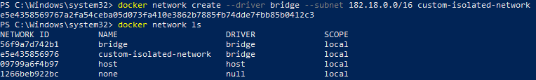

# Docker Outline

> This outline summarizes docker, docker swarm, and containerization main aspects.

Hint: Images and illustrations taken from [resources](#resources).

## Table of Content

- [What is Docker](#what-is-docker)
- [Challenges](#challenges)
- [What is Containers](#what-is-containers)
- [Difference Between Virtual Machines and Containers](#difference-between-virtual-machines-and-containers)
- [Installation](#installation)
- [Container vs Image](#container-vs-image)
- [Docker Architecture](#docker-architecture)
  - [Docker Engine](#docker-engine)
  - [Docker Client](#docker-client)
  - [Docker Registries](#docker-registries)
  - [Docker Objects](#docker-objects)
- [Docker Flow](#docker-flow)
- [Docker Commands](#docker-commands)
  - [Basic Commands](#basic-commands)
  - [Docker Search Command](#docker-search-command)
  - [Docker Images Command](#docker-images-command)
  - [Docker Container Command](#docker-container-command)
  - [Docker Run Command](#docker-run-command)
  - [Docker Run Command - Attach and Detach Option](#docker-run-command---attach-and-detach-option)
  - [Execute a Command on a Running Container](#execute-a-command-on-a-running-container)
  - [Pushing to Docker Hub](#pushing-to-docker-hub)
- [Save/Load Images vs Import/Export Containers](#saveload-images-vs-importexport-containers)
- [Port Mapping](#port-mapping)
- [How Data is Persisted in a Docker Container](#how-data-is-persisted-in-a-docker-container)
- [Inspect Containers](#inspect-containers)
- [Container Logs](#container-logs)
- [Environment Variables](#environment-variables)
- [Inspect Environment Variables of a Container Already Running](#inspect-environment-variables-of-a-container-already-running)
- [Stages of Containerization](#stages-of-containerization)
- [Docker Images](#docker-images)
- [Docker File](#docker-file)
- [Docker Layered Architecture](#docker-layered-architecture)
- [What can you Containerize](#what-can-you-containerize)
- [CMD vs Entry Point](#cmd-vs-entry-point)
- [Networking in Docker](#networking-in-docker)
  - [User Defined Networks](#user-defined-networks)
  - [Inspect Network](#inspect-network)
  - [Connect a Container to a Network](#connect-a-container-to-a-network)
  - [Embedded DNS](#embedded-dns)
- [Docker Storage](#docker-storage)
  - [Volumes](#volumes)
- [Docker Compose](#docker-compose)
  - [Docker Compose Build](#docker-compose-build)
  - [Docker Compose Versions](#docker-compose-versions)
  - [Networks in Docker Compose](#networks-in-docker-compose)
  - [Docker Compose Commands](#docker-compose-commands)
- [Docker Repository](#docker-repository)
  - [Private Registry](#private-registry)
  - [Deploy Private Registry](#deploy-private-registry)
- [What is Docker Engine](#what-is-docker-engine)
- [Docker Namespace](#docker-namespace)
- [Resource Control Groups](#resource-control-groups)
- [Container Orchestration](#container-orchestration)
- [Docker Swarm](#docker-swarm)
  - [Features](#features)
  - [Docker Machine](#docker-machine)
    - [Create a Virtual Machine on Azure and Install Docker Engine](#create-a-virtual-machine-on-azure-and-install-docker-engine)
- [Containerize Microservices Application - The DevOps Way - Git, Jenkins and Docker](#containerize-microservices-application---the-devops-way---git-jenkins-and-docker)
- [Docker Swarm vs Kubernetes](#docker-swarm-vs-kubernetes)
- [Kitematic](#kitematic)
- [Resources](#resources)

---

## What is Docker

Building and deploying new applications is faster with containers. Docker containers wrap up software and its dependencies into a standardized unit that includes everything it needs to run: code, runtime, system tools and libraries. This guarantees that your application will always run the same way and makes collaboration as simple as sharing a container image.

- Docker makes it easy to create, deploy, and run applications by using containers.
- Docker containers are lightweight alternatives to Virtual Machines and it uses the host OS.
- Docker doesn't consume ram unlike Virtual Machine.
- Docker name coming from Dock and Worker.
- No talk about microservices without docker.

---

## Challenges

Suppose we need to install NodeJS server, MongoDB, Redis, Ansible (orchestration tool), we need to make sure the compatibility with underlying OS, required libraries, hardware... If software version changes you need to make sure the newer version is compatible with underlying infrastructure. This refereed as the matrix from hell.

You have different dev, test and prod environments.

If you have a new developer, you will have a difficult time to setup and run development environment.

With docker you'll be able to run each component in a separate container contains all required and dependent libraries.

Now, all you have to do is to install Docker on their systems.

---

## What is Containers

Containers is completely isolated environment. Container has its own processes, network interfaces, mounts but only one thing is common which is they all share the same OS Kernel.

Containers are an abstraction at the Application Layer that packages code and dependencies together. Instead of shipping the application only, you'll ship the application and runtime as well.


All operating systems consists of two things:

- OS Kernel: Responsible for interacting with underlying hardware.
- Softwares: UI, drivers, compilers, file managers, developer tools, etc.

Docker can run any flavour of software on top of it as long as it shares the same OS Kernel.

That means Docker will utilize the underlying OS Kernel to run the containers, because at the end they are some set of services use the same OS kernel.


You'll not be able to run a Windows image on a docker running on top of linux. Because they don't share the same Kernel.

When you install docker on windows less than version 10, and run a linux container on docker, actually you're running a linux container on docker on top of a linux system on top of **Oracle VirtualBox Virtual Machine** on Windows.

When you install docker on windows 10, and run a linux container on docker, actually you're running a linux container on docker on top of a linux system on top of **Microsoft Hyper-V** on Windows.

If you install docker on Mac, Mac has **HyperKit** technology same as Microsoft Hyper-V.

Unlike hypervisors, docker is not meant to virtualize and run different operating systems and kernels on the same hardware. The main purpose of docker is to package and containerize applications and to ship them and to run them anywhere any times as many times as you want.

---

## Difference Between Virtual Machines and Containers

Virtual machines utilizes more resources as there are multiple virtual operating systems and kernel running on the same machine. Also it consumes higher disc space as each VM is heavy and usually in gigabytes in size.

Unlike docker, containers are lightweight and usually in megabytes in size, this leads to boot times in a matter of seconds.


Virtual machines and containers can be used together by running containers inside Virtual Machines


Running application using docker is as easy as just running docker command with the name of the docker image. Just make sure docker is installed in your system. eg: `docker run ansible`, `docker run mongodb`, `docker run redis`... etc.

In the old days we have infrastructure on top of it Hypervisors on top of it VMs.

In many cases virtualization and containers lives side-by-side.

---

## Installation

- `uname -r` check kernel version, should be greater than 3.10.
- `sudo curl -sSL https://get.docker.com/ | sh`
- `docker -v` verify docker version.
- you need to add users to "docker" group, you probably don't want to use your root account when using docker.

---

## Container vs Image

An **image** is a template or plan or package used to run one or more containers.

**Containers** are running instances of images that are isolated and have their own environment and set of processes.

---

## Docker Architecture


### Docker Engine

It is the core part of the whole Docker system. Docker Engine is an application which follows client-server architecture. It is installed on the host machine. There are three components in the Docker Engine:

- Server: It is the docker daemon called **dockerd**. It can create and manage docker images. Containers, networks, etc.
- Rest API: It is used to instruct docker daemon what to do.
- Command Line Interface (CLI): It is a client which is used to enter docker commands.

### Docker Client

Docker users can interact with Docker through a client. When any docker commands runs, the client sends them to dockerd daemon, which carries them out.

### Docker Registries

It is the location where the Docker images are stored. It can be a public docker registry or a private docker registry. Docker Hub is the default place of docker images, it's the public registry. You can also create and run your own private registry.

When you execute docker pull or docker run commands, the required docker image is pulled from the configured registry. When you execute docker push command, the docker image is stored on the configured registry.

### Docker Objects

When you are working with Docker, you use **images**, **containers**, **volumes**, **networks**; all these are Docker objects.

Docker **images** are read-only templates with instructions to create a docker container. Docker image can be pulled from a Docker hub and used as it is, or you can add additional instructions to the base image and create a new and modified docker image. You can create your own docker images also using a dockerfile. Create a dockerfile with all the instructions to create a container and run it; it will create your custom docker image.

Docker image has a base layer which is read-only, and the top layer can be written. When you edit a dockerfile and rebuild it, only the modified part is rebuilt in the top layer.

Docker **Containers**

After you run a docker image, it creates a docker container. All the applications and their environment run inside this container. You can use Docker API or CLI to start, stop, delete a docker container.

Docker **Volumes**

The persisting data generated by docker and used by Docker containers are stored in Volumes.

Docker **Networks**

Docker networking is a passage through which all the isolated container communicate.

---

## Docker Flow


---

## Docker Commands

### Basic Commands

- `docker --version` display current docker version.
- `docker --help` returns a list of commands available in Docker along with possible flags (options).
- `docker version` display version information.
- `docker info` display docker information.
- `docker pull docker/whalesay` download docker image of whalesay. Whalesay is the docker version of `cowsay` program in linux.
- `docker run docker/whalesay cowsay HelloWorld!` run an instance of the whalesay image passing "HelloWorld!" message. If the image is not exist it will go download and run it.
- `docker run redis` run a container running a redis service.
- `docker run --name webapp nginx:1.14-alpine` run a container from `nginx:1.14-alpine` image and name it `webapp`.
- `docker ps` will list all running containers and basic information about them.
- `docker ps -a` list all running/not running (exited) containers.
- `docker stop silly_sammet` provide docker id or docker name. Get id or name from `docker ps` command. Container will shutdown gracefully by waiting for other dependencies to shut.
- `docker rm silly_sammet` remove stopped or existed a container.
- `docker images` list all images in your host.
- `docker rmi 6b362a9f73eb` remove an image. You have to make sure no running containers of this image.
- If you run `docker run ubuntu` it will run a container and exit immediately. Unlike virtual machines, containers are not meant to host operating systems, containers meant to run a specific task or process (db, application server...), once the process finish it will exit. Container lives as long as the process inside it is alive. Ubuntu normally used as a base image of operating system for other application to run, There's no process or application running on it by default.
- It's possible to point the docker client to a remote daemon somewhere on the other end on the network.
- `docker stop $(docker ps -aq)` stop all containers in one command.
- `docker rm $(docker ps -aq)` remove all stopped containers in one command.
- `docker rmi $(docker images -q)` remove all images in one command.
- `docker kill $(docker ps -aq)` kill all running containers.
- `docker exec --user="root" -it 52987392d0b1 bash` login with root user in container.

### Docker Search Command

- `docker search python:3.6` search an image in docker hub.
- `docker search --filter "is-official=true" python` get official image.
- `docker search --format "table {{.Name}}\t{{.Description}}\t{{.IsOfficial}}" python` option `t` stands for tab.

### Docker Images Command

- `docker images`
- `docker images ubuntu` get all images with name ubuntu.
- `docker images --no-trunc ubuntu:16.04` return full image id.
- `docker image inspect ubuntu:latest` inspect an image, see all the configuration.
- `docker image inspect --format "{{.RepoTags}} : {{.RepoDigests}}" ubuntu:latest`
- `docker image inspect --format "{{json .Config}}" ubuntu > inspect-latest-ubuntu.txt`
- `docker image history ubuntu`
- `docker rmi 336252580e12 --force` remove by image id, image id can be more than once if you have multiple tags.

### Docker Container Command

Containers is a running instance of a docker image.

- `docker container create -it --name my-nginx nginx:latest` create a container from an image.
- `docker container start my-nginx` start a container.
- `docker container stop my-nginx` stop a container.
- `docker container restart my-nginx` restart a container.
- `docker container rename my-nginx your-nginx` rename a container name, you can rename anytime even if the container is running.
- `docker container attach my-nginx` attach standard IO and standard error of a running container to the terminal of our docker client. One issue here, if you type exit the container will stop. To overcome this problem use following command.
- `docker exec -it my-nginx bash` now if you type exit, container will not stop.
- `docker logs -f 05965` to see the live log output of docker container.
- `docker container run -itd --name my-nginx -P nginx:latest` automatic port mapping.
  - `docker ps` verify it's running.
  - `docker container port my-nginx` get the port mapping.
- `docker container rm container-id container-id container-id`
- `docker container rm container-id --force` remove running container.
- `docker container prune` remove all stopped containers.
- `docker container logs 8eaf9152b388`
- `docker container kill silly_sammet` ungracefully stop your container, unlike `stop` command. It's a force kill.

### Docker Run Command

- `docker run redis` run a container running a redis service.
  - Docker client calls Daemon, Daemon check local registry, if not found it will search on docker hub and get the image.
- `docker run redis:4.0` run a container running a specific version of redis. This is called a **TAG**. If you don't specify a tag, docker will bring the latest. Check [Docker Hub](https://hub.docker.com/) for the supported versions.
- By default, docker run in a non-interactive mode, if you want to run it in an interactive mode, pass `-i` parameter, eg: `docker run -i ubuntu /bin/sh` then enter any command you want. This is attaching output terminal to `sh` application.
  - If you run exit now, it will stop the bash process and exit the container because it is the only process it's running.
  - To exit this without stopping the container, press Ctrl P+Q.
  - To attach output terminal to container pass variable `t`, eg: `docker run -it ubuntu /bin/sh`.
  - `-i` Keep STDIN open even if not attached.
  - `-t` Allocate a pseudo-TTY.

### Docker Run Command - Attach and Detach Option

- `docker run simple-web-app` it will run in attach mode, to exit and stop the container press (CTRL + C).
- `docker run -d simple-web-app` it will run in detach mode, means in the background and you'll be back to your prompt immediately.
- To return to attach mode run `docker attach a043d` where `a043d` is the first 5 chars of the container id.
- `docker container attach my-nginx` attach standard IO and standard error of a running container to the terminal of our docker client. One issue here, if you type exit the container will stop. To overcome this problem use following command.
- `docker exec -it my-nginx bash` now if you type exit, container will not stop.
- `docker logs -f 05965` to see the live log output of a running container.

### Execute a Command on a Running Container

- `docker run ubuntu sleep 100` it will start the container and run `sleep` program for 100 seconds, then exit the container.
- `docker ps -a`
- `docker exec frosty_pare cat /etc/hosts` print the hosts inside `etc` dir inside the ubuntu container, where `frosty_pare` is the container name.

### Pushing to Docker Hub

- `docker login` login to your docker hub account, in order to push your images.
- `docker tag nginx:latest sabahallah/nginx:v1` tag existing image to create another image.
- Login and Tag steps are required to push any image to public repo.
- `docker images` verify the new package.
- `docker push sabahallah/nginx:v1` push image to your repo.
- `docker push sabahallah/discovery-server:tagname` if you don't specify the tagname, by default it will be latest.
- `docker commit 8eaf9152b388 sabahallah/my-new-ubuntu-image` creates a new image of an edited container on the local repo.

---

## Save/Load Images vs Import/Export Containers

- `save` and `load` work with docker images.
- `export` and `import` work with docker containers.

```shell
$ docker --help | grep -E "(export|import|load|save)"
  export      Export a container\'s filesystem as a tar archive
  import      Import the contents from a tarball to create a filesystem image
  load        Load an image from a tar archive or STDIN
  save        Save one or more images to a tar archive (streamed to STDOUT by default)
```

- Create a Dockerfile.
- `docker build --tag calc` this will create an image.
- `docker images ls` verify image is created.
- `docker run calc` run a container from an image.
- `docker save calc > calc.tar` save docker image.
- `docker image rm c93044af5b09 19485c79a9bb` remove current images first.
- `docker load < calc.tar` load the image again.
- `docker image ls` verify image is loaded.

Exporting vs Importing containers

Why is this useful? Imagine our app is more complicated and takes a long time to build, or it generates a bunch of compute-intensive build artifacts. If we want to clone or move it, we could rebuild it from scratch from the original image, but it would be much faster to export a current snapshot of it, similar to how you might use a prebuilt binary as opposed to compiling one yourself.

- `docker ps -a` list all containers.
- `docker export a8b14091b4e7 > calc-container.tar`.
- `mkdir calc-container && tar -xf calc-container.tar -C calc-container` extract tar file.
- `tree -L 1 calc-container` explore tar file contents, as we can see, this is just a regular old Linux file system.

Importing images

While save and load are easy to understand, both accepting and resulting in an image, the relationship between import and export is a little harder to grok.

There’s no way to “import a container” (which wouldn’t make sense, as it’s a running environment). As we saw above, `export` gives us a file system. `import` takes this file system and imports it as an image, which can run as-is or serve as a layer for other images.

```bash
$ docker import calc-container.tar calcfs:latest
$ docker image ls
REPOSITORY          TAG                 IMAGE ID            CREATED              SIZE
calcfs              latest              27ebbdf82bf8        About a minute ago   1.22MB
calc                latest              889226dbb27f        2 months ago         1.22MB
$ docker run -t -i calcfs /bin/sh
/ # ls
bin   dev   etc   home  proc  root  sys   tmp   usr   var
/ # echo "we have a shell!"
we have a shell!
/ #
```

Conclusion

- `save` works with Docker images. It saves everything needed to build a container from scratch. Use this command if you want to share an image with others.
- `load` works with Docker images. Use this command if you want to run an image exported with `save`. Unlike `pull`, which requires connecting to a Docker registry, `load` can import from anywhere (e.g. a file system, URLs).
- `export` works with Docker containers, and it exports a snapshot of the container’s file system. Use this command if you want to share or back up the result of building an image.
- `import` works with the file system of an exported container, and it imports it as a Docker image. Use this command if you have an exported file system you want to explore or use as a layer for a new image.
- `export` only applies to containers, while `import`, `load`, and `save` apply to images.

```bash
$ docker container --help | grep -E "(export|import|load|save)"
  export      Export a container\'s filesystem as a tar archive

$ docker image --help | grep -E "(export|import|load|save)"
  import      Import the contents from a tarball to create a filesystem image
  load        Load an image from a tar archive or STDIN
  save        Save one or more images to a tar archive (streamed to STDOUT by default)
```

---

## Port Mapping


When you run a containerized web application, it runs inside Docker Host or Engine.

But how the user access my application? My application running inside Docker Host on port 5000. But how to access from browser, which ip to use?

Two options:

- Every container assigned internal ip by default, eg: `179.17.0.9`. This is accessible only inside Docker Host/Engine. Users outside the host can't access this IP.
- In this case you need to use the Docker Host IP which is `192.168.1.5`.
- But for that to work you have to map the port inside the container to a free port inside the Docker Host.
- eg: `docker run -p 8080:5000 kodekloud/simple-webapp` now outside user can access the web app by visiting <http://192.168.1.5:8080/>. With this all traffic on my Docker Host will be routed to port 5000 inside the docker container.
- By this, you can run multiple instance of your application and map to different Docker Host port.

Try simple nginx server:

- `docker run -d -p 80:80 --name=nginx1 nginx` and access on localhost:80
- `docker run -d -p 81:80 --name=nginx2 nginx` and access on localhost:81

---

## How Data is Persisted in a Docker Container

Docker container has its own isolated environment, let's say you were to run a MySQL container. When databases and tables are created the data files are stored in location `/var/lib/mysql` inside the docker container itself. If you want to delete the container, all data inside the container will be removed.

If you would like to persist data you would want to map a directory outside the container on the docker host to a directory inside the container as below:

```bash
docker run -v /opt/datadir:/var/lib/mysql mysql
```

where `/opt/datadir` is directory in the docker host, and `/var/lib/mysql` is the local directory inside the container itself.


---

## Inspect Containers

If you would like to see additional details about a specific container use the docker inspect command and provide the container name or ID, it returns all details of a container in a json format.

```bash
docker inspect
```

---

## Container Logs

How do we see the logs of a container that we run in a background?
If you run a web application in a detached mode, how do you view the log?

Use the below command:

```bash
docker logs my-web-app
```

---

## Environment Variables

When you run your application, you can pass any number of environment variables by passing `-e` flag followed by the environment variables as below:

```bash
docker run -e OWNER=Mahmoud -d -p 82:80 --name=nginx3 nginx
```


---

## Inspect Environment Variables of a Container Already Running

```bash
docker inspect c032dd57f141
```

Check `Config.Env` value in the json response.

---

## Stages of Containerization


---

## Docker Images

In some cases, you would need to create a docker image:

- if you didn't find the image you want on docker hub.
- Or your team decided to dockerize your application for ease of deployment.

Below is a Dockerfile of how you dockerize an application.


Then you need to build the image with below command

```bash
docker build Dockerfile -t sabahallah/my-web-app
```

The option `-t` for tag, and this will create the image locally in your system, to make it public on docker hub repository run below command.

```bash
docker push sabahallah/my-web-app
```

---

## Docker File


Here is a sample of DockerFile.

```bash
############## Fundamental Instructions ##############

# version of the image
ARG CODE_VERSION=16.04

FROM ubuntu:${CODE_VERSION}

MAINTAINER sabahallah # the author or the docker image, it should come after FROM command.

LABEL Creator: "Mahmoud SabahAllah"

############# Configuration Instructions #############

# -y stands for yes, for giving permissions.
# each RUN will create its own separate layer.
# apt-get update for updating the OS.
# apt-get install -y nginx for installing nginx.
# then clean.
# rm -rf /var/lib/apt/lists/* clearing local repo after retrieving packages.
RUN apt-get update && apt-get install nginx -y \
    && apt-get clean \
    && rm -rf /var/lib/apt/lists/*

# copy your files/code from current host directory (source) to container's file system (destination).
ADD index.html /usr/share/nginx/html/index.html

# -p create entire path
RUN mkdir -p /home/apps/angular

# move to directory
WORKDIR /home/apps/angular

# enable access from your container to a directory on the host machine. Multiple containers can share the same path.
VOLUME ["my_files"]

# set environment variables.
ENV USER Mahmoud-SabahAllah
ENV SHELL /bin/bash
ENV LOGNAME Mahmoud-Muhammad-SabahAllah

# nginx will listen to port 80.
EXPOSE 80

# nginx will run in the foreground.
CMD ["nginx", "-g", "daemon off;"]
```

Lets run the following steps:

- `docker build -t my-nginx .`
- `docker images` list all images in local storage.
- `docker run -itd --rm --name my-nginx-instance-1 -p 8080:80 my-nginx`
  - option `-itd` will run in background in interactive mode.
  - option `--rm` will automatically remove the container once it has stopped.
  - option `--name` will give a name to the container.
  - option `-p` for port mapping.
- `docker ps` verify the container is running.
- `docker exec -it my-nginx-instance-1 bash` command `exec` to execute a command on a running container, here it will run the bash program in interactive mode.
- then let's verify the environment variables which we have set in the DockerFile
  - `echo $USER`
  - `echo $SHELL`
  - `echo $LOGNAME`
- and verify the directory we created.
  - `cd /home/ && ls`
- then `exit`
- Create `.dockerignore` file and put what you want to ignore during build, like node_modules.
- `.dockerignore` should be the same location as `DockerFile`.


---

## Docker Layered Architecture

When docker **builds** the image it builds it in a layered architecture, each line of instruction creates a new layer in the docker image with just the changes from the previous layer.

Since each layer only stores the changes from the previous layer it is reflected in the size as well. Check images below. You can also see these information if you run docker history command.

```bash
docker history my-nginx
```

Also if you run `docker build Dockerfile -t my-nginx` command, you can see the various steps. All layers are cached by docker, in case of any failure happen, you can fix, then resume the build from the last step, or add new steps in the build process. So layers can be cached and reused by docker.

This helps when changes to the source code of your application happen, as source code changes frequently, so you need to update your image.


What is the benefit of layered architecture?

From below image, we have two docker files with almost same instructions, but they differ only in the source code and entry point. So when you run `docker build` command for the second docker file, it will use the same layers which created before in building the first docker file. This way docker builds images faster and efficiently save disc space. This is also efficient if you want to update your application code.


---

## What can you Containerize

You can containerize anything you want, databases, operating systems, development tools, etc.

Going forward, no body would want to install any application, it just need to run a docker command, and that's it.

---

## CMD vs Entry Point

If you run `docker run ubuntu` it will run a container and exit immediately.

Unlike virtual machines, containers are not meant to host operating systems, containers meant to run a specific task or process (db, application server...), once the process finish it will exist. Container lives as long as the process inside it is alive. Ubuntu used as a base image of operating system for other application to run, There's no process or application running on it by default.

If you see Nginx image, you'll find at the end `CMD` command. This `CMD` command identify the program that will run within the container. The same for MySql.


What we tried before is to run a container from Ubuntu image that has nothing to do at the end. It uses `bash` as the default command. `bash` is a shell program that listens for inputs and outputs from a terminal, if it can't find a terminal it exits. By default, docker is not attaching a terminal to container when it's running.


How to override this behavior? by appending a command to a docker run command. By this way it overrides the command specified within `CMD` in the image.

```bash
docker run ubuntu sleep 5
```

Now, `sleep` program will override `bash` command.

How to make this change permanent? How to make sleep program run always for 5 seconds before exit? You'd create your image from base Ubuntu image and specify new command.

```bash
FROM Ubuntu

CMD sleep 5 # or CMD["sleep","5"] # CMD["command","param"]
```

Then you build the image

- `docker build -t ubuntu-sleeper .` option `-t` for tag.
- `docker run ubuntu-sleeper`

If you want to pass the number of seconds when running the command, you need to use ENTRYPOINT.

```bash
FROM Ubuntu

ENTRYPOINT["sleep"]
```

Now you can use `docker run ubuntu-sleeper 10`, 10 will be appended to the command sleep.

In case of `CMD`, command will be replaced entirely, but in case of `ENTRYPOINT` params will be appended.

If you didn't pass param, it will through an error. So you can use default value. By using `CMD` and `ENTRYPOINT` together.

```bash
FROM Ubuntu

ENTRYPOINT["sleep"]

CMD["10"] # default parameter
```

Now you can use `docker run ubuntu-sleeper` without params and default will be 10 seconds. If you pass a parameter, it will override the value.

If you want to override the entry point use `--entrypoint` option.

```bash
docker run --entrypoint sleep2.0 ubuntu-sleeper 10
```

---

## Networking in Docker

Docker Network Drivers:

- Piece of software that enables networking of containers.
- Native network drivers are shipped with docker engine.
- IP Address Management Drivers provide default subnets if not specified by admin.
- Drivers in docker (none, bridge and host).


When you install docker, it installs 3 networks automatically.

- **Bridge**: Default network which container attached to. It's private internal network created in Docker Host. Containers get internal ip addresses usually in range 172.17.x.x serious. Containers can access each other using the internal ips. To access any of these containers from outside you need to map the port of the container to port on a docker host.
- **Host**: Another way to access a container externally by associating the container to the host network. No mapping required as you are using the docker host network itself. Now you can't use the same port many times as before.
- **None**: Containers are not attached to any network. It has no access to external network or internal containers. they run in and isolated network.


### User Defined Networks

You can create your own network and group applications together. By default, docker creates one internal bridge network 172.17.0.1. Use `docker network ls` command to list all networks.


Use `docker network create` command to create a new bridge.

- `docker network create --driver bridge my-bridge`
- `docker network create --driver --subnet=192.168.0.0/16 --ip-range=192.168.5.0/24 bridge my-bridge-1`
- `docker network ls`
- `docker network ls --filter driver=bridge`




### Inspect Network

To see network settings and ip addresses of a container , run:

```bash
docker inspect container-id
```


### Connect a Container to a Network

- `docker network connect my-bridge-1 my-nginx`
- `docker container inspect my-nginx` verify networks.
- `docker container run -itd --network host --name my-nginx nginx:latest` now if you run `docker container port my-nginx` you'll not find any port mapping since it's attached to the host network driver. so you can access the app by the container port itself <http://localhost:80>.
- `docker inspect container my-nginx` you'll not find any bridge information, since we assigned to host network.
- `docker network inspect bridge` inspect bridge network, you'll find all the containers, subnet and gateway assigned to this bridge. By default docker is assigning containers to bridge network.
- `docker network disconnect my-bridge-1 my-nginx` disconnect a container from a network.

### Embedded DNS

Containers can reach each others using their names. Docker has a built in DNS server that helps containers to resolve each other using container name. Built in DNS server is always running on port 127.0.0.11


---

## Docker Storage

How docker store data on local file system?

When you install docker on a system, it creates folder `var/lib/docker`, this is where docker stores all of its data by default.

- `var/lib/docker`
  - `/network`
  - `/containers`
  - `/image`
  - `/volumes`

We learnt before about docker layered architecture. Once the build is complete you can't modify the contents of these layers, you can modify only by initiating a new build.

When you run `docker run`, docker creates a new writable layer on top of the image layer (which is not modifiable). The writable layer used to store data used by the container such as log files, temp files, etc. The life of these layer is only as long as the container is alive, when container is destroyed, all of the files are gone.

Remember the same image layer is shared across all containers created using this image.


But what if you want to change the source code of an image, you can't do this until you rebuild your image, but docker enable us another way to modify the source code, **docker is copying the source code from image layer to the modifiable layer**, so you can modify the version in the writable layer until you rebuild you app. This is called COPY-ON-WRITE. Remember the same image layer is shared across all containers created using this image.


### Volumes

Containers data should be backup somewhere as a permanent storage.

Docker is creating the volumes under `/var/lib/docker/volumes` if you create a new volume it will be listed here, and when container start mounting this volume, all container logs will be copied to this volume.

If you working with database and want to preserve these data outside of the container. You can add a persistent volume to the container.

- `docker volume create db_data_volume` create a volume inside docker host.
- `docker volume ls` list all docker volumes.
- `docker run -v db_data_volume:/var/lib/mysql mysql` map the volume inside the container to host volume. This is called **Volume Mounting**.
  - if `db_data_volume` is not exist, docker will create it automatically.
- `docker run -v /data/mysql:/var/lib/mysql mysql` map to a separate folder not under `/var/lib/docker/volumes`. This is called **Bind Mounting**.
- Using `-v` is old style, you should use `--mount` option as below:
  - `docker run --mount type=bind,source=/data/mysql,target=/var/lib/mysql mysql`
- **Volume Mounting** vs **Bind Mounting**
  - Volume Mounting: It will create/use volume under `/var/lib/docker/volumes/`.
  - Bind Mounting: Mount to a separate location.
- The Dockerfile format does have a `VOLUME` verb.
- `docker volume ls --filter "dangling=true"` it will list all volumes which is not mounted yet to any container.
- `docker volume inspect vol-box` inspect a volume.
- `docker volume rm vol-box`
- `docker container inspect --format "{{json .Mounts}}" cont-ubuntu | python -m json.tool` find information about volumes, it will be formatted in json.


The created storage is storage drivers. Common storage drivers are:

- AUFS
- ZFS
- BTRFS
- Device Mapper
- Overlay
- Overlay2

The selection of the storage driver depends on the underlying OS used. eg: for Ubuntu, overlay2 is used. Docker choose the best storage driver automatically based on the operating system when docker is started.

You can check which storage driver is used by the daemon by running the following command.

```bash
docker info
```

It will show the storage driver used by the daemon.

We can set storage driver by setting its name to the `dockerd` command. The following command starts a daemon and set new driver.

```bash
dockerd --storage-driver=devicemapper
```

Later on, we can check docker driver by the following command.

```bash
docker info
```

---

## Docker Compose

Docker compose used to run multi-container application, each container will run a standalone application and it can communicate with each other containers present in the same host.

If you want to start multiple containers at once, create a **docker-compose.yml** file as below. Then you run `docker-compose up` to bring up the entire application stack. This applicable to run only on a single docker host.

To start in detach mode `docker-compose up -d`.


Let's understand with an example.


Let's look at the normal process to bring up our application stack.  
Note: `--name` in each command is important.

We didn't tell the vote app which instance of redis to use. We didn't tell the worker which PostgresSQL instance to us. So application will not run as expected.


So how to link docker containers? By using links. Note: `--link` will be deprecated.

Link containers by their name.


Mapping above commands to a yml file.


### Docker Compose Build

Sometimes, you have images not yet built or pushed to repository. For previous example Redis and PostgresSQL is already on the docker hub. So to instruct docker to build the image when running `docker-compose up`, you can replace the `image` line by `build` line, specifying the location of the `Dockerfile` to build the docker image.


### Docker Compose Versions

- `docker-compose --version`
- Version 1: Initial version.
- Version 2:
  - Docker create a network for all the applications, so you can connect to any container by its name, so no need to use **links**.
  - Dependencies, if you would to specify the order of starting containers. So you can use `depends_on`.
- Version 3:
  - Come with support for docker swarm.


### Networks in Docker Compose

In this example we'll discuss networks in docker-compose, we will create two networks. One for frontend and other for backend. Then, we'll connect the applications with these networks.


### Docker Compose Commands

- Run mysql instance pointing to another mysql instance `docker run -it --link mysql_database:mysql --rm mysql sh -c 'exec mysql -h "$MYSQL_PORT_3306_TCP_ADDR" -P"$MYSQL_PORT_3306_TCP_PORT" -uroot -p"$MYSQL_PORT_3306_TCP_PASSWORD"'`
- `docker-compose config` show yml file content.
- `docker-compose config --services` show services only.
- `docker-compose images` list out all the images in yaml file.
- `docker-compose logs` fetch the log output from services.
- `docker-compose logs --tail=10` last 10 logs from all services to be printed on the terminal.
- `docker-compose ps`
- `docker-compose rm`
- `docker-compose top` list out all the running processes inside all of the containers. you'll get the PID ( process id) and PPID (parent process id).
- `docker-compose down` stops the services, remove containers, remove additional resources like networks.

---

## Docker Repository


### Private Registry


Note: Registry itself is a docker image, you can use to make your own on-premise private registry.

### Deploy Private Registry


---

## What is Docker Engine

- Docker Engine consists of three layers, Docker Cli, Rest API and Docker Daemon.  
  
- Docker Daemon manages images, containers, volumes, etc.
- You can contact with Daemon using REST API. You can create your own tool to communicate through REST API.
- Docker CLI uses the REST API to interact with Daemon. Docker CLI could be on another system. Just use the `-H` option as below to connect to remote docker engine:  
  

---

## Docker Namespace

Docker uses namespace to isolate workspace. Each has its own namespace for isolation between containers.


To list all the running process in linux, use `ps` command.

There's a mapping happening between container process and system process, cause at the end it's the same process, with a name inside the container namespace and this is visible only inside the container.

If you run Nginx inside a container and lists all the processes inside the container, you'll see Nginx service is process number PID: 1, if you list services in the docker host, you'll find the same process with a different id.

- `ps -aux | grep nginx`
- `sudo docker top 069e12 -eo pid,cmd`


More Resources:

- [How Docker Works - Intro to Namespaces](https://www.youtube.com/watch?v=-YnMr1lj4Z8)
- [Docker for Beginners - The PID Namespace](https://www.youtube.com/watch?v=XDnpLskA_uk)
- [Network Namespaces Basics Explained in 15 Minutes](https://www.youtube.com/watch?v=j_UUnlVC2Ss)
- [Container Network Interface (CNI) Explained in 7 Minutes](https://www.youtube.com/watch?v=l2BS_kuQxBA)
- [Understanding and Securing Linux Namespaces](https://www.linux.com/news/understanding-and-securing-linux-namespaces/)
- [Isolate containers with a user namespace](https://docs.docker.com/engine/security/userns-remap/)

---

## Resource Control Groups

Limit amount of hardware resources allocated for each container, like amount of memory, cpu, etc...


- `docker run --cpu=.5 ubuntu` container will not take more than 50% of the host cpu at any given time.
- `docker run --memory=100m ubuntu` same for memory.

---

## Container Orchestration

If you have a docker host running multiple containers and there are more users coming to your server and you want to scale up more containers, you need to add more docker hosts and deploy containers to manage higher load.  
If one of the containers went faulty, who will replace this container with new container!.  
If entire node went down, how the containers move to the other available nodes!.  
If you need to deploy new container to all docker hosts, who will take care of that!

The one who can manage all of these activity we called container orchestrator.

Container Orchestration service providers:

- Docker Swarm
- [Kubernetes](./kubernetes-outline.md)
- [OpenShift](./openshift-outline.md)
- Nomad

---

## Docker Swarm

Docker Swarm provides native clustering capabilities to run a group of Docker Engines into a single, virtual Docker Engine for scaling up and high availability.

- Swarm components
  - Dispatcher
  - Allocator
  - Orchestrator
  - Schedular


In Docker Swarm you have a manager node and worker nodes.

For testing, have two machines connected on the same network, one master and one slave. Run command `> docker swarm init --advertise-addr 192.168.56.105` on master node, where `192.168.56.105` is the ip of the manager node. Once you hit enter, you will get below command to run on the worker nodes, so worker nodes can join the cluster.

```bash
docker swarm join --token generated-token-id 192.168.56.105:2377
```

Now if you start an application on the worker node, you can access it from the manager by worker ip address and port number.

To leave a swarm cluster, execute below command on the worker node, if you run this command on the master node, you have to add the `--force` option.

```bash
docker swarm leave
```

### Features

- High availability of services.
- Auto Load Balancing.
- Easy to scale up deployments.
- Rolling updates.

### Docker Machine

Docker Machine installs multiple Docker Engine on Virtual Hosts, which will act as individual nodes on swarm cluster. It can connect to cloud provider, install virtual machine and install docker on it, so you can control your cluster from one machine.

Docker Machine allows you to control the docker engine of a VM created using docker-machine remotely. It even allows you to update the docker engine, restart the virtual machine (depending if the driver supports it), view its state and so on.

You can also use it to install nodes locally on your system like we do here.

- Install virtualbox.
- Install docker-machine.
- Create manager node.
- Create 2 worker nodes.
- Setup swarm cluster, one node as a manager and two nodes as workers.
- Start a service on the cluster. Service means start/manage containers on the cluster as a single unit.

Steps

- `sudo nano /etc/apt/sources.list`
- Install `virtualbox` software on linux.
- Install `docker-machine` software.
  - On linux `base=https://github.com/docker/machine/releases/download/v0.16.0 && curl -L $base/docker-machine-$(uname -s)-$(uname -m) >/tmp/docker-machine && sudo mv /tmp/docker-machine /usr/local/bin/docker-machine && chmod +x /usr/local/bin/docker-machine`
- `docker-machine --version` verify docker version.
- Setting up nodes
  - `docker-machine create --driver virtualbox manager`
  - `eval $(docker-machine env manager)` Run this command to configure your shell.
  - `docker-machine ls` list all nodes. `docker-machine ls --filter state=running` list all running nodes.
  - `docker-machine create --driver virtualbox worker-1`
  - `docker-machine create --driver virtualbox worker-2`
  - `docker-machine ls` list all nodes.
- `docker-machine stop manager` stopping the manager node.
- `docker-machine start manager` starting the manager node.
- `docker-machine ip manager` get ip of the manager node.
- `docker-machine inspect manager`
- `docker-machine ssh manager` connect to the virtual manager node via ssh.
- Setup swarm cluster
  - Open 3 terminals, one for each node.
  - Connect to manager
    - `docker-machine ssh manager`
  - Initialize swarm cluster on manager.
    - `docker swarm init --advertise-addr 192.168.99.100`
    - if you lost your token, run this command `docker swarm join-token worker`. It runs only if the manager has been initialized.
  - Connect to worker-1 and worker-2
    - `docker-machine ssh worker-1`
  - Join the cluster
    - `docker swarm join --token SWMTKN-1-40ohmq0bptomkl4cj1h170qxkx2ty4dtnskk3vxc8dil4tt005-5hid18fdrx3d7ttpvt0503bep 192.168.99.100:2377`
  - Go to manager again
    - `docker node ls` list all nodes. If you have more manager in the cluster, one of them will be the leader (Shown in Manager Status).
    - `docker node inspect --pretty self` inspect manager node itself.
    - `docker node inspect --pretty worker-1` inspect worker-1 node.
- Creating services
  - Start service globally on all nodes,run command `docker service create --name web-server -p 8080:80 --mode global nginx:latest` on manager node.
    - You can also control how many replicas needed, `docker service create --name web-server -p 8080:80 --replicas 2 nginx:latest` it will start the service on two nodes and manager will load balance between two.
    - Even if your replica is 2, you can access the service from the not replicated node.
  - `docker service ls` verify service is running, and shows it's replicated and number of replicas is 2.
  - Inspect service `docker service inspect web-server`
  - `docker service ps web-server` check in which node web-server is running.
  - Now you can access angular-app from any node, any node can serve the request. Port number will be exposed internally between nodes. Because of that you can access <http://manager-ip:8080/>, <http://worker-1-ip:8080/>, <http://worker-2-ip:8080/>, even if the application is running in only one node.
- High availability of services
  - On manager, drain a node, take down one node for maintenance or went it down.
  - `docker node update --availability drain worker-2` it means node is up, but drained from the cluster, means no containers can be scheduled on it. any containers inside this node will be scheduled in one of the other nodes.
  - Verify `docker service ps web-server`
  - `docker node rm worker-2` remove the node from the cluster at all, you'll get an error, even if node is drained from cluster it may still serve some api. You need to go to worker-2 node and leave the cluster first `docker swarm leave` or you can run `docker node rm worker-2 -f` on the manager node.
  - `docker node ls` verify node is removed.
- Scaling up and down (on manager node)
  - `docker service scale web-server=6` It will start more services and make sure the number of services across all nodes is 6.
  - `docker service ps web-server` check in which node web-server is running.
  - Run `docker service ls` you'll find replicas 6/6.
- Rolling updates
  - Update image of containers on runtime `docker service update --image nginx:alpine web-server`
  - To verify the new image `docker service inspect --pretty web-server`
- Remove all services `docker service rm web-server`
- Detach manager node from running instances.
  - Manager is responsible for managing cluster nodes only. You should not start services in the manager node.
  - To do so, on manager node run `docker node update --availability drain manager`.
  - Option `drain` means stop allocating service to this particular node. All services will be shut down and will be started on other nodes.
  - You can also drain any of the node by using the same command.
  - Run `docker service ps web-server` to verify. You will see all apps started on other nodes.
  - Run `docker node ls` to check all nodes, you will find the availability of the manager is _drain_. If you scale the services now, all the services will be allocated on worker nodes.
  - To return availability again to active, run `docker node update --availability active manager`.
- `docker-machine rm worker-1` remove a machine. If this is on cloud it will be removed.

`docker service` control any existing docker service, eg: Containers, Compose, Swarm, etc in a swarm cluster. Command `service` should be executed only on the manager node.

- `docker service ls`
- `docker service ps`
- `docker service create <name> <image-name>`
- `docker service scale <name>=5`
- `docker service stop`
- `docker service logs`
- `docker service rm`
- `docker node ls` list the nodes, it should be run on the manager.
- `docker node ps` list services in a node.
- `docker node rm <id>` remove a node from cluster.

#### Create a Virtual Machine on Azure and Install Docker Engine

```bash
#!/usr/bin/env bash
set -e
MACHINE_NAME="VIRTUAL MACHINE NAME"
RESOURCE_GROUP="RESOURCE GROUP NAME"
SUBSCRIPTION="YOUR AZURE SUBSCRIPTION ID"
AZURE_LOCATION="eastus"
AZURE_VNET_NAME="VNET NAME"
docker-machine create --driver azure
                      --azure-availability-set="MACHINE_NAME-as"
                      --azure-subscription-id="${SUBSCRIPTION}"
                      --azure-location "${AZURE_LOCATION}"
                      --azure-open-port 80
                      --azure-open-port 443
                      --azure-size "${AZURE_MACHINE_SIZE}"
                      --azure-subnet "${AZURE_VNET_NAME}-subnet"
                      --azure-vnet "${AZURE_VNET_NAME}"
                      --azure-resource-group "${RESOURCE_GROUP}"
                        ${MACHINE_NAME}
```

You can use the public identification key in order to connect to an existing machine (virtual or not) and install docker engine on it.

```bash
#!/usr/bin/env bash
set -e
MACHINE_IP="MACHINE IP"
MACHINE_NAME="MACHINE NAME"
SSH_USER="MACHINE USERNAME"
SSH_PUBLIC_KEY="MACHINE USERNAME PUBLIC KEY PATH"
# If you did an ssh-copy-id to the machine: ~/.ssh/id_rsa
docker-machine create --driver generic
--generic-ip-address=${MACHINE_IP}
--generic-ssh-key ${SSH_PUBLIC_KEY}
--generic-ssh-user ${SSH_USER}
${MACHINE_NAME}
```

You can also copy files to/from the machine:

- `docker-machine scp ~/localfile.txt demo-machine:~/`
- `docker-machine scp demo-machine:~/removefile.txt ~/`

Create virtual machine and install docker on digital ocean

- `docker-machine create --driver digitalocean --digitalocean-access-token=$DO_TOKEN dockerhost`

---

## Containerize Microservices Application - The DevOps Way - Git, Jenkins and Docker


- Dockerfile should be in same project repository.
- In Jenkins, goto configure > source code management > specify the git repo URL, and add the commands to execute in the build section. eg: `docker build -t ...etc`, `docker run --rm ...etc`
- These commands will not run without administrative access, and you can't put `sudo` command here. So you have to give root credentials to jenkins itself.


jenkins can push to docker hub, then you can run the image in any environment, dev, prod...

In order to build all microservices you need to create a pipeline.

---

## Docker Swarm vs Kubernetes

|                              | Docker Swarm                                                                         | Kubernetes                                                                                                                                                                         |
| ---------------------------- | ------------------------------------------------------------------------------------ | ---------------------------------------------------------------------------------------------------------------------------------------------------------------------------------- |
|                              | Preferred for simple architecture.                                                   | Preferable for complex architecture.                                                                                                                                               |
| No. of Containers            | Better when 10-20 containers used in prod.                                           | Better when 100-1000 containers in prod.                                                                                                                                           |
| Community                    | Developer community not as big as k8s.                                               | Developer community is huge.                                                                                                                                                       |
| Maintainer                   | Created and maintained by Docker inc.                                                | Created by Google, now maintained by CNCF.                                                                                                                                         |
|                              | Setting up the cluster is simple, requires only 2 commands.                          | Setting up the cluster is challenging & complicated. Bring up the cluster, setup the storage for the cluster, setup environment, dashboard. Only then nodes can join your cluster. |
|                              | Cluster strength not as strong.                                                      | Cluster strength is stronger. Fail-over mechanism and recovery it's faster. more security.                                                                                         |
| GUI                          | There's no GUI available.                                                            | Provides a GUI (Kubernetes Dashboard), wit GUI, apps can easily scaled and deployed. How any containers, nodes...                                                                  |
| Scalability                  | Scaling up is **5x faster** than Kubernetes.                                         | Scalability is easy.                                                                                                                                                               |
| Auto-Scaling                 | Scaling up or down has to be done manually.                                          | Based on server traffic, containers will be scaled automatically by k8s.                                                                                                           |
| Load Balancing               | Swarm does auto load balancing.                                                      | Manual configuration needed for load balancing.                                                                                                                                    |
| Rolling updates and rollback | Rolling updates progressively update containers one after another while ensuring HA. | Rolling updates progressively update pods one after another while ensuring HA.                                                                                                     |
|                              | No automatic rollback                                                                | Automatic rollback in case of failure.                                                                                                                                             |
| Data Volumes                 | Storage volumes can be shared with any other container in the node.                  | Storage volumes can be shared only between containers within the same pod.                                                                                                         |
| Logging and monitoring       | 3rd party tools, like elk.                                                           | Built-in tools.                                                                                                                                                                    |

---

## Kitematic

Kitematic is basically a graphical User Interface for Mac OS and Windows that is used to manage docker containers. It integrates with the individual’s Docker hub account and one can manage and use his/her Docker repos using Kitematic.

---

## Resources

- [Youtube: Docker for Beginners: Full Course](https://www.youtube.com/watch?v=zJ6WbK9zFpI)
- [Udemy: Docker Essentials](https://www.udemy.com/course/docker-essentials/)
- [Youtube: Docker Full Course - Learn Docker in 5 Hours](https://www.youtube.com/watch?v=RSIstPUiEjY)
- [Docker import/export vs. load/save](https://pspdfkit.com/blog/2019/docker-import-export-vs-load-save/#)
- [Docker Post-installation steps for Linux](https://docs.docker.com/engine/install/linux-postinstall/)
- [Installing Nginx Docker](https://docs.nginx.com/nginx/admin-guide/installing-nginx/installing-nginx-docker/)
- [How To Run Nginx in a Docker Container on Ubuntu 14.04](https://www.digitalocean.com/community/tutorials/how-to-run-nginx-in-a-docker-container-on-ubuntu-14-04)
- [Play with Docker](https://play-with-docker.com)
