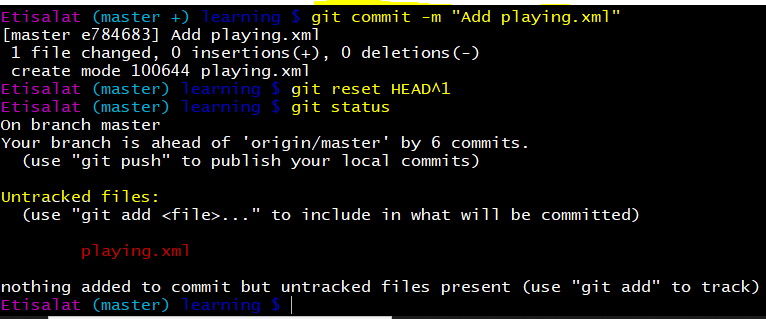
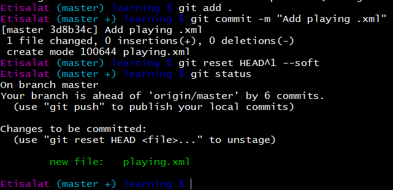
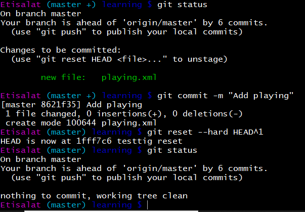
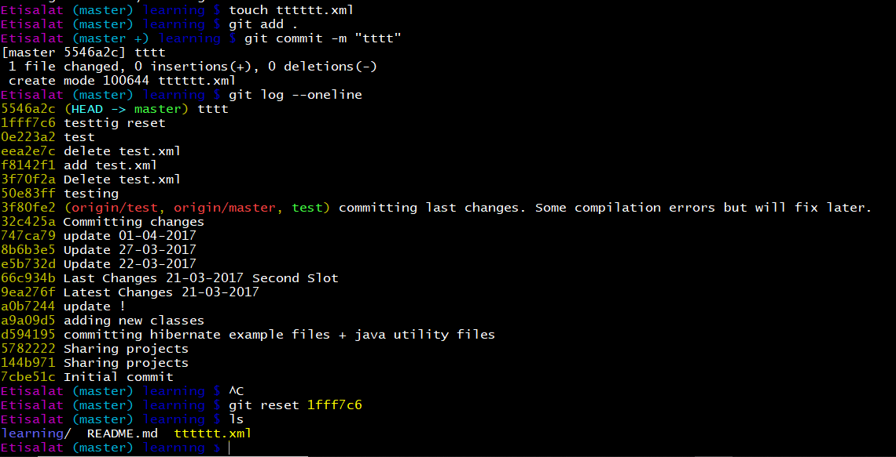
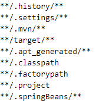
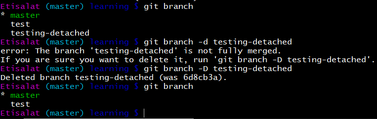
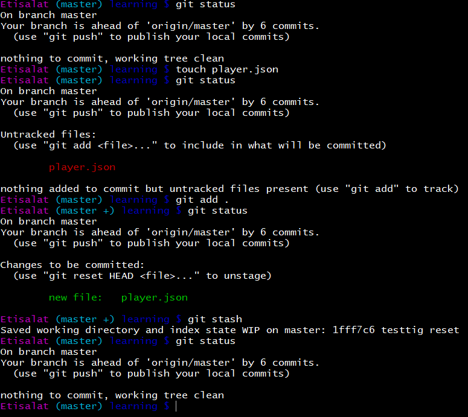
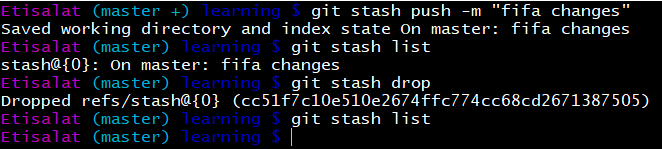

# Git Outline

> I created this outline to help myself and others summarizing Git commands and topics which we usually use in our day-to-day job activity as a software developers.

## Index

* [Introduction](#Introduction)
* [Hints](#Hints)
* [Working Directory, Staging Area and Repository](#Working-Directory-Staging-Area-and-Repository)
* [How Often to Commit](#How-Often-to-Commit)
* [What is a README](#What-is-a-README)
* [Git Errors and Warnings](#Git-Errors-and-Warnings)
* [Configuring Git Bash Prompt](#Configuring-git-bash-prompt)
* [Configuring Git](#Configuring-git)
* [Git Init](#Git-init)
* [Git Status](#Git-status)
* [Git Log](#Git-log)
* [Git Show](#Git-Show)
* [Filtering Commits](#filtering-commits)
* [Pager in Git](#pager-in-git)
* [File Changes in Git](#File-Changes-in-Git)
  * [git add](#git-add)
  * [git rm](#git-rm)
  * [git commit](#git-commit)
  * [git diff](#git-diff)
  * [git ls-files](#git-ls-files)
* [Edit and Undo Changes](#Edit-and-Undo-Changes)
  * [Amend Commit - Changing the Last Commit](#Amend-Commit---Changing-the-Last-Commit)
  * [Git Revert vs Git Reset](#Git-Revert-vs-Git-Reset)
  * [Git Rebase](#git-rebase)
    * [Merge feature branch into master branch](#Merge-feature-branch-into-master-branch)
    * [What are The Drawbacks](#What-are-The-Drawbacks)
    * [Resources](#Resources)
  * [Squashing Commits - Changing Multiple Commit Messages](#Squashing-Commits---Changing-Multiple-Commit-Messages)
    * [By using git reset - Method #1](#1--By-using-git-reset---Method-1)
    * [By using git reset - Method #2](#2--By-using-git-reset---Method-2)
    * [By using git rebase](#3--By-using-git-rebase)
    * [By using git merge squash](#4--By-using-git-merge-squash)
  * [git reflog](#git-reflog)
* [Git Ignore File](#git-ignore-file)
* [Branching](#Branching)
  * [Switch Between Branches](#Switch-Between-Branches)
* [Merging Files](#Merging-files)
  * [Newline characters between Windows and Unix systems](#Newline-characters-between-Windows-and-Unix-systems)
* [Remote Repositories](#Remote-Repositories)
* [Fork Repository](#Fork-Repository)
* [Creating a Pull Request](#Creating-a-pull-request)
* [Keeping Forked Repo in Sync With Original Repo](#Keeping-forked-repo-in-sync-with-original-repo)
* [Stashing](#Stashing)
  * [List Stashed changes](#List-Stashed-changes)
  * [Retrieve stashed changes](#Retrieve-stashed-changes)
  * [Remove Stashed changes](#Remove-Stashed-changes)
* [Tags](#tags)
  * [Create Tag](#Create-Tag)
  * [List Tags](#List-Tags)
  * [Delete Tag](#Delete-Tag)
  * [Check out Specific Tag](#Check-out-Specific-Tag)
  * [New Branch from Tag](#New-Branch-from-Tag)
  * [Clone Specific Tag](#Clone-Specific-Tag)
* [Git Cherry Pick](#Git-Cherry-Pick)
* [Git Bisect](#git-bisect)
* [Useful Resources](#Useful-Resources)

## Introduction

* Git is a British slang for something roughly equivalent to unpleasant person
* Git is a tool to manage different versions of source code
* Git is a VCS (Version Control System), SCM (Source Code Manager), Revision Control or Source Control
* Download Git from [git-scm.com](https://git-scm.com/)
* Most popular version control systems: Git, Subversion and Mercurial
* Earlier version of Git was CVS (Concurrent Version Systems), SVN (Subversion), Mercurial (hg)
* There are two main types of version control system models:
  * The centralized model - all users connect to a central, master repository
  * The distributed model - each user has the entire repository on their computer
* In the distributed version control systems, every developer can has its own version, even offline
* Commit is the building block of Git
* Git is a version control tool but [GitHub](https://github.com/) is a service that hosts Git projects
* [BitBucket](https://bitbucket.org/) is a Git code management, another free Git hosting service that also has the benefit of giving you unlimited private repositories for free! You can learn more about [bitbucket here](https://confluence.atlassian.com/bitbucket/tutorials-755338051.html)

***

## Hints

* Repository or Repo: It's a directory that contains your project (locally or remote copy). It contains all the snapshots or your files.
  * Repo is made of commits (or snapshots).
* Commit: is a snapshot or picture of all of your work files at a time.
* Working Directory: is a temporary mirror of one specific snapshot (the latest, eventually), the place where your files are in, which you are editing.
* Git is tracking the difference between your working directory and local repository, and between your local repository and (one of) remote repositories.
* Checkout: Process of getting files/content from repository and copy it to your working directory.
* Staging Area, Staging Index or Index: It's a file in Git directory which stores information about all the files that will go into your next commit.
* `SHA` (Secure Hashing Algorithm): is an id for each commit, ex: `de4e7e314ca8d8107856a0c68126b41bdb8d9ceb`, consists of 40 char made of number between (0-9) and characters between (a-f), only 7 char appears in the commit, ex: `de4e7e3`.
* When you commiting your changes, only the files in the staging area will be commited, any other changes will not be committed.
* `HEAD` is Git's name for the current commit.
* You can't have nested Git repository.

### Working Directory, Staging Area and Repository


***

## How Often to Commit

A good rule of thumb is to make one commit per logical change. For example, if you fixed a typo issue, then fixed a bug in a separate part of the file, you should use one commit for each change since they are logically separate.

If you do this, each commit will have one purpose that can be easily understood. Git allows you to write a short message explaining what was changed in each commit, and that message will be more useful if each commit has a single logical change.

When choosing whether to commit, just keep in mind that each commit should have one clear logical purpose.

Best practices for Git it to make small frequent commits and make it descriptive.

It's a standard Git practice to write your commit message as if it were a command, eg: "Add request validation".

***

## What is a README

Many projects contain a file named "README" that gives a general description of what the project does and how to use it. It's often a good idea to read this file before doing anything with the project, so the file is given this name to make users more likely to read it.

***

## Git Errors and Warnings

> `Should not be doing an octopus`
  
Octopus is a strategy Git uses to combine many different versions of code together. This message can appear if you try to use this strategy in an inappropriate situation.
  
> `You are in 'detached HEAD' state`

`HEAD` is what Git calls the commit you are currently on. You can “detach” the HEAD by switching to a previous commit. To get this message you need to checkout a commit, not a branch. Despite what it sounds like, it’s actually not a bad thing to detach the HEAD. Git just warns you so that you’ll realize what you’re doing it. let's explain this as below:

* `$ git checkout master` You're on master which has multiple commits.
* `$ git checkout f5c55ac66` You're on master but checked out different commit, so your `HEAD` is pointing to previous commit `f5c55ac66`. If you made any change now in any file then commited it, this commit will not belong to any branch.

  ```bash
  $ git checkout f5c55ac66
  Note: checking out 'f5c55ac66'.
  
  
  You are in 'detached HEAD' state. You can look around, make experimental changes and commit them, and you can discard any commits you make in this state without impacting any branches by performing another checkout.
  
  
  If you want to create a new branch to retain commits you create, you may do so (now or later) by using -b with the checkout command again. Example:
  
  git checkout -b <new-branch-name$
  
  HEAD is now at f5c55ac66 Add furture expiry date to base offer daily reset
  ```

* `$ git commit -a -m "testing detached"` Create new commit with the new changes, this commit will not belong to any branch.

  ```bash
  $ git commit -a -m "testing detached"
  [detached HEAD b80b7898f] testing detached
  
  Committer: Mahmoud Sabahallah <msabahallah@etisalat.ae$
  
  Your name and email address were configured automatically based on your username and hostname. Please check that they are accurate. You can suppress this message by setting them explicitly. Run the following command and follow the instructions in your editor to edit your configuration file:

  git config --global --edit
  
  After doing this, you may fix the identity used for this commit with:
  
  git commit --amend --reset-author

  1 file changed, 2 insertions(+)
  ```

* `$ git checkout master` Now you checked out to the most recent commit in this branch, and Git will give you a warning.

  ```bash
  $ git checkout master
  Warning: you are leaving 1 commit behind, not connected to any of your branches:

  b80b7898f testing detached

  If you want to keep it by creating a new branch, this may be a good time to do so with:

  git branch <new-branch-name$ b80b7898f

  Switched to branch 'master'

  Your branch is up to date with 'origin/master'.
  ```

* `$ git branch test-detached-branch 34fb66c3` Run this command to keep track of this commit, otherwise this commit will not belong to any branch.
* Master is the name given to main branch, in most Git repositories, and every time you create a repository Git creates a master branch for you.
* As a matter of terminology, we sometimes refer to the current last commit on a branch as being _the tip of_ that branch.

***

## Configuring Git Bash Prompt

* Download the files from `./metadata/git-config/`
* `$ start .` Open current directory.
* `$ cd ~` Go to home directory.
* `$ mkdir .git-config` Create .git-config folder.
* `$ mv downloads/git-completion.bash ~/.git-config/git-completion.bash` Move file `git-completion.bash` to `~/.git-config`.
* `$ mv downloads/git-prompt.sh ~/.git-config/git-prompt.sh` Move file `git-prompt.sh` to `~/.git-config`.
* `$ mv downloads/.bash_profile ~/.git-config/.bash_profile` Move file `.bash_profile` to `~/.git-config`.
* Edit your `.bash_profile` if necessary to point to `git-completion.bash` file and `git-prompt.sh` file.
* Some explanation inside `.bash_profile` to show up the purpose of each line.
* `git-prompt.sh` This file is necessary for the Git related stuff, like commit ids to show up in your prompt.
* If needed, `$ mv .git-initial-config .git-config` Rename the folder, sometimes windows won't let you know do this from the GUI.
* You can also follow [this](https://www.youtube.com/watch?time_continue=1&v=CCYjHfBk9hw&feature=emb_logo) video.

***

## Configuring Git

* `$ git --version` Check Git current version.
* `$ git config --global user.email "you@example.com"` Configure your email globally.
* `$ git config --global user.name "Your Name"` (ex:`$ git config --global user.name msabahallah`) Configure your name globally.
* `$ git config --global color.ui auto` Make sure that Git output is colored, it enables helpful colorization of command line output.
* `$ git config --global merge.conflictstyle diff3` Display the original state in a conflict.
* `$ git config --list` or `-l` List all current configuration.
* `$ git config --global core.editor "atom --wait"`
* `$ git config --global core.editor "'C:/Program Files/Sublime Text 2/sublime_text.exe' -n -w"` Configure sublime, to open code editor when commit, `-n` means new window, `-w` means wait for user to close the editor.
* `$ git config --global core.editor "code --wait"` Configure VSCode, to open code editor when commit.
  * If you type `$ code` it will open the editor
* You can configure Git to push to the current branch using the following command `$ git config --global push.default upstream`.
  * Then just do `$ git push` this will push the code to your current branch.
  * Another solution is to use `$ git push origin HEAD` A handy way to push the current branch to the same name on the remote.

***

## Git Init

* `$ git init rtf-app` Create a brand new and empty repo in your computer.
  * If you have a project not tracked yet by git, goto project directory and run '$ git init'.

***

## Git Status

* `$ git status` Check repo current status, you must run this command before and after running any other command.

***

## Git Log

Display information about the exsiting commits

* `$ git log`
* `$ git log --oneline`
* `$ git log --stat` Show statistics about the files have been changed.
* `$ git log -p` `--patch` Show actual code changes or differences.
* `$ git log -p --stat`
* `$ git log -p -w` Ignore whitespaces.
* `$ git log -p fdf5493` Show commits happened before this commit, including this commit.
* `$ git log --follow [file]` Lists version history for a file, including renames.
* You can also list all of the commits of other branch:
  * `$ git log -p --stat --online sidebar`
* `git log --graph --decorate --pretty=oneline --abbrev-commit`

***

## Git Show

Display information about given commit

* `$ git show` Show only last recent commit you did.
* `$ git show fdf5493` Display info about specific commit.
* `$ git show -p --stat -w` Show only last commit with patch or differences with statistics with ignore whitespaces.
  * `-p` Patch or changes.
  * `--stat` Statistics.
  * `-w` Remove whitespace.
* `$ git show fdf5493 -p --stat -w` Show specific commit.

***

## Filtering Commits

* `$ git shortlog -s -n` Show all contributers with thier commits, `-s` means number of commits, `-n` means sort by number of commits not by name.
* `$ git log --author=Mahmoud` Get logs by author.
* `$ git log --grep="unit tests"` Filter commits with the --grep flag.

***

## Pager in Git

Bash is using **Less** fot navigating the logs.

If you're not used a pager on the command line, navigating in Less can be a bit odd, here are some helpful keys:

* `j` or `↓` (arrow down) to move/scroll down one line at a time.
* `k` or `↑` (arrow up) to move/scroll up one line at a time.
* `d` or `u` to move by half the page screen (go down, go up).
* `f` or `b` to move by a whole page screen (go down, go up).
* `q` to quit out of the log (returns to the regular command prompt).

***

## File Changes in Git

### git add

* `$ git add file_name file_name` Move files from working directory to staging index.
* `$ git add -A` Stage all changes.
* `$ git add .` Stage new files and modifications, without deletions.
* `$ git add -u` Stage modifications and deletions, without new files.

### git rm

* `$ git rm file_name` Delete the file from the working directory and stage the deletion.
* `$ git rm --cached <file>`
  * Remove the file from index alone and keeps it in your working copy.
  * If you added a file into your working directory, and commited it, but realized that you want to remove from index but keep in your working directory, run this command it will remove from index but will keep it in the working directory for your use and it will be marked as untracked file.
* If you have untracked file and want to remove it `$ rm file_name`.

### git commit

* `$ git commit` Take files from staging index to repository.
* `$ git commit -m "Initial commit"` Commit without opening the editor.

### git diff

* `$ git diff` Display differences between two versions of file.
  * If you don’t give `$ git diff` any arguments, it compares the current state of your working directory to the most recent commit and will get changes happended in files but not yet staged or commited.
* `$ git diff SHA SHA` Get differnce between two commits. ex: `$ git diff 4e3b55c 374ad87`.
* `$ git diff --staged` Show file differences between staging and the last file version.

### git ls-files

Show information about files in the index and the working tree, it has alot of options, check [doc](https://git-scm.com/docs/git-ls-files).

* `$ git ls-files --other --ignored --exclude-standard` List all ignored files in this project.

***

## Edit and Undo Changes

### Amend Commit - Changing the Last Commit

* `$ git commit --amend` Alter the most-recent commit, it lets you combine staged changes with the previous commit instead of creating an entirely new commit.
* If you have edited file or added file, just stage it first `$ git add .` then `$ git commit --amend` it will add the changes to current commit.
* If you haven't change anything, editor will open to modify the commit message.
* Or you can update the commit message without opening the editor `$ git commit --amend -m "an updated commit message"`.
* `$ git commit --amend --no-edit` The `--no-edit` flag will allow you to make the amendment to your commit without changing its commit message. Say if you just make a fix for typo error, so no need to change the commit message. The resulting commit will replace the incomplete one, and it will look like we committed the changes in a single snapshot.
* Amended commits are actually entirely new commits and the previous commit will no longer be on your current branch.

### Git Revert vs Git Reset

_Reverting_, creates a new commit that reverts or undos a previous commit.

_Resetting_, on the other hand, erases commits!

* `$ git revert SHA` It will revert back a commit, it also creates a new commit.
* `$ git reset HEAD` if you have staged changes and you want to move back to the working directory, run this command. Then changes will be unstaged.
* `$ git reset 0f72e0` It will erase commits up to specific commit `0f72e0`.
* `$ git reset HEAD^1` It will move the last commit changes to working directory (default is `--mixed`) mixed means back to the working directory.

* `$ git reset --soft HEAD^1 It will move the last commit changes to the staging index.

* `$ git reset --hard HEAD^1` It will move the last commit changes to the trash.

* `$ git reset --hard HEAD^2` It will get back two steps.
* `$ git reset --hard HEAD^3` It will get back three steps.
* After resetting, you may need to push your changes to remote repo
  * `$ git push -f origin master` `-f` means force.
* `$ git reset name_of_file` Remove tracking and don't delete the file itself. If you have a tracked file and want to ignore it run this command and put the file name in the `.ignore` file.


To alleviate the stress a bit, Git does keep track of everything for about 30 days before it completely erases anything, to access this content, you'll need to use the `$ git reflog` command.

### Git Rebase

What is `$ git rebase <base>`

eg: `$ git rebase -i HEAD~3`

`$ git rebase -i 6394dc` where `6394dc` is the hash of the commit just before the first one you want to rewrite from. You can read the whole thing as: Merge all my commits on top of `6394dc`.

`$ git rebase -i --root` squash commits from beginning.

You can use git rebase to combine a sequence of commits into a new base commit. New commits will be replacing the old ones. Rebase is one of two Git utilities that specializes in integrating changes from one branch onto another. The other change integration utility is `$ git merge`. [git rebase vs git merge](https://coderefinery.github.io/git-branch-design/01-rebase/).

* Merge keeps the history whereas rebase rewrites it.
* Git rebase replays the branch commits on top of master.
* Suppose you made a pull request and owner requested you to combine some commits together, so you have to do squashing.
* `$ git rebase -i HEAD~3` Combining last 3 commits together and create new commit with a new SHA, 3 commits will be erased.
  * `-i` stands for "interactive mode", Git will pop up your configured text editor and prompt to edit and combine the specified commits which are rebased. You can reorder the commits, you can remove them (weeding out bad or otherwise unwanted patches).
* When editors open, you should see a list of commits, each commit starting with the word "pick".
* Make sure the first commit says "pick" and change the rest from "pick" to "squash" or "s". This will squash each commit into the previous commit, which will continue until every commit is squashed into the first commit.
* Save and close the editor.
* It will give you the opportunity to change the commit message.
* Save and close the editor again.
* `$ git push -f` Force pushing.
* You have to be carful when doing squash, you may take a backup `$ git branch backup`.


#### Merge feature branch into master branch

Before you merge a feature branch back into your main branch (often master or develop), your feature branch should be squashed down to a single buildable commit, and then rebased from the up-to-date main branch. Here’s a breakdown.

* `$ git pull origin master` Pull master branch.
* `$ git checkout -b branchName` Create bug/feature branch.
* Make changes as needed with as many commits that you need to. Make sure the final commit is buildable and all tests pass.
* `$ git log --graph --decorate --pretty=oneline --abbrev-commit` Get the number of commits from the start of your branch.
* `$ git rebase -i HEAD~[NUMBER OF COMMITS]` or `$ git rebase -i [SHA]` Squash to specific commit.
* `$ git push origin branchName --force` If you have previously pushed your code to a remote branch, you will need to force push.
* `$ git checkout master` Checkout master branch.
* `$ git pull origin master` Pull master branch.
* `$ git checkout branchName` Checkout bug/feature branch.
* `$ git rebase master` Rebase from master.
* Handle any conflicts and make sure your code builds and all tests pass.
* `$ git push origin branchName --force` Force push branch to remote.
* Checkout, merge, and push into master
  * `$ git checkout master`
  * `$ git merge branchName`
  * `$ git push origin master`

If you run into conflicts during the rebase, they’re usually quite easy to resolve and Git leads you through as much as possible. The basics of this is fix the conflict in question, `$ git add` the file, and then `$ git rebase --continue` will resume the process. Of course, doing a `$ git rebase --abort` will bring you back to your previous state if you want. If for some reason you’ve lost a commit in the rebase, you can use the reflog to get it back.

#### What are The Drawbacks

Since we’re squashing commits and rebasing, we are literally changing the history for the repository. Some people feel that history should reflect your true history, the good the bad and the ugly. I propose a clean history is more valuable than one that is hard to understand. Not all history is lost; diehards can still see the original history in the ref log. Another small drawback is that we lose some granularity when we squash our commits. If you really want to have multiple commits for a feature, at least squash down so that each commit builds and passes tests. While this workflow can be dangerous if you don’t have an understanding of what you are doing, after minimal education on the matter, this process is extremely safe.

#### Resources

* [always-squash-and-rebase-your-git-commits](https://blog.carbonfive.com/2017/08/28/always-squash-and-rebase-your-git-commits/)
* [Squshing commits in one commit](https://www.internalpointers.com/post/squash-commits-into-one-git)
* [How-can-i-merge-two-commits-into-one-if-i-already-started-rebase](https://stackoverflow.com/questions/2563632/how-can-i-merge-two-commits-into-one-if-i-already-started-rebase)
* [A quick guide to squashing Git commits](https://dev.to/victoria/a-quick-guide-to-squashing-git-commits-7io)
* [git rebase vs git merge](https://coderefinery.github.io/git-branch-design/01-rebase/)

### Squashing Commits - Changing Multiple Commit Messages

Squashing is combining commits together in one single commit. It's a nice way to group some changes together, especially before sharing them with others.

In Git you can merge several commits into one with the powerful interactive `rebase`. It's a handy tool to use; I usually tidy up my working space by grouping together several small intermediate commits into a single lump to push upstream.

There are different ways to do so.

#### 1- By using git reset - Method-1

```bash
git reset --soft origin/master
git commit
```

This is appropriate when:

* We're committing directly to master.
* We don't intend to open a pull request to merge a feature.
* We don't want to preserve history of branches or changes we haven't yet pushed.

This method takes a Git tree that looks like this:

```git
*   3e8fd79 - (HEAD -> master) Fix a thing
|
*   4f0d387 - Tweak something
|
*   0a6b8b3 - Merge branch 'new-article'
|\
| * 33b5509 - (new-article) Update article again again
| |
| * 1782e63 - Update article again
| |
| * 3c5b6a8 - Update article
| |
* | f790737 - (master) Tweak unrelated article
|/
|
* 65af7e7 Add social media link
|
* 0e3fa32 (origin/master, origin/HEAD) Update theme
```

And makes it look like this:

```git
* 7f9a127 - (HEAD -> master) Add new article
|
* 0e3fa32 - (origin/master, origin/HEAD) Update theme
```

#### 2- By using git reset - Method-2

```bash
git reset --soft HEAD~5
git commit -m "New message for the combined commit"
```

Where `--soft` leaves our files untouched and staged, and `HEAD~5` can be thought of as "the number of previous commits I want to combine."

Then we can do `$ git merge master` and create a pull request from our branch to master.

This is appropriate when:

* If you want to write the new commit message from scratch.
* We want to squash the last x commits but not all commits since `origin/master`.
* We want to open a pull request to merge a branch.

This method takes a Git tree that looks like this:

```git
* 13a070f - (HEAD -> new-article) Finish new article
|
* 78e728a - Edit article draft
|
* d62603c - Add example
|
* 1aeb20e - Update draft
|
* 5a8442a - Add new article draft
|
| * 65af7e7 - (master) Add social media link
|/
|
* 0e3fa32 - (origin/master, origin/HEAD) Update theme
```

And makes it look like this:

```git
* 90da69a - (HEAD -> new-article) Add new article
|
| * 65af7e7 - (master) Add social media link
|/
|
* 0e3fa32 - (origin/master, origin/HEAD) Update theme
```

#### 3- By using git rebase

We want to retain some of this history, but clean up the commits. We also want to change the messages for some of the commits. To achieve this, we'll use `$ git rebase`.

This is appropriate when:

* We want to squash only some commits.
* We want to edit previous commit messages.
* We want to delete or reorder specific commits.

```git
* dc89918 - (HEAD -> master) Add link
|
* 9b6780f - Update image asset
|
* 6379956 - Fix CSS bug
|
*   16ee1f3 - Merge master into branch
|\
| |
| * ccec365 - Update list page
| |
* | 033dee7 - Fix typo
| |
* | 90da69a - Add new article
|/
|
* 0e3fa32 - (origin/master, origin/HEAD) Update theme
```

* `$ git fetch` Receive the latest changes from a remote git server.
* `$ git rebase -i origin/master` or `git rebase -i 0e3fa32` Merge all of your unpushed commits into a single commit since origin/master. Where `0e3fa32` is the last commit hash we want to retain as-is.

This will bring up your text editor (`-i` is for "interactive") with a file that looks like this:

```markdown
pick 90da69a Add new article
pick 033dee7 Fix typo
pick ccec365 Update list page
pick 6379956 Fix CSS bug
pick 9b6780f Update image asset
pick dc89918 Add link
```

Change the commit you want from "pick" to "squash" (or "s") except the first one:

```markdown
pick 90da69a Add new article
squash 033dee7 Fix typo
pick ccec365 Update list page
squash 6379956 Fix CSS bug
squash 9b6780f Update image asset
squash dc89918 Add link
```

If there is merge, fix it and then resume the process with git `rebase --continue`.

After rebase it will look like

```git
* 3564b8c - (HEAD -> master) Update list page
|
* 3cbad01 - Add new article
|
* 0e3fa32 - (origin/master, origin/HEAD) Update theme
```

#### 4- By using git merge squash

`$ git merge –squash`

It allows you to merge all changes on a branch into your current branch, but as a single commit.

Squashing to a single commit gives you an opportunity to clean up messy commits and provide a good rationale for the changes your are merging.

Say you want to merge all of your changes from bug/feature to master branch in one single commit, Say your bug fix branch is called `bugfix` and you want to merge it into `master`:

* `$ git checkout master` Switch to your master branch.
* `$ git merge --squash bugfix` Take all the commits from the bugfix branch and merges it with your current branch.
* `$ git commit` Create a single commit from the merged changes.
  * Omitting the `-m` parameter lets you modify a draft commit message containing every message from your squashed commits before finalizing your commit.
* Or you can provide a commit message `-m "Squash"`
* If you face conflicts, fix them then `$ git add file_name` and `$ git commit`

### git reflog

Reference logs, or "reflogs" are a mechanism Git uses to record updates applied to tips of branches and other commit references. Reflog allows you to go back to commits even though they are not referenced by any branch or tag.

After rewriting history, the reflog contains information about the old state of branches and allows you to go back to that state if necessary.

Every time your branch tip is updated for any reason (by switching branches, pulling in new changes, rewriting history or simply by adding new commits), a new entry will be added to the reflog. In this section we will take a high level look at the git reflog command and explore some common uses.

* `$ git reflog` Displays the reflog for the local repository.
* `$ git reflog --relative-date` Show the reflog with relative date information (e.g. 2 weeks ago).

It's important to note that the reflog only provides a safety net if changes have been committed to your local repository and that it only tracks movements of the repositories branch tip. Additionally reflog entries have an expiration date. The default expiration time for reflog entries is 90 days.

Check [git-reflog](https://www.atlassian.com/git/tutorials/rewriting-history/git-reflog)

***

## Git Ignore File

Create `.gitignore` file and then add all of your files inside which needs to be ignored



***

## Branching

* `$ git branch` List all _local_ branches in the current repository and indicates the current active branch.
* `$ git branch sidebar` Create a branch.
* `$ git branch alt-sidebar-loc 42a69f` Create a new branch called alt-sidebar-loc and pointing at the commit with the SHA `42a69f`.
* `$ git branch -d sidebar` Delete a branch.
  * Git won't let you delete a branch if it has commits on it that aren't on any other branch, to force deletion: `$ git branch -D sidebar`.

* `$ git checkout` Switch between different branches or tags.
  * `$ git checkout sidebar` Switch to branch _sidebar_.

### Switch Between Branches

* You are on master branch and did some changes
* `$ git checkout -b new-branch` Create new branch from local snapshot and check out this branch automatically.
* `$ git add .`
* `$ git commit -m "new-branch initial commit"`
* `$ git commit -a -m` `-a` means to commit all the changes you've made.
* `$ git push origin new-branch` If you are authorized or you are the owner of the remote repo.

***

## Merging Files

* `$ git merge` will include the currently checked out branch in the merged version. So if you have _branch1_ checked out, and you run `$ git merge branch2 branch3`, the merged version will combine _branch1_ as well as _branch2_ and _branch3_.
* Since the checked-out branch is always included in the merge, you may have guessed that when you are merging two branches, you don't need to specify both of them as arguments to git merge on the command line. If you want to merge _branch2_ into _branch1_, you can simply `$ git checkout branch1` and then type `$ git merge branch2`. The only reason to type `$ git merge branch1 branch2` is if it helps you keep better mental track of which branches you are merging.
* Remember that making a merge makes a commit.
* `$ git merge sidebar`
* Undo the merge (Make sure to include the `^` character! It's a known as a "_Relative Commit Reference_" and indicates "the parent commit")
  * `$ git merge --abort` If you get conflict and want to go back to the state before merging.
  * `$ git reset --hard HEAD^` It will move the last commit changes to the trash.
* keep in mind 'merge in' means get changes from other branch to current branch

### Newline characters between Windows and Unix systems

* Context: Whenever we hit the "Enter" key on the keyboard, we are actually telling the computer to insert an invisible character into our text file to indicate to the computer that there should be a new line.
* Unix systems adds one character called the "line feed" character or `LF` or `\n` while Windows systems adds two characters, "carriage return" and "line feed" or `CRLF` or `\r\n`.
* Mahmoud's files have `LF` because her files were edited on Mac OSX, which uses `LF`.
* If a Windows user were to edit Mahmoud's files, the Windows text editor might convert all `LF` to `CRLF` to make editing files possible.
* When the Windows user merges her file with Mahmoud's files, a merge conflict will result due to the different `LF` and `CRLF` characters.
* To fix this, Windows users should set the global `autocrlf` attribute to true

```bash
$ git config --global core.autocrlf true
# Configure Git on Windows to properly handle line endings
```

More information can be found here: [Dealing with line endings](https://help.github.com/en/github/using-git/configuring-git-to-handle-line-endings#platform-all)

***

## Remote Repositories

* `$ git remote` Get the current remote repo short-name, defualt is `origin` you can name it anything.
* `$ git remote -v` Get the full URL of the project.
* `$ git remote add origin https://github.com/richardkalehoff/RichardsFantasticProject.git` Connect local repo to remote repo.
  * `origin` is just a short-name for our repo, if you wanna change default name from `origin` to anything else, it is up to you.
* `$ git pull origin master` Get all remote changes and merge them automatically.
* `$ git fetch origin master` Get all remote changes without merge.
  * If you have changes in remote repo as well as local repo (you are on the same branch), so it will bring all the changes without merging.
  * Then you can merge manually `$ git merge origin/master`
  * Then to push the changes and update remote repo `$ git push origin master`.
* `$ git remote set-url origin https://github.com/sabahallah/certifications-and-online-training` Update remote url on local repo.

***

## Fork Repository

* Fork means split into identical copy.
* Fork makes identical copy and you'll be the owner of that copy.
* Fork is different than cloning.
* Fork to be made via [github.com](https://github.com) itself.
* You can make a clone of the remote repo but at the end it is one remote repo, but if you fork you completely create a new identical repo.
* On [github.com](https://github.com), you can add contributers to enable them to push to your repo, from settings in repo itself.
* `$ git clone url`
  * It will bring remote repo to your local.
  * Copy entire Git repo.
  * Git will setup automatically remote url for you instead of writing command `$ git remote add origin <url>`.
  * Then you can do any change.

***

## Creating a Pull Request

* If you want to move changes from my own forked repo to original repo, for example, this can be fone from [github](https://github.com) gui.
* Or if you're not authorized to commit changes to a specific branch in a repository, so you have to create a pull request from your own branch to the restricted branch.

***

## Keeping Forked Repo in Sync with Original Repo

* If i want to move changes from my own forked repo to original repo
* Staying in sync with original remote repo (you wanna get changes from the original remote repo to your forked repo).
* `$ git remote add upstream "remote url"` Connect to original repo to get its recent commits.
  * `upstream` is a short-name, you can change it to anything, but best practice is to keep it like that
  * `$ git remote rename mine origin` If you want to rename the short-name to any name.
  * `$ git remote rename source-repo upstream` Rename the short-name to any name.
* `$ git fetch upstream master` Get all remote changes from origin remote repo / master branch without merge.
* `$ git log --oneline --graph --decorate --all`
* `$ git checkout master` Make sure i'm on my master branch in my local forked repo.
* `$ git merge upstream/master` Merge all changes from original repo to my forked repo.
* `$ git push origin master` Push all the changes to my forked remote repo.
* Remember that a `$ git pull` is the same thing as a `$ git fetch` + `$ git merge`!

***

## Stashing

Shelve and restore incomplete changes.

* `$ git stash` Temporarily stores all modified tracked files, and back to the latest commit automatically.
* `$ git stash push -m 'feature 1'` Stash changes with commit message.


### List Stashed changes

* `$ git stash list` List all stashed changes.
* `$ git stash apply` Bring the latest stashed files again to your working directory.
* If you did multiple stashes, you can get this by running `$ git stash list` and to get back to specific stash `$ git stash apply 2`, where `2` is the stash index.


### Retrieve stashed changes

* `$ git stash pop` Restore the most recently stashed files to your working directory), same as `$ git stash apply`.
* `$ git stash pop 2` Restore indexed stash.

### Remove Stashed changes

* `$ git stash drop` Discard the most recently stashed changeset.
* `$ git stash drop 2` Discard the stashed changes with index `2`.
* `$ git stash clear` Clear the stash stack.


***

## Tags

A tag is used to label and mark a specific commit in the history. It is usually used to mark release points (eg. v1.0, etc.).

Although a tag may appear similar to a branch, a tag, however, does not change. It points directly to a specific commit in the history.

Tags are alias to hexadecimal version names.

You will not be able to checkout the tags if it's not locally in your repository so first, you have to fetch the tags to your local repository.


### Create Tag

* `$ git tag -a v1.0` Too tag a commit. Normal tag.
* `$ git tag -a v1.0 -m "Product Release"` Annotated tag, adding some extra information by using `-a`, you can add metadata like what you have in a git commit: name, e-mail, date, comment & signature.

### List Tags

* `$ git tag` List all tags.
* `$ git tag --list 'v-*'` List all tags with given pattern ex: `v-*`.

### Delete Tag

* `$ git tag -d <tag name>` Delete any given tag.
  * `$ git tag -d v1.0` Delete a tag, same as `$ git tag --delete v1.0`
  * Don't forget to remove the deleted tag from the server with `$git push tags`.
* `$ git tag -a v1.0 a87984` Add tag to a past commit `ssdsdf`.

### Check out Specific Tag

* `$ git fetch --all --tags --prune`
* `$ git checkout tags/2.0.0-rc.10`

### New Branch from Tag

* `$ git checkout tags/2.0.0-rc.10 -b new-branch`

### Clone Specific Tag

* `$ git clone --branch <tag_name> <repo_url>`

***

## Git Cherry Pick

When you are working with a team of developers on a medium to large sized project, managing the changes between a number of git branches can become a complex task.

Sometimes you don't want to merge a whole branch into another, and only need to pick one or two specific commits. This process is called 'cherry picking'.

Cherry picking in Git means to choose a commit from one branch and apply it onto another.

This is in contrast with other ways such as merge and rebase which normally apply many commits onto another branch.

* `$ git checkout master` You're on master branch now.
* `$ git checkout -b new-feature` You checked out new branch.
* You did some commits and pushed this branch to remote repo.
* Now you want to move one of these commits to master branch.
* `$ git log --oneline`  
  
* `$ git checkout master` Switched to master branch.
* `$ git cherry-pick d467740` Now you can cherry pick from new-feature branch.
* `$ git cherry-pick d467740 de906d4` Cherry pick multiple commits.
* If the cherry picking gets halted because of conflicts, resolve them and run:
  * `$ git cherry-pick --continue`
* If you want to bail of this step out altogether, just type
  * `$ git cherry-pick --abort`
* Cherry pick options
  * `$ git cherry-pick d467740 -edit` The `-edit` option will cause Git to prompt for a commit message before applying the cherry-pick operation.
  * `$ git cherry-pick d467740 --no-commit` The `--no-commit` option will execute the cherry pick but instead of making a new commit it will move the contents of the target commit into the working directory of the current branch. So you can commit it yourself.

***

## Git Bisect

The idea behind `git bisect` is to perform a binary search in the history to find a particular regression or a bug introduced in a bad git commit.

* [How to use git bisect](https://stackoverflow.com/questions/4713088/how-to-use-git-bisect/4714297#4714297)
* [A beginner's guide to GIT BISECT - The process of elimination](https://www.metaltoad.com/blog/beginners-guide-git-bisect-process-elimination)
* [How to discover a bug using git bisect](https://flaviocopes.com/git-bisect/)

***

## Git Hooks

Git hooks are scripts that Git executes before or after events such as: commit, push, and receive.

* [What are Git Hooks?](https://githooks.com/)
* [How to setup server side pre-receive hook?](https://stackoverflow.com/questions/50505459/how-to-setup-server-side-pre-receive-hook)
* [Creating a pre-receive hook script](https://help.github.com/en/enterprise/2.19/admin/developer-workflow/creating-a-pre-receive-hook-script)
* [Git Hooks](https://www.atlassian.com/git/tutorials/git-hooks)
* [Anatomy of a Git pre-commit Hook](https://georgestocker.com/2019/10/31/anatomy-of-a-git-pre-commit-hook/)

***

## Useful Resources

* [Github Git Cheat Sheet](./metadata/github-git-cheat-sheet.pdf)
* [How to Use Git and GitHub](https://classroom.udacity.com/courses/ud775)
* [Udacity: Version Control with Git](https://www.udacity.com/course/version-control-with-git--ud123)
* [Style Guide to Write a Good Commit Message](http://udacity.github.io/git-styleguide/)
* [How to Write a Git Commit Message](https://chris.beams.io/posts/git-commit/)
* [Gitit App for Github](https://github.com/jlord/git-it-electron)
* [Connecting to GitHub with SSH](https://help.github.com/articles/connecting-to-github-with-ssh/)
* [Github Contribution](https://codeburst.io/a-step-by-step-guide-to-making-your-first-github-contribution-5302260a2940)
* [Caching your GitHub password in Git](https://help.github.com/articles/caching-your-github-password-in-git/)
* [Git Cherry Pick](https://www.atlassian.com/git/tutorials/cherry-pick)
* [Understanding Git Cherry-pick: How to Use](https://www.codementor.io/@olatundegaruba/how-to-git-cherry-pick-dyrp9pnmc)
* [Tagging](https://git-scm.com/book/en/v2/Git-Basics-Tagging)
