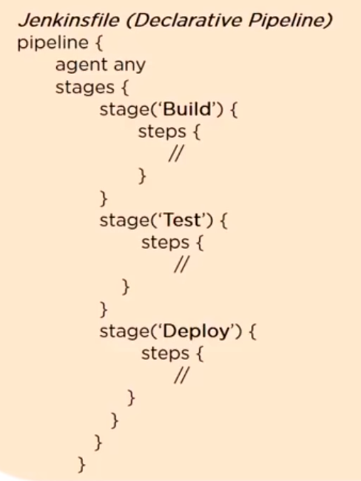

# Jenkins Outline

> This outline summarizes Jenkins tool.

Jenkins is automating builds (CI) and deployments (CD) of software.

Hint: Images and illustrations taken from [resources](#resources).

## Table of Content

* [Tools before Jenkins](#tools-before-jenkins)
* [What is Jenkins](#what-is-jenkins)
* [Features of Jenkins](#features-of-jenkins)
* [Install Jenkins](#install-jenkins)
  * [On Windows](#on-windows)
  * [Using Docker](#using-docker)
  * [Restart](#restart)
* [Job Workspace](#job-workspace)
* [Jenkins Plugins](#jenkins-plugins)
  * [Role-based Authorization Strategy Plugin](#role-based-authorization-strategy-plugin)
  * [Git Plugin](#git-plugin)
  * [Maven Plugin](#maven-plugin)
  * [SonarQube Plugin](#sonarqube-plugin)
* [Jenkins Master-Slave Architecture](#jenkins-master-slave-architecture)
* [Distributed Build](#distributed-build)
* [Build Triggers](#build-triggers)
* [Backup Jenkins Configuration](#backup-jenkins-configuration)
* [Jenkins Pipeline](#jenkins-pipeline)
  * [Scripted Pipeline](#scripted-pipeline)
  * [Declarative Pipeline](#declarative-pipeline)
* [Jenkins Blue Ocean](#jenkins-blue-ocean)
* [Recommendations](#recommendations)
* [Resources](#resources)

***

## Tools before Jenkins

* 2001 CruiseControl
* 2004 Hudson
* 2011 Jenkins Born as Hudson project but then renamed by community vote.

***

## What is Jenkins

Enhance your continuous integration environment. It's a continuous integration tool that allows continuous development, test and deployment of newly created code.

* Developer commit changes to the source code control.
* Code is pulled whenever there is a commit made to the source code.
* Jenkins run the tests.
* Jenkins then deploys the build on test server for testing or to execute a specific test script, using something like Selenium. If test fails, feedback is immediately sent to the developer.
* Then all the changes built continuously to production server.

***

## Features of Jenkins

* Easy installation.
* Easy configuration.
* Hundreds of plugins for CI/CD.
* Extensible.
* Distributed.

***

## Install Jenkins

### On Windows

Default username is `admin` and default password located at `drive:\Program Files (x86)\Jenkins\secrets\initialAdminPassword`

Jenkins root folder on windows `drive:\Program Files (x86)\Jenkins\` contains all its configuration data, jobs and project workspace, etc.

### Using Docker

Run command `docker run -d -v jenkins_home:/var/jenkins_home -p 8080:8080 -p 50000:50000 jenkins/jenkins:lts`

`/var/jenkins_home` is the home directory of jenkins where all the files, plugins, projects, configuration will exist inside the container. You should back up this folder always.

We are doing Volume Mounting to persist the data out of the container, so if something wrong happened to container - destroyed for example - data will not be lost.

You can access logs with command `docker logs CONTAINER_ID` in order to check first login token.

You can install plugins from command line directly `docker exec -it CONTAINER_ID ./usr/local/bin/install-plugins.sh`, then you need to restart jenkins, on `http://jenkins-server-ip:port/restart`

If you have your own plugins, you can create your own Jenkins Docker image

```docker
FROM jenkins/jenkins:lts
COPY plugins.txt /usr/share/jenkins/ref/plugins.txt
RUN /usr/local/bin/install-plugins.sh < /usr/share/jenkins/ref/plugins.txt
```

### Restart

* `http://jenkins-server:8080/restart` force restart without waiting the builds to complete.
* `http://jenkins-server:8080/safeRestart` wait for builds to complete.

***

## Job Workspace

Each job you have will create a workspace in the home directory. You can navigate to this workspace from the UI directly goto the job, in the left panel you'll find "Workspace" button.

***

## Jenkins Plugins

Jenkins without Plugins is nothing. You can find more and more plugins on [Jenkins Plugins](https://plugins.jenkins.io/), for example, to connect to AWS instance, Docker, Maven, Github, SonarQube, Bitbucket, etc.

### Role-based Authorization Strategy Plugin

To create rules in your jenkins server. Then activate `Role-based Strategy` option under _Configure Global Security_ > _Authorization_. You can configure your rules at `http://localhost:8080/role-strategy/`. Now you can:

* Create new role.
* Create new user.
* Assign the role to the user.

### Git Plugin

Create new job > Select "Git" under Source Code Management > Enter the URL > Select or add your Github credentials > Add build instructions > Save > Then run the build.

### Maven Plugin

If you run Jenkins inside a docker container, you need to add the maven to the container.

```docker
FROM jenkins/jenkins:lts
# if we want to install via apt
USER root
RUN apt-get update && apt-get install -y maven
# drop back to the regular jenkins user - good practice
USER jenkins
```

or you can start jenkins container and install maven manually.

### SonarQube Plugin

You can build a job on jenkins to push to SonarQube, then SonarQube run analysis on code then send results back to Jenkins.

***

## Jenkins Master-Slave Architecture


***

## Distributed Build

By default you have 2 Build Executers, but if you have multiple jobs, you need more agents to help you, so you need to setup agents.

* Goto Configure Global Security > Agents > Select JNLP Random.
* Goto > Manage Nodes.

This require port 50000 to be open, because of that we opened while running docker container

JNLP stands for "Java Network Launch Protocol"

Adding the nodes from GUI is not preferred way, you can use [Swarm Plugin](https://plugins.jenkins.io/swarm/). Agents will search the network for Jenkins and will register themselves. This still a manual process, you should automate the provisioning and make them ephemeral. You can use ansible to provision agents. If an agent goes down for whatever reason, make sure to spin up a new one.

***

## Build Triggers

Build Triggers > Poll SCM > Poll SCM  > schedule `*/2 * * * *`  
Job get trigger a build without any manual intervention every two minutes will check git repo.

***

## Backup Jenkins Configuration

You need to install Backup plugin. After install you will find Backup Manager. You can export configuration and restore whenever needed.

***

## Jenkins Pipeline

Pipeline is a job configuration as code.  
Stages are logical group of steps.

```Jenkinsfile
stages {
    stage('Build') {...}
    stage('Test') {...}
    stage('Deploy') {...}
    stage('E2E') {...}
    stage('Prod') {...}
}
```


Pipeline is a sequence of connected jobs. Old process is to install `Delivery Pipeline` and connect one job to another.

Jenkins provides 2 ways of developing a pipeline, **Scripted** and **Declarative**.

Key aspect of jenkins pipeline are **_Pipeline_**, _**Node**_, _**Step**_ and **_Stage_**.

You can use docker image as an agent in pipeline, it will spin up a docker container then after finish, throw it away.

```jenkinsfile
pipeline {
    agent {
        docker { image: 'node:7-alpine'}
    }
    stages {

    }
}
```

You can also use docker image with persistance storage like below:

```jenkinsfile
pipeline {
    agent {
        docker { image: 'maven:3-alpine'}
        args '-v $HOME/.m2:/root/.m2'
    }
    stages {

    }
}
```

Now it doesn't need to download maven jars again.

### Scripted Pipeline

You can write a groovy script and feed into jenkins.


Go to New Item > Pipeline > Provide Groovy Script.

You name the file as `Jenkinsfile`.

### Declarative Pipeline

Much friendly and simple groovy syntax. [Pipeline syntax](https://www.jenkins.io/doc/book/pipeline/syntax/).



Check [Pipeline Script](https://github.com/simplilearn-github/Pipeline_Script)

```groovy
pipeline {
    agent none
    stages {

        stage('Non-Parallel Stage') {
            agent {
                    label "master"
                }
            steps {
                    echo 'This stage will be executed first'
                }
        }

        stage('Run Tests') {
            parallel 'end-to-end-tests': {
                stage('Test On Windows') {
                    agent {
                        label "Windows_Node"
                    }
                    steps {
                        echo "Task1 on Agent"
                    }
                }
                stage('Test On Master') {
                    agent {
                        label "master"
                    }
                    steps {
                        echo "Task1 on Master"
                    }
                }
                node('perf-test-node') {

                }
            }, 'performance-tests': {
                node('perf-test-node'){

                }
            }
        }
    }
}
```

Another example using maven.

```groovy
pipeline {
    agent any

    stages {
        stage ('Compile Stage') {
            steps {
                sh 'mvn clean compile'
                }
            }
        }

        stage ('Testing Stage') {
            steps {
                sh 'mvn test'
                }
            }
        }

        stage ('Deployment Stage') {
            steps {
                sh 'mvn deploy'
            }
        }
    }
}
```

***

## Jenkins Blue Ocean

[Jenkins Blue Ocean](https://jenkins.io/projects/blueocean/) is a new GUI for jenkins. It also has a pipeline editor for declarative pipelines. You can install "Blue Ocean" Plugin then from home page "Open Blue Ocean".

***

## Recommendations

* Use Pipeline instead of Maven Job.
* When using pipeline, always use agents, it will take all the heavy works. If you need a stage to be run on the master, put agent to none, eg: `agent none`
    ```Jenkinsfile
    pipeline {
        agent none
        stages {

        }
    }
    ```
* Jenkins has shared libraries, if you have shared libraries between pipelines.
* You can build your own GUI views.
* In Views, you can install `Build Monitor` view, it's a nice way to visualize your builds.
* Nice Plugins
  * Build Monitor
  * Job Config History
  * Job DSl
  * Throttle Concurrent Builds
  * Timestamper
  * Version number plugin & Build-name-setter
* There's another project to configure your plugins using YAML file which is [Jenkins Configuration as Code](https://github.com/jenkinsci/configuration-as-code-plugin) or [Here](https://plugins.jenkins.io/configuration-as-code/).
* Jenkins X is a new project for kubernetes.
* Multi-branch Pipeline Plugin: If you want to run a pipeline from all branches you have, it will scan you repo, and create a pipeline for each branch.

***

## Resources

* [Jenkins Building Software project](https://wiki.jenkins.io/display/JENKINS/Building+a+software+project)
* [Youtube: Jenkins Tutorial For Beginners](https://www.youtube.com/watch?v=FX322RVNGj4)
* [Youtube: What Is Jenkins?](https://www.youtube.com/watch?v=V568cAbz2ls)
* [Youtube: How to run a Maven GitHub project in Jenkins?](https://www.youtube.com/watch?v=BfJvxGs-HxQ)
* [Youtube: How to create Jenkins Pipeline with an Example | Pipeline as Code](https://www.youtube.com/watch?v=s73nhwYBtzE)
* [What is Blue Ocean in Jenkins?](https://www.youtube.com/watch?v=EYXQyjaydKQ)
* [Continuous Integration vs. Continuous Delivery vs. Continuous Deployment](https://www.atlassian.com/continuous-delivery/principles/continuous-integration-vs-delivery-vs-deployment)
* Using Git, Jenkins, Ansible, Docker, Kubernetes and AWS in Continuous Integration and Continuous Deployment.
  * [Youtube: 1# CI/CD through Jenkins](https://www.youtube.com/watch?v=Z9G5stlXoyg)
  * [Youtube: 2# Ansible Installation & Configuration on AWS EC2](https://www.youtube.com/watch?v=79xFyOc_eEY)
  * [Youtube: 3# CI/CD pipeline using GIT, Jenkins & Ansible](https://www.youtube.com/watch?v=nE4b9mW2ym0)
  * [Youtube: 4# DevOps project with Git, Jenkins and Docker on AWS](https://www.youtube.com/watch?v=nMLQgXf8tZ0)
  * [Youtube: 5# How To Create a Docker Image Using Jenkins And Ansible](https://www.youtube.com/watch?v=MJ74RcL6jv8)
  * [Youtube: 6# Create DevOps project using Git, Jenkins and Ansible and Docker](https://www.youtube.com/watch?v=ZwdB1I14vEc)
  * [Youtube: 7# Enable versioning on docker images through jenkins job](https://www.youtube.com/watch?v=vU7K94Pt2yQ)
  * [Youtube: 8#  Create DevOps project using Git, Jenkins, Ansible, Docker and Kubernetes](https://www.youtube.com/watch?v=gVjLDwcA6sQ)
* Youtube serious
  * [1- Jenkins Installation & Configuration on AWS EC2 instance](https://www.youtube.com/watch?v=-0dkiteJEuE)
  * [2 - Jenkins: Create Users Manage Assign Roles | Jenkins User Administration](https://youtu.be/jZOqcB32dYM)
  * [3 - Jenkins: Configure Global Security | Securing Jenkins Server](https://youtu.be/19FmJumnkDc)
  * [4 - Jenkins: Plugins Installation | Necessary Jenkins Plugins in realtime](https://youtu.be/p_PqPBbjaZ4)
  * [5 - Jenkins: Master Slave Configuration](https://youtu.be/hwrYURP4O2k)
  * [6 - Maven: Setup & configure](https://youtu.be/wgfsVmHnAiM)
  * [7 - Tomcat: Setup & configure](https://youtu.be/m21nFreFw8A)
