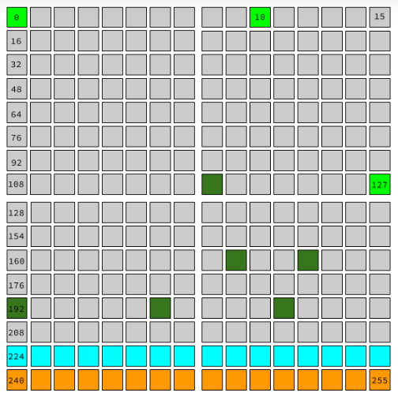

# Networking for Web Developers

> This outline contains some basic information about network and how to trace network traffic.

As a software developer. you're usually working at one particular layer of abstraction at a time. But it is important to know about the lower layers, because the way they work affects the way they can fail and what strange things can happen to your application.

## Index

* [Introduction and Setup Tools](#introduction-and-setup-tools)
* [Directory System for Internet Hosts](#directory-system-for-internet-hosts)
* [Handling Requests by Web Servers](#handling-requests-by-web-servers)
* [Types of DNS Records otherwise A-Record](#types-of-dns-records-otherwise-a-record)
* [Reserved IP Addresses](#reserved-ip-addresses)
* [Network Layers](#network-layers)
* [Protocol Layers](#protocol-layers)
* [Monitor Network Traffic](#monitor-network-traffic)
  * [Use `tcpdump` to Monitor `ping`](#use-tcpdump-to-monitor-ping)
  * [Use `tcpdump` to Monitor DNS Lookup](#use-tcpdump-to-monitor-dns-lookup)
  * [Use `tcpdump` to Monitor HTTP](#use-tcpdump-to-monitor-http)
    * [Analyzing `tcpdump` data](#analyzing-tcpdump-data)
    * [The six basic `TCP` `Flags`](#the-six-basic-tcp-flags)
    * [`TCP` Timers](#tcp-timers)
    * [Hops](#hops)
    * [Bandwidth and latency](#bandwidth-and-latency)
* [Middleboxes, Firewalls & Filtering](#middleboxes-firewalls-and-filtering)
* [Proxies](#proxies)
* [Conclusion](#conclusion)
* [Resources](#resources)

## Introduction and Setup Tools

You will know some tools that are actually really useful of understanding the network and finding what's going on under the hood of the web, and for debugging various sorts of network problems that might affect your web app.

You need to make sure you have `vagrant` installed if you don't have linux machine. [Check this link for Vagrant installation](https://github.com/sabahallah/outlines/blob/master/bash-outline.md#vagrant)

* `$ vagrant up`
* `$ vagrant ssh`
* `$ sudo apt-get update && sudo apt-get upgrade` run first command if succeed, run the second command.
* `$ sudo apt-get install netcat-openbsd tcpdump traceroute mtr` install some apps used in this outline.

Programs we will use:

* `nc`
* `ping`
* Web Browser
* `traceroute`
* `mtr`

`$ ping -c3 8.8.8.8`

* `ping` program to test if your computer can send and receive network traffic with this address.
* `-c3` means to send 3 test messages, then quit and print result.

All traffic in the internet is split up into messages called packets.  

A **packet** is just a short message sent from one computer to another with the address of the sender and recipient on it.

If you `ping` a computer and it is running, that doesn't mean it has a webserver running on it, because message sent by `ping` called Echo request and is received by the destination's operating system.

`ping` is simpler than `HTTP`, but `HTTP` is not based on `ping`

`$ printf 'HEAD / HTTP/1.1\r\nHost: en.wikipedia.org\r\n\r\n' | nc en.wikipedia.org 80`

* `printf` printing formatted string, but it is smarter. It is like `echo` but `echo` will not format `\n` and `\r` but `printf` do.
* `|` or pipe means take output of the program in the left hand side as an input to the right hand side.
* `nc` stands for net cat, it is a handy tool to manually talk to internet services.
  * ex: `$ nc localhost 22` talking to ssh service in your local.
  * ex: `$ nc gmail-smtp-in.l.google.com 25` say hello to gmail server.

The `http` layer implemented by the web browser and web servers _and_ the underlying protocol `TCP` is implemented in the operating system. `nc` command is a thin wrapper over `TCP`.

There are several different layer models for talking about network protocols. We will be using `IETF` model.

Ports from 1 to 1023 reserved by programs started by superuser account or `root` on linux, and ports from 1024 to 65535 for any other program.

`$ sudo lsof -i` list open files, `-i` means list internet sockets only, you'll find `LISTEN` word indication.

## Directory System for Internet Hosts

If you ping google.com from different computers, it will return different IPs.

DNS (Domain Name System) is worldwide distributed directory of network information.

The known kind of DNS record is "A-Record" which 'A' is for address, it maps site name to an `IPv4` address, but there are different types of DNS records, [coming below](#types-of-dns-records-otherwise-a-Record).

If your DNS goes down, the site can't be reached by most users.

DNS used in the security mechanism in HTTP, including SSL encryption and cookie privacy.

The **Resolver** is a DNS client code built into your operating system, programs such as _NC_, _Ping_ or _web browser_ can just use it.

* `$ host -t a facebook.com` basic utility for looking up a record in DNS, it will return the ip from the DNS by name.
* `$ dig facebook.com` same as `host` but with more information.

## Handling Requests by Web Servers

A single webserver can handle requests for multiple sites by their domain names:

* `Apache` calls this virtual host configuration.
* `NGINX` calls it having multiple server blocks.

This is why your request `http` header should have the `hostname: facebook.com`

## Types of DNS Records otherwise A-Record

DNS record can be in multiple types:

* CNAME type [canonical name - alias name]
* AAAA or "quad-A" type [IPv6 address]
* NS record type (DNS name server, NS record for a particular domain says what DNS servers have the records for that domain)

| Domain      | DNS Servers (Which contains records for this domain)|
| ----------- | --- |
| facebook.com| DNS Server 1|
| | DNS Server 2|
| | DNS Server 3|
| google.com| DNS Server x|
| | DNS Server y|
| | DNS Server z|

## Reserved IP Addresses

An IPv4 address is actually a 32-bit numeric value. We usually write it as a _dotted quad_ — four decimal numbers, separated by dots, like `206.190.36.45` or `180.149.132.47`.

Each of the four numbers represents one octet or 8-bit value.

But writing an IP address as four decimal numbers is just a convention to make it easier to read. When it’s used between computers, an address is transmitted in binary, just like all the other data sent over the network.

However, not all of the possible 32-bit values are used for real addresses. Some of them are used for special applications that use addresses differently. Some of them are reserved for internal private networks. Some of them are for testing or documentation.

Here's a visualization of the entire IPv4 address space. Each square represents one possible value of the first octet of an address. For instance, the square on the top right, labeled 15, represents all the IPv4 addresses that start with 15 as their first octet. `15.154.76.48`



* The light-green squares (0, 10, and 127) are blocks that are entirely reserved.
* The dark-green squares are blocks that are partly reserved. For instance, not all of the 192 block is reserved, but some of it is.
* The entire cyan row (starting at 224) is set aside for IP [multicast](https://en.wikipedia.org/wiki/IP_multicast).
* And the entire orange bottom row (starting at 240) was [originally set aside for "future use" but was effectively lost due to being blocked as invalid](http://packetlife.net/blog/2010/oct/14/ipv4-exhaustion-what-about-class-e-addresses/).

## Network Layers

The network layers use abstraction and encapsulation. The lower layers encapsulate the higher layers.

* Layer 5 - **The Application layer** can have its own protocols, e.g. HTTP
* Layer 4 - **The Transport layer** encapsulates the application datagrams, and it communicates with the same Transport layer protocol on the target device. Some transport protocols have guarantees and create connections for reliability, e.g. TCP (segments), but some are connection-less with no guarantees, e.g. UDP (datagrams). The purpose of this layer is to get the application data from one application to another application. Some transport protocols use addressing (ports) to accomplish this, and some use something else, or nothing at all.
* Layer 3 - **The Network layer** encapsulates the transport protocol datagrams into packets. The purpose of this layer is to get packets from a device on one network to a device on another network. Routers use the addressing information in the packet headers to accomplish this (IPv4, IPX, IPv6, AppleTalk, etc. addresses).
* Layer 2 - **The Data Link layer** encapsulates the network packets into frames, and it communicates with the data link of a device on the same network. The purpose of this layer is to get frames to another device on the same network (PC printer, router, etc.). Some data-link protocols use addressing (IEEE protocols use MAC addressing, either 48-bit or 64-bit MAC addresses), some use other addressing (frame relay uses DLCIs, ATM uses VPI/VCI, etc.), and some use no addressing (PPP only has two devices, so it needs no addressing). The protocol can change change as the encapsulated packet is sent from one network to another on its way to the destination device. Routers strip off the frame and discard it as they forward the packets from one network to another, creating a new frame to encapsulate the packet for the new network.
* Layer 1 - **The physical layer** (layer 1) converts the frames of the Data Link layer (layer-2) into the "bits on the wire."

The destination device performs the reverse of the above, delivering the application data to the destination application.

TCP can theoretically use any network-layer protocol, but in practice it only uses IPv4 or IPv6. IP will encapsulate the TCP segments into IP packets.

IP will use the data-link protocol of the interface through which that packets will be sent. On a PC, this is most likely either ethernet or Wi-Fi, but it can be something else like PPP. The data-link protocol will encapsulate the packets into frames for the data-link protocol. Each data-link protocol has a different frame format. If the destination device is on the same network, the frames are addressed and delivered directly to the destination. If the destination is on a different network, the frames are addressed and delivered to the gateway (router) configured in the source OS.

## Protocol Layers

As a software developer. you're usually working at one particular layer of abstraction at a time. But it is important to know about the lower layers, because the way they work affects the way they can fail and what strange things can happen to your application.

All underlying protocols provided by the operating system, eg: `NTP` or (network time protocol) is to keep your date and time in sync.

## Monitor Network Traffic

Use `tcpdump` program to monitor any traffic between host and network not just `tcp`.

### Use `tcpdump` to Monitor `ping`

* Open open terminal `$ sudo tcpdump -n host 8.8.8.8`
* From another terminal try `$ ping -c3 8.8.8.8`

```markdown
$ sudo tcpdump -n host 8.8.8.8
tcpdump: verbose output suppressed, use -v or -vv for full protocol decode
listening on eth0, link-type EN10MB (Ethernet), capture size 262144 bytes
08:03:14.002406 IP 10.0.2.15 > 8.8.8.8: ICMP echo request, id 3139, seq 1, length 64
08:03:14.029071 IP 8.8.8.8 > 10.0.2.15: ICMP echo reply, id 3139, seq 1, length 64
08:03:15.003659 IP 10.0.2.15 > 8.8.8.8: ICMP echo request, id 3139, seq 2, length 64
08:03:15.017338 IP 8.8.8.8 > 10.0.2.15: ICMP echo reply, id 3139, seq 2, length 64
08:03:16.022193 IP 10.0.2.15 > 8.8.8.8: ICMP echo request, id 3139, seq 3, length 64
08:03:16.034085 IP 8.8.8.8 > 10.0.2.15: ICMP echo reply, id 3139, seq 3, length 64
```

### Use `tcpdump` to Monitor DNS Lookup

Use `$ sudo tcpdump -n port 53` watch all DNS requests that your machine sent, you need to know what ports DNS uses, it is `53`.

From another terminal try `$ host -t a facebook.com` to look up a record in DNS.

```markdown
$ sudo tcpdump -n port 53
tcpdump: verbose output suppressed, use -v or -vv for full protocol decode
listening on eth0, link-type EN10MB (Ethernet), capture size 262144 bytes
08:08:57.148299 IP 10.0.2.15.60323 > 10.0.2.3.53: 25139+ A? puppet.etisalat.corp.ae. (41)
08:08:57.148427 IP 10.0.2.15.60323 > 10.0.2.3.53: 20814+ AAAA? puppet.etisalat.corp.ae. (41)
08:08:57.172245 IP 10.0.2.3.53 > 10.0.2.15.60323: 25139 NXDomain* 0/1/0 (116)
08:08:57.174201 IP 10.0.2.3.53 > 10.0.2.15.60323: 20814 NXDomain* 0/1/0 (116)
08:08:57.174594 IP 10.0.2.15.59757 > 10.0.2.3.53: 13959+ A? puppet. (24)
08:08:57.174891 IP 10.0.2.15.59757 > 10.0.2.3.53: 52680+ AAAA? puppet. (24)
08:08:59.229646 IP 10.0.2.3.53 > 10.0.2.15.59757: 13959 ServFail 0/0/0 (24)
08:08:59.229683 IP 10.0.2.3.53 > 10.0.2.15.59757: 62209 ServFail 0/0/0 (24)
08:08:59.229688 IP 10.0.2.3.53 > 10.0.2.15.59757: 52680 ServFail 0/0/0 (24)
08:08:59.229789 IP 10.0.2.15.59757 > 10.0.2.3.53: 13959+ A? puppet. (24)
08:08:59.229895 IP 10.0.2.15.59757 > 10.0.2.3.53: 52680+ AAAA? puppet. (24)
08:08:59.231412 IP 10.0.2.3.53 > 10.0.2.15.59757: 62465 ServFail 0/0/0 (24)
08:09:01.297538 IP 10.0.2.3.53 > 10.0.2.15.59757: 52680 ServFail 0/0/0 (24)
08:09:01.297653 IP 10.0.2.3.53 > 10.0.2.15.59757: 13959 ServFail 0/0/0 (24)
08:09:01.297660 IP 10.0.2.3.53 > 10.0.2.15.59757: 62977 ServFail 0/0/0 (24)
08:09:01.297664 IP 10.0.2.3.53 > 10.0.2.15.59757: 62721 ServFail 0/0/0 (24)
08:09:08.620170 IP 10.0.2.15.46840 > 10.0.2.3.53: 44485+ A? facebook.com. (30)
08:09:08.658930 IP 10.0.2.3.53 > 10.0.2.15.46840: 44485 1/0/0 A 157.240.13.35 (46)
08:11:01.301373 IP 10.0.2.15.36658 > 10.0.2.3.53: 20668+ A? puppet.etisalat.corp.ae. (41)
08:11:01.301547 IP 10.0.2.15.36658 > 10.0.2.3.53: 58302+ AAAA? puppet.etisalat.corp.ae. (41)
08:11:01.330740 IP 10.0.2.3.53 > 10.0.2.15.36658: 20668 NXDomain* 0/1/0 (116)
08:11:01.330773 IP 10.0.2.3.53 > 10.0.2.15.36658: 58302 NXDomain* 0/1/0 (116)
08:11:01.330927 IP 10.0.2.15.37840 > 10.0.2.3.53: 57798+ A? puppet. (24)
08:11:01.331005 IP 10.0.2.15.37840 > 10.0.2.3.53: 33749+ AAAA? puppet. (24)
08:11:03.396723 IP 10.0.2.3.53 > 10.0.2.15.37840: 57798 ServFail 0/0/0 (24)
08:11:03.396758 IP 10.0.2.3.53 > 10.0.2.15.37840: 33749 ServFail 0/0/0 (24)
08:11:03.396764 IP 10.0.2.3.53 > 10.0.2.15.37840: 64257 ServFail 0/0/0 (24)
08:11:03.396868 IP 10.0.2.15.37840 > 10.0.2.3.53: 57798+ A? puppet. (24)
08:11:03.397009 IP 10.0.2.3.53 > 10.0.2.15.37840: 64001 ServFail 0/0/0 (24)
08:11:03.397048 IP 10.0.2.15.37840 > 10.0.2.3.53: 33749+ AAAA? puppet. (24)
08:11:05.464776 IP 10.0.2.3.53 > 10.0.2.15.37840: 57798 ServFail 0/0/0 (24)
08:11:05.464816 IP 10.0.2.3.53 > 10.0.2.15.37840: 64513 ServFail 0/0/0 (24)
08:11:05.464819 IP 10.0.2.3.53 > 10.0.2.15.37840: 33749 ServFail 0/0/0 (24)
08:11:05.464821 IP 10.0.2.3.53 > 10.0.2.15.37840: 64769 ServFail 0/0/0 (24)
```

### Use `tcpdump` to Monitor HTTP

`tcpdump` can look at a lot more than just pings in DNS requests, for instance we can use it to look at the packets that your machine uses to talk to a webserver.

* Open one terminal `$ sudo tcpdump -n port 80`
* Open another terminal `$ printf 'HEAD / HTTP/1.1\r\nHost: example.net\r\n\r\n' | nc example.net 80`

```markdown
$ sudo tcpdump -n port 80
13:19:52.379292 IP 10.0.2.15.52158 > 93.184.216.34.80: Flags [S], seq 2892897554, win 29200, options [mss 1460,sackOK,TS val 4121720 ecr 0,nop,wscale 6], length 0
13:19:52.390354 IP 93.184.216.34.80 > 10.0.2.15.52158: Flags [S.], seq 2134080001, ack 2892897555, win 65535, options [mss 1460], length 0
13:19:52.390494 IP 10.0.2.15.52158 > 93.184.216.34.80: Flags [.], ack 1, win 29200, length 0
13:19:52.393386 IP 10.0.2.15.52158 > 93.184.216.34.80: Flags [P.], seq 1:39, ack 1, win 29200, length 38: HTTP: HEAD / HTTP/1.1
13:19:52.394177 IP 93.184.216.34.80 > 10.0.2.15.52158: Flags [.], ack 39, win 65535, length 0
13:19:52.396329 IP 10.0.2.15.52158 > 93.184.216.34.80: Flags [F.], seq 39, ack 1, win 29200, length 0
13:19:52.397786 IP 93.184.216.34.80 > 10.0.2.15.52158: Flags [.], ack 40, win 65535, length 0
13:19:53.036765 IP 93.184.216.34.80 > 10.0.2.15.52158: Flags [P.], seq 1:352, ack 40, win 65535, length 351: HTTP: HTTP/1.1 200 OK
13:19:53.036847 IP 10.0.2.15.52158 > 93.184.216.34.80: Flags [.], ack 352, win 30016, length 0
13:19:53.037197 IP 93.184.216.34.80 > 10.0.2.15.52158: Flags [F.], seq 352, ack 40, win 65535, length 0
13:19:53.037260 IP 10.0.2.15.52158 > 93.184.216.34.80: Flags [.], ack 353, win 30016, length 0
```

#### Analyzing `tcpdump` data

`length`: how much data sent in this packet, for most of them, the length value is 0. This is important fact about `tcp`, even before the client and server get to exchange any real data, they've got some setup to do to bring up the connection and after they are done with the real data, they have some tear down to do.

* "length 38": http request.
* "length 351": http response.
* "10.0.2.15": my ip.
* "93.184.216.34": example.net ip

#### The six basic `TCP` `Flags`

The original `TCP` packet format has six flags. Two more optional flags have since been standardized, but they are much less important to the basic functioning of `TCP`.

For each packet, `tcpdump` will show you which flags are set on that packet.

* SYN (synchronize) or [`S`]: This packet is opening a new `TCP` session and contains a new initial sequence number.
* FIN (finish) or [`F`]: This packet is used to close a `TCP` session normally. The sender is saying that they are finished sending, but they can still receive data from the other endpoint.
* PSH (push) or [`P`]: This packet is the end of a chunk of application data, such as an HTTP request or response.
* RST (reset) or [`R`]: This packet is a `TCP` error message; the sender has a problem and wants to reset (abandon) the session.
* ACK (acknowledge) or [`.`]: This packet acknowledges that its sender has received data from the other endpoint. Almost every packet except the first SYN will have the ACK flag set.
* URG (urgent) or [`U`]: This packet contains data that needs to be delivered to the application out-of-order. Not used in HTTP or most other current applications.

`ICMP` and `UDP` protocols don't have flags like `TCP`. If you look at `tcpdump` data for [pings](#use-tcpdump-to-monitor-ping) or [basic DNS lookups](#use-tcpdump-to-monitor-dns-lookup), you will not see any flags. This is because `ping` uses `ICMP`, and basic DNS lookups use `UDP`. These protocols do not have `TCP` flags or sequence numbers.

#### `TCP` Timers

If you try:

* Open one terminal `$ sudo tcpdump -n port 12345`
* Open another terminal `$ nc udacity.com 12345`

TCP will try hard to connect to that port but after sometime it will timeout. This is because TCP has a number of built in timers.

Keeping a TCP session open doesn't rely on the DNS. A client uses DNS to lookup a server's IP address before connecting, but after that it is not needed.

#### Hops

Packets travels between routers starting from its source to destination, each forward from one machine to another is called a hop

You can see all the hops involved in getting your traffic from you to destination server by using a `traceroute` tool.

* `$ traceroute google.com`
* `$ mtr google.com` more advanced tool.

If your run the tool to see the hops between you and some other site, you may see some codes like `sea`, `sjc`, `lax`... There are not arbitrary names, they're airport codes. Network operators often name large nodes of their network after a near by airports
it makes it easier to keep track of them geographically.

#### Bandwidth and latency

Bandwidth and latency are the two network things that people often mean when they refer to speed of a network connection.

Low bandwidth and high latency can both feel like slowness.

### Middleboxes, Firewalls and Filtering

Firewalls are devices that network operators can use to filter traffic that's coming into or leaving their network.

A firewall is one example of a class of network devices called middleboxes — devices that inspect, modify, or filter network traffic.

Other examples of middleboxes include intrusion detection systems and load balancers.

Technically, it's only a middle-box if it's a separate device from the client or server — server-side "firewalls" like Linux `iptables` aren't middleboxes.

A firewall can be a real boon to an organization's network security. The most common configuration for a firewall is to drop any incoming traffic except traffic to (host & port) pairs that are supposed to be receiving connections from the Internet.

This lets the network administrator be sure that other machines on the network — like backend databases or administrative systems — aren’t going to get direct attacks from outside.

Aside from blocking traffic outright, middleboxes can also alter traffic, for instance replacing web pages with error messages.

This is often done for social or political purposes. For instance, in the U.S., many schools use traffic filters of various sorts to prevent students from accessing web sites deemed inappropriate for children.

But what sites get counted as "inappropriate" can reflect the biases or opinions of the people who wrote or configured the filter.

Rather famously, some countries have deployed large-scale firewalls or filters to censor their citizens' access to the global Internet.

Major well-known sites such as YouTube and Twitter are sometimes blocked entirely in some countries

To check if access is being blocked by a firewall or filter:

* Can the user ping your site by ip address?
* Can the user access a different domain on the same server?
* Can they look up your server's name using host or dig?
* Are all the users with the problem in the same country?

### Proxies

How could a web app distinguish users who are behind the same public IP address?

* Logged in user identity (like username).
* Session cookies.

## Conclusion

* Programs we use like `nc`, `ping`, `traceroute` and `mtr`.
* `nc` command is a thin wrapper over `TCP`
* `$ ping -c3 8.8.8.8` test if your computer can send and receive network traffic with this address.
* `nc` stands for net cat, it is a handy tool to manually talk to internet services.
* `$ printf 'HEAD / HTTP/1.1\r\nHost: en.wikipedia.org\r\n\r\n' | nc en.wikipedia.org 80` send request to wikipedia site using `nc` or netcat program.
* `$ sudo lsof -i` list open files, `-i` means list internet sockets only, you'll find `LISTEN` word indication.
* `$ host -t a facebook.com` basic utility for looking up a record in DNS, it will return the ip from the DNS by name.
* `$ dig facebook.com` same as `host` but with more information.
* Monitor Network Traffic
  * `$ sudo tcpdump -n host 8.8.8.8` monitor any traffic to ip `8.8.8.8`
  * `$ sudo tcpdump -n port 53` monitor any DNS lookup
  * `$ sudo tcpdump -n port 80` monitor any HTTP traffic
  * `ICMP` and `UDP` protocols don't have flags like `TCP`. If you look at `tcpdump` data for [pings](#use-tcpdump-to-monitor-ping) or [basic DNS lookups](#use-tcpdump-to-monitor-dns-lookup), you will not see flags. This is because ping uses `ICMP`, and basic DNS lookups use UDP. These protocols do not have `TCP` flags or sequence numbers.
* `$ traceroute google.com` see all the hops involved in getting your traffic from you to destination server.
* `$ mtr google.com` more advanced tool.

## Resources

* [Udacity: Networking for Web Developers](https://www.udacity.com/course/networking-for-web-developers--ud256)
* [Page Weight Matters Article](http://blog.chriszacharias.com/page-weight-matters) is a very interesting article about page weight.
