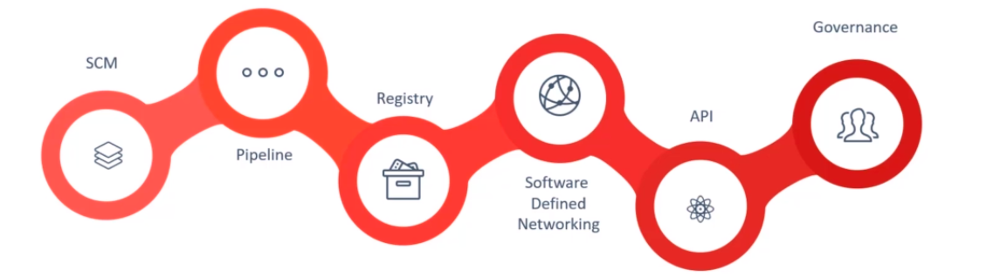
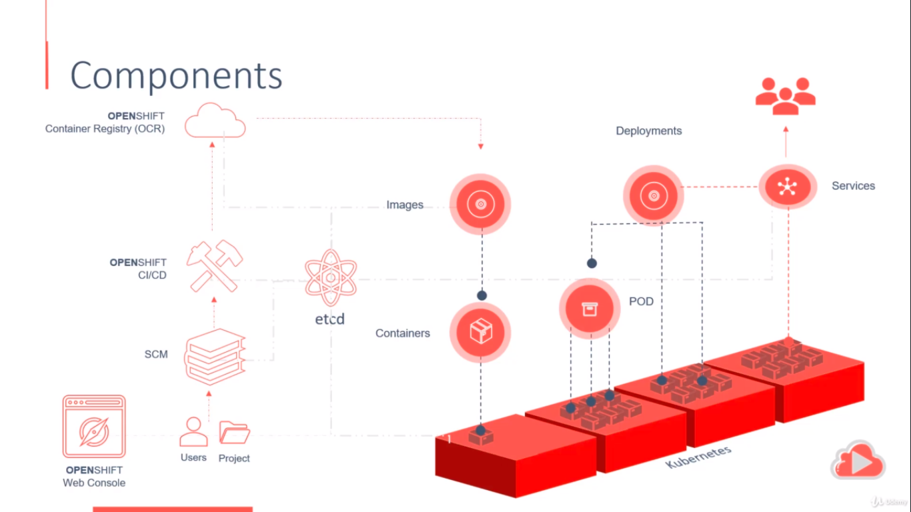

# OpenShift Outline

> This is a short outline that summarizes what is OpenShift.

***

## Table of Content

* [What is OpenShift](#what-is-openshift)
* [OpenShift and Kubernetes What's the Difference](#openshift-and-kubernetes-whats-the-difference)
* [OpenShift Flavours](#openshift-flavours)
* [OpenShift Origin](#openshift-origin)
* [OpenShift Architecture](#openshift-architecture)
* [References](#references)

***

## What is OpenShift

OpenShift is open source container application platform from Red Hat Inc. for the development, deployment and management of applications.

OpenShift provides developers with an integrated development environment (IDE) for building and deploying Docker-formatted containers, and then managing them with the open source Kubernetes container orchestration platform.

Once deployed OpenShift takes care of managing the underlying infrastructure components, thereby enabling the developers to do what they do best; coding.

OpenShift is a cloud development PaaS, platform as a service. The free and open source cloud-based platform allows developers to create, test and run their applications and deploy them to the cloud.

OpenShift provides support for Node.js, Ruby, Python, PHP, Perl, and Java and is extensible so that users can add support for other languages.

Resources allocated for applications can be automatically or manually scaled so that as demand increases there is no degradation of performance.

Here's how Red Hat describes the process of creating an application through OpenShift:

* Create an "Application" in OpenShift (With the command-line or via their IDE).
* Code the application (in Vi, TextMate, Eclipse, Visual Studio, or whatever).
* Push the application code to OpenShift (again, with the command-line or from their IDE).
* OpenShift will take care of everything, creating a jenkins job, dockerize your application ,pushing artifact to private registry, deploying the application, scaling through ansible if needed, monitoring and more...

***

## OpenShift and Kubernetes What's the Difference

Simple explanation: Kubernetes is the “kernel”. OpenShift is the distribution.

OpenShift is a distribution of Kubernetes focused on the experience of developers who have the need to develop the next generation of cloud native applications. OpenShift focused on the experience of administrators and operations teams who needed to quickly remediate issues with the operating system and Kubernetes itself.

***

## OpenShift Flavours

* OpenShift Origin. (Open source application container platform. It's the original upstream open source project which all other modules are derived)
* OpenShift Online. (The publicly hosted version of OpenShift Origin)
* OpenShift Dedicated. (OpenShift managed private cluster on cloud platforms like AWS and GCP)
* OpenShift Enterprise. (On-premise private PaaS)

***

## OpenShift Origin

OpenShift is based on top of docker containers and the Kubernetes cluster manager with added developer and operational centric tools that enable rapid application development, deployment and lifecycle management.

The tools added by OpenShift: SCM, Pipeline, Registry, Software defined networking, API and Governance (Support for projects, teams and users to organize and manage access to applications)

***

## OpenShift Architecture

OpenShift leverages Kubernetes underneath as the primary infrastructure component. Kubernetes can deploy applications in the form of containers such as docker. Containers are created from images of applications.

You may configure OpenShift to pull these images from a public docker repository or registry like Docker Hub. Alternatively you may use the OpenShift container registry that comes built in with OpenShift origin.

A collection of one or more containers together form a **pod** and **multiple pods form a deployment**.

We use services to expose the deployments to other applications or to the external world.

These are the basic Kubernetes constructs that OpenShift leverages to manage all of these with ease.

OpenShift comes with a built in web console that developers can access to browse and manage their applications. This web console can only be accessed by users which are managed by OpenShift's authentication and authorization mechanisms.

Users can create projects to group together and manage various components of their applications.

OpenShift also comes with built in integration to source code management systems through which users can import their application code. The code repository has integration with built in CI/CD pipelines where the application code is built into docker images and pushed to the built in container registry.

At the heart of OpenShift lies the ETCD key values store that stores information about various components.

***

## References

* [Youtube: What is OpenShift?](https://www.youtube.com/watch?v=KTN_QBuDplo)
* [What is OpenShift in simple terms?](https://www.quora.com/What-is-OpenShift-in-simple-terms)
* [Udemy: DevOps - The Introduction Course](https://www.udemy.com/course/learn-devops/)
* [OpenShift Tutorial](https://www.tutorialspoint.com/openshift/index.htm)
