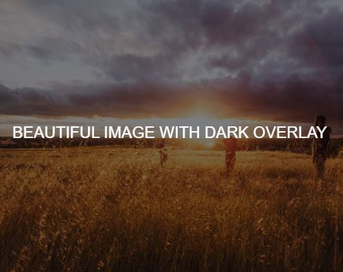
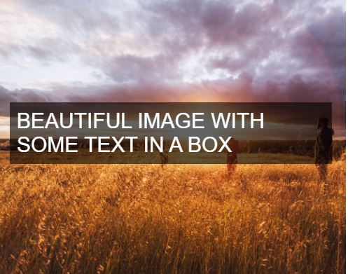
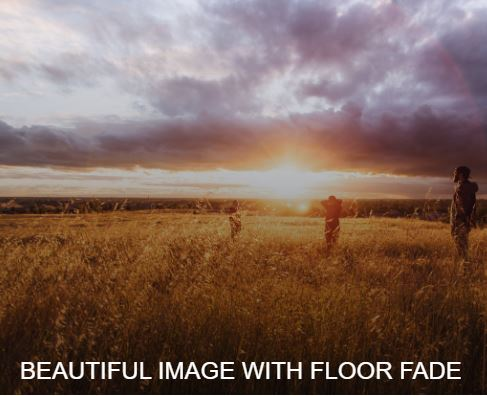

# Web Design Outline

> Design is the secret to great business.

## Index

- [Visual design Concepts](#visual-design-concepts)
  - [Flat Design](#flat-design)
  - [Typography](#typography)
  - [Colors](#colors)
  - [Images](#images)
  - [Icons](#icons)
  - [Spacing and Layout](#spacing-and-layout)
  - [Inspiration](#inspiration)
  - [Summary](#summary)
- [User Interface and User Experience](#User-Interface-and-User-Experience)
- [7 Steps to a fully functional website](#7-Steps-to-a-fully-functional-website)
- [Improve your website's conversion](#Improve-your-website's-conversion)
- [Social Media Marketing](#social-media-marketing)
- [Design Roles](#design-roles)
- [Design Resources](#design-resources)

## Visual design Concepts

### Flat Design

Remove shadows, color gradient, textures. keeping the design is two dimensional design.

### Typography

- Use font-size between 15 and 25 pixels for paragraphs.
- Use (Really) big font sizes for headlines, `h1`, `h2` ... `h6` may be with lower font weight.
- For paragraphs, use line spacing between 120% and 150% of the font size.
- Use 45 to 90 characters per line.
- Use good fonts.
  - F (sans-serif)
    - More Natural
    - Clean
    - Simple
    - Modern Websites (Some san-serif google fonts: Open Sans, Lato, Raleway, Monsterrat, PT sans)
  - F (Serif)
    - Traditional Purposes
    - Storytelling
    - Long Reading

### Colors

- Use only one base color (base color means any color other than black, white and some shade of grey).
- Use a tool if you want to use more colors.
  - [adobe.com color wheel](https://color.adobe.com/create/color-wheel/)
  - [0to255.com](http://www.0to255.com/) is a color tool for finding lighter and darker colors based on any color.
  - [Material UI Colors](http://materialuicolors.co/)
- Use color to draw attention.
- Never use black in your design.
- Choose colors wisely.  
  Picking a color for a website means more than picking your favorite color and turning it into a design. It means picking the right color in order to get the desired response from your audience. Color really makes a difference. This happens because there are psychological effects behind each color.
  - _Red_ is a great color to use when power, passion, strength and excitement want to be transmitted. Brighter tones are more energetic and darker shades are more powerful and elegant.
  - _Orange_ draws attention without being as overpowering as red. It means cheerfulness and creativity. Orange can be associated with friendliness, confidence, and courage.
  - _Yellow_ is energetic and gives the feeling of happiness and liveliness. Also, it associates with curiosity, intelligence, brightness, etc.
  - _Green_ is the color of harmony, nature, life and health. Also, it is often associated with money. In design, green can have a balancing and harmonizing effect.
  - _Blue_ means patience, peace, trustworthiness, and stability. It is one of the most beloved colors, especially by men. It is associated with professionalism, trust and honor. That's actually why the biggest social networks use blue.
  - _Purple_ is traditionally associated with power, nobility and wealth. In your design, purple can give a sense of wisdom, royalty, nobility, luxury, and mystery.
  - _Pink_ expresses romance, passivity, care, peace, affection, etc.
  - _Brown_ is the color of relaxation and confidence. Brown means earthiness, nature, durability, comfort, and reliability.

### Images

- Overlay the image (make it shadow with color, add effects to the image).
- Put text directly on the image.
- Put your text in a box, box should be obique so you can still see the image underneath it. You can also make the box black or go with other color
- Blur the image, you can blur the whole image in the background, or auto focus area.
- The floor fade. Technique where an image suddenly fades towards black at the bottom with white text written over it.
- To get free images for your website.
  - Check this [resources](<(http://codingheroes.io/resources/)>) link, images section
  - <https://500px.com/>

#### Examples

_Overlay the image_. [See the example](http://jsfiddle.net/drpak8vy/1/)

```css
.darken {
  background-image: linear-gradient(rgba(0, 0, 0, 0.5), rgba(0, 0, 0, 0.5)),
    url(YOURIMAGEHERE);
}
```



_Put the text in a box_. [See the example](http://jsfiddle.net/qg83m36p/)

```css
.text-box {
  background-color: rgba(0, 0, 0, 0.5);
  color: #fff;
  display: inline;
  padding: 10px;
}
```



_Floor fade_. [See the example](http://jsfiddle.net/gRzPF/409/)

```css
.floor-fade {
  background: linear-gradient(to bottom, rgba(0, 0, 0, 0), rgba(0, 0, 0, 0.6)),
    url(YOURIMAGEHERE);
}
```



### Icons

- Use Icons to list features/steps.
- User icons for actions and links:
  - icons should be recognizable.
  - label your icons.
- Icons should not take a center stage in your design instead they should take a supporting role.
- Use Icon fonts whenever possible  
  There are two types of icons format:
  - form of image.
  - form of font. [recommended, high resolution and because they scale endlessly and therefore don't blur]

### Spacing and Layout

- You need to use whitespace effectively:
  - Put whitespace between your elements.
  - Put whitespace between your group of elements.
  - Put whitespace between your website's sections.
  - But don't exaggerate.
- Define hierarchy of webpage sections and white spaces between them:
  - Define where you want your audience to look first.
  - Establish a flow that corresponds to your content's message.
  - Use whitespace to build that flow.

### Inspiration

The secret ingredient for stunning webdesign, it is absolutely essential for beginners. Without inspiration you'll have a hard time even start anything.

- Use other websites as inspiration to see what other leading designers are doing right.
- Collect designs that you like.
- Try to understand everything about them.
- Why do they good look.
- What do these sites have in common.
- How were they built in HTML and CSS?
- Steal like an artist ;)

### Summary

Most of your content will be text, so beautiful typography is a key element to a good looking website.
Images are getting more and more important in webdesign, so choosing great images and putting text on them is an essential part of your work.  
Icons are also a good way of setting a friendly tone for your website, but use them carefully.
The adequate use of whitespace makes a website look professionally designed, so use it a lot, but in the correct way.  
Build a layout by defining the visual hierarchy of your content. Whitespace is also important for this.
Your website should be designed in a way that ensures that both the user and the owner of the website achieve their goals. This is the user experience.  
It is very important that you get inspired by studying well-designed websites from other designers.

## User Interface and User Experience

- **User Interface**: is the presentation of a product, how it looks and feels.
- **User Experience**: is the overall experience that the user has with a product. In simple terms, user experience is: _how it works_;

> It's not just what it looks and feels like. Design is how it works.  
> _Steve Jobs_

Check this [UX Course](http://thehipperelement.com/post/75476711614/ux-crash-course-31-fundamentals)

## 7 Steps to a Fully Functional Website

### Define your Project (Goal and Audience)

Start off by defining the goal of your project. This can be showing your portfolio to the world, selling an e-book, building a blog, etc.
Also define your audience. Ask yourself: what is the typical user that will visit my website?
This is important, because you should always design with your goal and audience in mind.

### Plan out Everything

Once your project is defined, plan your content carefully. This includes text, images, videos, icons, etc.
Remember what I told you about visual hierarchy. It plays an important role when you start thinking about what you want on your website and what you don't.  
Defining the content before actually starting the design is called the content-first approach.  
It means that you should design for the content, instead of designing a webpage and then filling it with some stuff.  
Define the navigation.
Define the site structure. You can draw a sitemap in this step if we're talking about a bigger project.

### Sketch your Ideas Before You Design

Now it's time to get inspired and think about your design.
Then, get the ideas out of your head, and with that I mean that you should sketch your ideas before you start designing.
It will help you explore ideas and create a concept of what you want to build. Using pencil and paper is a great way of quickly retaining your valuable ideas.
Make as many sketches as you want, but don't spend too much time perfecting anything.
Once you have an initial idea, you can concentrate on the details when designing in HTML and CSS.
I advise you to never ever start designing without having an idea of what you want to build.  
Getting inspiration is very important in this phase.

### Design and Develop your Website

After sketching, start to design your website using all the guidelines and tips you've learned in the web design section.
You'll do that using HTML and CSS, which is called designing in the browser. Designing in the browser is basically designing and developing at the same time.
There are more and more designers leaving traditional design programs such as Photoshop and start designing in the browser.
The biggest reason for this is that you can't design responsive websites in Photoshop. It also saves you tons of time.
In this phase, you'll use your sketches, content and planning decisions you've made in steps 1, 2 and 3.

### Optimization

Before you can actually launch your beautiful masterpiece for the world to see it, we have to optimize its performance in terms of site speed.  
You also need to do some basic search engine optimization (SEO) for search engines such as google.

- Reduce image size, open google developer tool check the current size and actual size and check the mobile size, then reduce to image resolution to double the min size.
- Use [optimizilla.com](https://imagecompressor.com/) to compress image online.
- Minify css/js code, use [this free CSS compressor and CSS compression tool](http://www.minifycss.com/css-compressor/)
- SEO

  - Add **meta** description tag.

    ```html
    <!-- no more than 160 char -->
    <meta
      name="description"
      content="Omnifood is a premium food delivery service with the mission to bring affordable and healty meals to as many people as possible."
    />
    ```

  - Write **valid html code**: use validator.w3.org
  - **content** is king: It is very important to have a great content in your website, keep providing new content if you can.
  - **keywords**:
    - Place keywords in your content.
    - Don't over use key words; search engine considers this as keyword spamming.
    - Use keywords in title, meta desc tag, heading and your links.
  - **backlinks** in which other websites link to you, search engine rank the site based on the number of backlinks points to your site.

### Launch the masterpiece

Your optimized website is now finally ready to launch.
All you need for launching is a webserver that will host your website and deliver it to the world.

### Site maintenance

The launch of your website is not the end of the story.
Now it's time to monitor your users behavior and make some changes to your website if necessary.
You should also update your content regularly in order to show your users that your website is alive! For instance, a blog can be a great way of doing that.

Use google analytics, if you have multiple pages, you need to add google analytics script to multiple pages.

## Improve your website's conversion

[Check This Lecture](https://www.udemy.com/web-design-secrets/learn/v4/t/lecture/2796104)

You want to sell a product, so you need to:

- Build trust with future customers.
  - Give your customer a gift so you can build a trust instead of trying to sell anything rightaway.
- Repeat Your Primary action, ex:
  - Signup for free [button in the navigation bar]
  - Getting started - free forever! [in the middle]
- Grab your users attention, ex: popup box:
  - subscribe for news letter
- Tell your user the benefits, ex:
  - From now on, things will be better.
  - Zendesk is ......
  - Get started today with 30 days free trial.
  - Ask for email and pass only - Try it for free
- Don't ask for too much information.
- Use social proof:
  - Customer testimonies or showing other company using your product or service. Customers will trust others than trust you.
- Use urgency, like udemy offers, ex:
  - limited time remaining, buy now.
  - limited quantity available.
  - over 320 bought.
  - this deal has limited time remaining, buy it now.
- Use scarcity, ex:
  - only 1 left in stock

## Social Media Marketing

- Choose your words very wisely when posting on social media sites.
- You can easily write an essay post when you get up to one thousand followers on Twitter for instance. Thank your followers for showing a desire for your social media site. These details will certainly be quickly be shared.
- Have a look at your competitors does always to gain a benefit.

## Design Roles

- Senior Manager of Content Strategy.
- Creative Director.
- Content Writer.

### Design Resources

- Learning resources
  - [Udemy: Web Design for Web Developers Course](https://www.udemy.com/web-design-secrets/)
- [Jonas' Resources](http://codingheroes.io/resources/)
- Softwares
  - [Adobe XD for graphic design](https://www.adobe.com/mena_en/products/xd.html)
  - [figma](https://www.figma.com/)
- Hire Designers
  - [99designs.com](https://99designs.com/)
- [Text on Images](https://css-tricks.com/design-considerations-text-images/)
- [UI tricks that can lead to higher conversion rates](https://goodui.org/)
- [UX Course](http://thehipperelement.com/post/75476711614/ux-crash-course-31-fundamentals)
- Icons: [http://entypo.com](http://entypo.com/)
- Images: [Food Images](https://www.foodiesfeed.com/)
- [Design Lessons](https://hackdesign.org/lessons)
- [Free templates](https://onepagelove.com/templates/free-templates)
- Other Resources
  - [Inspired by google fonts](http://femmebot.github.io/google-type/)
  - <https://www.admiretheweb.com/>
  - <https://calltoidea.com/>
  - <http://mazwai.com>
  - <http://thepatternlibrary.com/>
  - <https://fontpair.co/>
  - <https://www.newdesigngroup.ca/website-design/web-design-process-infographic/>
  - <https://heydesigner.com/>
  - <https://1stwebdesigner.com/>
  - <https://www.smashingmagazine.com/>
  - [Using Internet Explorer on a Mac](https://www.modern.ie)
  - [Social Network Colors](http://designpieces.com/2012/12/social-media-colours-hex-and-rgb/)
  - [JQuery Plugins](http://www.webappers.com/category/components/tooltips/)
  - [Magnific Popup](http://dimsemenov.com/plugins/magnific-popup/)
  - [Tooltipster](http://iamceege.github.io/tool.pster/#demos)
  - [A Google Maps Javascript plugin for jQuery](http://maplacejs.com/)
  - [one page scroller website](http://www.thepetedesign.com/demos/onepage_scroll_demo.html)
  - [Favicon Generator](http://realfavicongenerator.net/)
  - [Compress images](https://imagecompressor.com/)
  - [Codrops, webdesign blog with lots of freebies](https://tympanus.net/codrops/)
  - <http://www.blindtextgenerator.com/lorem-ipsum>
- Some amazing designers on Dribble:
  - <https://dribbble.com/victorerixon>
  - <https://dribbble.com/benske>
  - <https://dribbble.com/peterfinlan>
  - <https://dribbble.com/Radium>
- Huge list of frontend development resources:
  - <https://github.com/dypsilon/frontend-dev-bookmarks>
